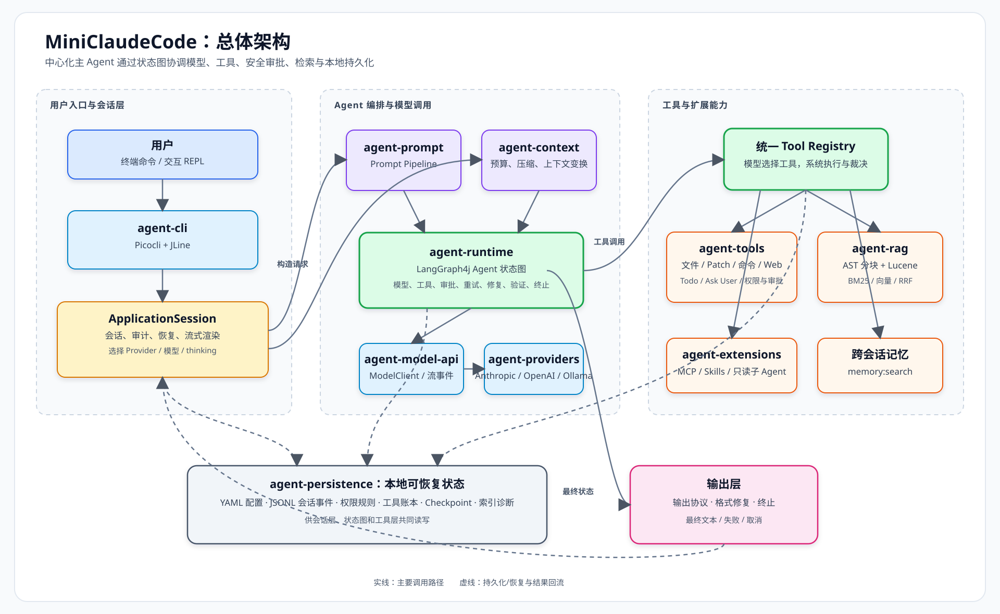

# MiniClaudeCode 项目全景解析

> **阅读范围**：本文依据当前仓库中的 `README.md`、Maven 配置、示例配置、架构与安全文档，以及 CLI、运行时、工具、RAG、持久化等关键实现整理。文中“已实现”表示能在当前工作区找到对应配置或代码；“待确认”表示需要连接真实外部服务才能验证，不能仅由仓库静态确认。

## 执行摘要

MiniClaudeCode 是一个用 Java 21 实现的终端编程 Agent：它把大模型、文件与命令工具、代码检索、审批、安全策略、会话恢复和可选的 MCP/Skills 组合成一个可循环执行的编码助手。它借鉴 Claude Code 一类工具调用型 Coding Agent 的通用思路，但定位是可学习、可展示的模块化工程，而非商业产品的等价实现。学习重点应放在“状态图如何编排模型与工具”“副作用如何审批与恢复”“RAG 如何作为按需工具”三条主线。

---

## 1. 一句话介绍

**MiniClaudeCode 是一个运行在终端中的 Java 21 编程 Agent：它让大模型能够在受控条件下阅读代码、检索代码、修改工作区、执行命令，并根据工具结果继续推理直至给出答复。**

- **解决什么问题？**  单靠聊天模型无法直接查看本地工程、修改文件或运行测试。本项目提供一条“模型提出工具调用 → 本地执行 → 结果回到模型”的闭环，使模型可以参与真实的编码任务。
- **参考什么类型的产品/能力？**  它借鉴 Claude Code、Codex CLI 等终端 Coding Agent 的通用能力：工作区工具、模型流式输出、工具调用循环、审批、会话与代码检索。仓库明确说明它**不是** Claude Code 的界面仿制品，更不能据此认为两者能力或安全性等价。
- **适合谁？**  适合已有 Java 与 Maven 基础、正在学习 LLM 工具调用、Agent 工作流、RAG 和安全工程化的人；也适合用于课程项目、实习或面试中展示模块化 Agent 设计。

---

## 2. 背景与定位

### 为什么需要这类 Agent？

传统 IDE 插件或聊天窗口通常只能“建议代码”。真实开发任务却需要在一个循环里完成：理解仓库、定位相关文件、修改、运行测试、观察失败、再修改，并向使用者说明结果。Coding Agent 的价值在于把语言模型的推理能力接到受控的外部行动上。

可以把它理解为：

```text
聊天模型（只会生成文本）
          +
工具系统（能读文件、改文件、跑命令、搜索代码）
          +
工作流与安全机制（决定何时执行、何时暂停、何时结束）
          =
终端 Coding Agent
```

### 本项目在这一领域中的定位

MiniClaudeCode 选择的是“**中心化主 Agent + 受控工具 + 可选只读子 Agent**”路线。

- 主 Agent 是一个由 LangGraph4j 状态图驱动的查询循环，而不是一个巨大的 `while` 循环。
- 模型、提示词、上下文、Provider、工具、RAG 和存储被拆进 Maven 模块；CLI 是唯一的装配点。
- 多 Agent 并不是多个平等 Agent 自主协商：`agent:delegate` 创建的是 1–4 个并行的**只读**探索/审查/规划子 Agent，写入、审批和最终答复仍由中心 Agent 控制。

这是一个偏工程教学与可解释性的选择：相比“功能堆在一个 Agent 类里”，它更容易讨论依赖方向、失败恢复和安全边界；代价是模块与装配代码更多。

### 能力边界

| 已实现、可从仓库确认 | 当前没有实现或不应误解为已实现 |
| --- | --- |
| 终端交互与单次非交互任务；工作区文件读写、patch、命令、Web Fetch、Todo、提问、代码搜索 | 图形化 IDE 界面、Web 服务端、多租户平台未见实现 |
| Anthropic、OpenAI-compatible、Ollama Provider；流式文本与部分 thinking 信息 | 任意模型/任意网关都已真实兼容：**待连接实际服务确认** |
| JSONL 会话事件、工具账本、checkpoint、会话恢复、跨会话记忆 | 关系型数据库、向量数据库服务、云端共享记忆未见实现 |
| AST/文本分块、Lucene BM25 + 向量 + RRF 的代码检索 | Graph RAG 未实现；仓库文档也明确区分它与 LangGraph4j |
| MCP stdio/Streamable HTTP、`SKILL.md` 发现/路由/按需加载 | Skill 不是可执行插件；它不能改变工具权限 |
| Linux/macOS 的尽力 OS 命令沙箱；Windows 的显式降级提示 | 跨平台强隔离沙箱并未实现；Windows 默认没有同等 OS 级隔离 |

---

## 3. 技术栈总览：不只“用了什么”，还要理解“为何需要”

| 技术/组件 | 在项目中的职责 | 为什么需要它 |
| --- | --- | --- |
| **Java 21** | 主开发语言；虚拟线程用于部分工具和子 Agent 并发 | 适合把并发、文件 I/O、进程控制、类型契约放在同一工程中；虚拟线程降低 I/O 型任务的并发成本 |
| **Maven 多模块** | 将领域模型、运行时、Provider、工具、RAG、持久化、CLI 分开构建 | 避免 Provider 或 CLI 反向污染核心运行时；也使每层能独立测试 |
| **LangGraph4j** | 编排主 Agent 状态图、条件路由、审批中断和 checkpoint 恢复 | Agent 不是一次函数调用：需要表示“调用模型后执行工具”“等待用户审批后恢复”等状态 |
| **LangChain4j** | 统一对接聊天模型与嵌入模型的抽象 | 不让运行时直接依赖某个厂商 SDK；Provider 可以替换或扩展 |
| **Anthropic / OpenAI-compatible / Ollama** | 当前 Provider 实现 | 覆盖云端 API、兼容网关和本地模型三种常见使用方式 |
| **Picocli + JLine** | CLI 子命令、REPL、补全、历史、流式渲染、Ctrl+C | Coding Agent 的主入口是终端；长任务需要能显示中间进度并可取消 |
| **Jackson + YAML** | 用户配置、项目配置、事件/工具参数序列化 | 模型与人都需要可读、可配置的数据格式；YAML 适合配置，JSONL 适合追加事件 |
| **Lucene** | 本地代码索引、BM25 文本检索、向量字段检索 | 让 Agent 在大仓库中按需检索，而不是把全部源代码塞进 Prompt |
| **JavaParser** | Java 源码 AST 分块 | 按类型、方法、构造器、字段拆分，比固定字符数切块更能保留代码结构 |
| **本地哈希嵌入 / 远程 EmbeddingModel** | 为向量检索提供表示 | 默认离线哈希嵌入可复现且无网络依赖；远程 OpenAI-compatible embedding 是可选的质量扩展 |
| **MCP** | 外部工具和资源接入协议 | 把外部能力纳入统一工具模型，但不把 MCP 服务的声明当作可信权限来源 |
| **JSONL、文件 checkpoint、工具账本** | 会话审计、恢复、处理副作用的不确定状态 | Agent 可能在审批或工具执行时中断，不能只把状态留在内存 |
| **JUnit 5、AssertJ、Mockito、Awaitility、JaCoCo、Spotless、SpotBugs** | 测试、断言、异步验证、覆盖率、格式和静态检查 | Agent 工程很容易因边界条件失控；这些工具确保协议、状态机与安全规则可回归验证 |

构建要求为 JDK 21。根 `pom.xml` 还配置了 Maven Enforcer、依赖收敛检查与禁止部分日志依赖，表明该项目重视“可重复构建”和基础依赖卫生。

---

## 4. 总体架构

### 核心架构图



> 若当前 Markdown 预览未立即加载图片，请关闭并重新打开预览，或直接打开 `docs/assets/miniclaudecode-architecture.svg`。

### 模块怎样协作？

| 层次 | 主要输入 | 主要输出 | 协作方式 |
| --- | --- | --- | --- |
| CLI / 会话层 | 命令行参数、REPL 文本、审批选择 | 渲染事件、退出码、会话命令结果 | 创建工作区组件、选择 Provider/模型，记录用户消息与最终结果 |
| Prompt 层 | 工作区信息、工具描述、输出协议、提示词贡献者 | System Prompt | 将稳定规则和当前输出约束组合起来；不持有运行状态 |
| Context 层 | 历史消息、Token 预算 | 原消息或压缩后的消息 | 超预算时按规则压缩，保持 assistant tool call 与对应 tool result 的边界 |
| Runtime | ModelRequest、工具执行器、限制、checkpoint | 最终 `MiniClaudeState` | 用状态图把模型、工具、审批、错误和终止连成可恢复流程 |
| 模型层 | 消息、工具描述、模型配置 | 流式文本、thinking、工具调用、usage、错误 | Provider 将厂商协议适配为统一 `ModelStreamEvent` |
| 工具层 | 模型发出的 `ToolCall`、会话/工作区上下文 | `ToolResult` 或审批请求 | 统一注册、参数校验、执行、审计；结果再进入下一轮模型消息 |
| RAG / 扩展层 | 检索问题、MCP 配置、Skill 元数据 | 代码片段、外部工具结果、Skill 文本 | 作为普通工具按需调用，而非每轮强制执行 |
| 持久化层 | 事件、权限规则、配置、索引、账本 | 可恢复的本地状态 | 使用本地 YAML/JSONL/文件；当前不是集中式服务端存储 |

**重要边界**：`agent-cli` 是 composition root（组合根）。它负责把实现装配起来；`agent-runtime` 只依赖抽象的模型与工具执行接口，不应直接了解具体 Provider 或 CLI。

---

## 5. Agent 的核心工作流

### 一次请求的完整路径

```text
用户             CLI/会话层       Prompt/Context       Agent 状态图       模型/Provider       Tool Registry       持久化
 │                  │                    │                  │                  │                  │                │
 │ 输入任务         │                    │                  │                  │                  │                │
 ├─────────────────>│                    │                  │                  │                  │                │
 │                  ├──────────────────────────────────────────────────────────────────────────────────────────────>│ 记录用户事件
 │                  ├───────────────────>│ 构造提示词、历史、记忆、工具描述     │                  │                │
 │                  │                    ├─────────────────>│ ModelRequest      │                  │                │
 │                  │                    │                  ├─────────────────>│ 流式调用          │                │
 │<─────────────────┼────────────────────┼──────────────────┼<─────────────────┤ 文本/思考实时渲染 │                │
 │                  │                    │                  │<─────────────────┤ 工具调用或最终文本 │                │
 │                  │                    │                  │                  │                  │                │
 │                  │                    │                  │── 有工具调用 ────>│─────────────────>│ 执行 ToolCall    │
 │                  │                    │                  │                  │                  ├───────────────>│ 审计/账本/大结果
 │                  │                    │                  │                  │                  │                │
 │                  │                    │                  │<──────────────────────────────────────────────┤ ToolResult
 │                  │                    │                  ├─────────────────>│ 工具结果回到下一轮模型上下文                  │
 │                  │                    │                  │                  │                  │                │
 │                  │                    │                  │── 需审批时：保存 checkpoint → CLI 显示审批 → 用户决定 → resume ──┐
 │                  │                    │                  │                                                              │
 │                  │                    │                  │<─────────────────────────────────────────────────────────────┘
 │                  │                    │                  │── 无工具调用：检查格式、验证、步数、终止条件
 │                  │<───────────────────┼──────────────────┤ 最终文本 / 失败 / 取消
 │<─────────────────┤ 输出最终回复        │                  │                  │                  │                │
 │                  ├──────────────────────────────────────────────────────────────────────────────────────────────>│ 记录最终事件/记忆
```

### 用步骤理解这个循环

1. **接收任务**：`miniclaude run` 接收单次请求，或 REPL 接收一条对话消息。
2. **准备上下文**：会话层放入 System Prompt、历史消息；若命中跨会话记忆，会加入“这是不可信历史数据”的说明。`ContextPlanner` 判断是否超预算，必要时压缩。
3. **调用模型**：运行时只调用 `ModelClient`。Provider 把具体 API 的流式响应转成统一事件：文本增量、thinking 增量、工具调用完成、usage 或错误。
4. **路由决策**：模型有工具调用则进入工具节点；上下文溢出进入压缩；可重试错误进入恢复；最终输出不符合协议时进入修复。
5. **工具执行**：工具名由统一 Registry 找到；文件、命令、Web、MCP 等工具各自进行参数、安全与权限检查。
6. **审批暂停（如需要）**：文件修改、危险命令、私网 URL、MCP 等可产生 `APPROVAL_REQUIRED`。状态图在审批节点后中断并写 checkpoint；用户决定后从同一状态恢复。
7. **结果回灌**：工具结果变成 `ToolMessage`，随下一次模型调用回到模型上下文。大结果可被外置为内容地址，模型再用 `context:read_result` 分页读取，避免重复膨胀上下文。
8. **验证、修复或完成**：修改后运行时会提示模型执行验证；输出协议检查通过后，写入最终事件并渲染最终答复。

这是一种典型的“观察 → 行动 → 再观察”的 Agent 循环。它和常被称为 **ReAct** 的思路相容，但仓库没有把“ReAct”作为一个独立算法类实现；更准确的描述是：**基于 Function/Tool Calling 的状态图工作流，具有 ReAct 式工具反馈循环。**

---

## 6. 技术路线与关键设计选择

### 6.1 采用了哪些 Agent 模式？

| 模式 | 当前判断 | 依据与说明 |
| --- | --- | --- |
| Function Calling / Tool Calling | **已实现** | `ModelRequest` 携带工具描述；模型流事件可产生 `ToolCall`；统一 Registry 执行后回传 `ToolResult` |
| ReAct 式循环 | **已实现为工作流形态** | 模型根据观察调用工具，工具结果再进入下一轮模型上下文；不是一个单独命名为 ReAct 的框架 |
| 工作流编排 | **已实现** | LangGraph4j 状态图含准备上下文、调模型、工具、审批、压缩、重试、修复、验证、结束节点 |
| 多 Agent | **有限实现** | 中心 Agent 可委派 1–4 个并发只读子 Agent；不属于自主协商式 Agent 群体 |
| Plan-and-Execute | **部分具备，非独立规划器** | 可用 Todo、规划角色子 Agent 和循环执行，但未发现先生成强制计划、再由独立执行器严格消费的双阶段架构 |
| RAG | **已实现** | `workspace:code_search` 使用本地索引；由模型按需调用，非每轮自动检索 |
| Graph RAG | **未实现** | 项目文档明确说明 LangGraph4j 不等于 Graph RAG |

### 6.2 上下文与 Prompt：把“发给模型的内容”当成有限资源

**已实现的做法**：

- `PromptPipeline` 按顺序组合多个 `PromptContributor`，形成系统提示词并注入输出约束。
- `ContextPlanner` 估算上下文预算；`DeterministicContextReducer` 用确定性规则压缩历史。
- 压缩时避免拆开 assistant 的工具调用与对应的 tool result，防止模型看到不完整因果链。
- 大型工具结果和代码搜索结果可放入内容地址存储，通过 `context:read_result` 分页读取。
- 跨会话记忆会按相关性与用户偏好注入，同时明确标记为“不可信历史数据”。

**优点**：避免长会话、代码检索或命令输出迅速挤满上下文；也让压缩行为可测试、可复现。

**代价**：规则压缩可能遗漏对当前任务有用的细节；默认离线 embedding 的语义检索能力也有限。
**适用场景**：本地工程助手、长对话排障、需要控制 Token 的工具型 Agent。

### 6.3 工具注册、选择与执行：模型选择，系统裁决

`WorkspaceComponents` 显式创建文件、命令、Web、RAG、记忆、Skills、MCP 与委派工具，并交给 `DefaultToolRegistry`。工具描述会先传给模型；模型在输出中选择要调用的工具。Provider 负责在本地限定名和厂商可接受的工具名之间做映射。

工具执行并不是“模型说了算”：

- Registry 校验工具名；工具解析 JSON 参数。
- 文件工具限制在工作区并对变更生成 diff。
- 命令工具先执行 denylist/allowlist，再风险分类与审批；随后才启动进程。
- MCP 调用即使服务端宣称安全，也仍由本地 Registry 发起高风险审批。
- 成功的工具结果会经过提示注入扫描；可疑内容带风险标签并以“不可信数据”形式回传。

**优点**：权限判断集中，新增工具不会绕开审计。

**代价**：每类工具都需遵守统一契约；模型错误调用未知工具当前会使该轮工具执行失败，而不是自动纠正，这是可改进的韧性点。

### 6.4 模型输出与终止：不把“像答案的文本”直接当成功

项目有两类输出协议：

- `natural-language`：接受非空自然语言文本。
- `json`：要求类似 `{"status":"completed","final":"..."}` 的明确完成对象。

若输出不满足协议，`RepairOutputNode` 会要求模型修复；超过 `max-output-repairs` 后明确失败，而不是本地猜测字段。模型步数、工具步数、重试次数、输出修复次数和 LangGraph 递归次数也都有限制。

**优点**：终止条件可审计，适合脚本使用 JSON 协议。

**代价**：严格 JSON 可能增加一次模型调用；`natural-language` 只能保证“有文本”，并不保证内容正确。

### 6.5 安全、权限与副作用恢复

安全不是单个开关，而是多层机制：

```text
路径约束 / 参数校验
        ↓
命令策略或风险分类
        ↓
用户审批（带范围）
        ↓
OS 级沙箱（平台支持时）
        ↓
事件日志 + 工具账本 + checkpoint
```

- 文件变更审批绑定目标、变更前 hash 和 diff hash；文件变化后旧批准失效。
- Shell 的 denylist 优先于 allowlist 与审批；严格 allowlist 可直接拒绝未列出的命令。
- 项目配置不得覆盖 `security`，降低不可信仓库自我放宽安全策略的风险。
- JSONL 事件可恢复历史；工具账本区分待执行、等待审批、不确定副作用、完成等状态。
- Linux 使用 `bwrap`、macOS 使用 `sandbox-exec`（可用时）；**Windows 没有纯 Java 的同等后端，会显式降级**。用户可设置 `MINICLAUDE_SANDBOX=required` 强制拒绝未沙箱化命令。

**成本/Token 控制**：已实现上下文预算、`max-output-tokens`、最大模型/工具步数、`/usage` 中 Token 和 Prompt Cache 统计。**未发现按货币价格计算或强制会话消费上限的实现**；如需此能力，应视为后续扩展。

### 6.6 RAG：作为“可调用的检索工具”，不是强制前置步骤

代码搜索首次使用时建立或增量更新索引。Java 代码优先按 AST 结构切分，其他文件走结构化文本或回退文本分块。检索以三条信号协作：

1. Lucene BM25：擅长精确符号、路径与关键词；
2. 向量检索：默认是可复现的 384 维离线特征哈希，也可改用远程 embedding；
3. RRF：只融合排序，避免直接比较两种异构分数。

**优点**：不强制每一轮消耗检索 Token，适合代码定位任务；嵌入模型变更时会识别身份并安全重建索引。

**代价**：默认哈希嵌入不是神经语义模型，同义表达能力较弱；远程 embedding 需要网络、Key 和稳定服务。
**待确认**：实际仓库规模和真实查询集上的召回质量需要通过 `miniclaude rag eval` 在目标工程运行才能得出。

### 6.7 Graph RAG：相关概念，但不是本项目当前能力

**Graph RAG** 是“知识图谱 + 检索增强生成（RAG）”的结合。普通 RAG 通常从问题中检索若干相关文本块，再交给模型；Graph RAG 则还把实体及其关系组织为可遍历的图。例如，在代码场景中可以表达：

```text
UserService ─调用→ OrderService ─写入→ OrderRepository
OrderService ─依赖→ PaymentClient
```

当用户询问“修改订单创建会影响哪些模块”时，Graph RAG 可以从 `OrderService` 出发，沿调用、依赖、数据访问等边扩展相关节点，再把关联代码和关系摘要交给模型。它更擅长回答跨文件调用链、模块影响范围、领域实体关系等问题。

这里最容易混淆的是两个“Graph”：

| 名称 | 图表示什么？ | 在 MiniClaudeCode 中的状态 |
| --- | --- | --- |
| **LangGraph4j** | Agent 的执行状态和流转，例如“调模型 → 执行工具 → 等待审批 → 恢复” | **已实现**，用于运行时工作流编排 |
| **Graph RAG** | 知识实体及其关系，例如类调用类、模块依赖模块、表关联表 | **未实现**；项目目前是 AST/文本分块 + BM25/向量/RRF 的混合 RAG |

当前实现中的 Java AST 分块会保留类型、方法、所属包和符号等结构化元数据，但这些元数据尚未被构造成“节点 + 边”的可遍历知识图谱。因此，不能把“使用 LangGraph4j”或“有 AST 分块”误认为项目已经拥有 Graph RAG。

**何时值得增加？** 当目标仓库很大，用户经常询问调用链、依赖影响、架构边界或跨模块业务流程时，Graph RAG 可能有价值。代价是要设计实体/关系抽取、图索引更新、图遍历策略、图与文本检索的融合，以及更复杂的评测；对于小型仓库或以精确符号定位为主的任务，现有混合 RAG 往往更简单且足够有效。

---

## 7. 最值得学习的技术亮点

### 亮点一：把 Agent 循环写成可中断、可恢复的状态图

- **它是什么**：用 LangGraph4j 将准备上下文、模型调用、工具执行、审批等待、重试、修复、验证和结束建模为节点与条件边。
- **解决什么问题**：普通循环很难优雅处理“用户稍后审批”“工具中断”“失败后重试”“恢复旧会话”。
- **项目中如何体现**：`AgentGraphFactory` 构建图；审批节点配置 checkpoint 和 interrupt-after，恢复时使用同一会话线程标识继续。
- **为什么值得学习**：这是把 demo Agent 变成可运行系统的重要分界线。状态明确后，失败路径、限额和测试都更容易覆盖。

### 亮点二：将文件修改审批绑定到具体 diff

- **它是什么**：写入/Edit/Patch 先计算 unified diff、原始文件 hash 与 diff hash，再生成审批请求。
- **解决什么问题**：避免用户批准“修改 A 文件”后，工具在内容已变化的情况下应用另一份修改（TOCTOU 问题）。
- **项目中如何体现**：`PermissionEngine` 的 mutation plan 与审批决定进行匹配校验；失配会拒绝执行。
- **为什么值得学习**：它说明安全并不只是“弹个确认框”，而是要把确认与实际副作用精确绑定。

### 亮点三：RAG 的工程化取舍清楚且可评测

- **它是什么**：Java AST 分块 + Lucene BM25 + 向量检索 + RRF + 增量指纹 + `explain`/`eval`。
- **解决什么问题**：既要在大代码库中定位符号，又要减少无关上下文；还要让检索质量能被测量而非凭感觉。
- **项目中如何体现**：索引持久化 embedding identity；切换模型前先探测后端，避免远程 embedding 不可用时先毁掉旧索引。
- **为什么值得学习**：它展示了一个实用事实：代码检索不是“接一个向量库”就结束，分块、增量、一致性、评测和降级都很重要。

### 亮点四：受控的中心化多 Agent

- **它是什么**：主 Agent 可并发委派只读子 Agent，角色限定为 explore、review、plan。
- **解决什么问题**：把大任务中的并行搜集、审查和规划工作拆开，同时避免多个 Agent 同时写文件或自行批准高风险动作。
- **项目中如何体现**：`agent:delegate` 最多运行 4 个子任务；子 Agent 的工具注册表只含只读工具，中心 Agent 保留写入与审批权。
- **为什么值得学习**：它比“让多个 Agent 随意互聊”更接近工程可控的并发设计：最小权限、有限并发、输出压缩。

### 亮点五：把不可信工具结果当数据，而不是指令

- **它是什么**：对成功工具结果进行提示注入信号扫描，可疑文本被添加风险等级、信号和显式警告。
- **解决什么问题**：仓库文件、网页、MCP、Skill、历史记忆都可能包含“忽略规则、泄露密钥”之类的恶意或无关指令。
- **项目中如何体现**：`RegistryToolExecutor` 在把结果回传模型前调用 `PromptInjectionScanner`；Skill/MCP 也不被允许提升权限。
- **为什么值得学习**：LLM Agent 的攻击面不仅是 API；任何回流到 Prompt 的外部文本都是数据边界。

### 亮点六：Provider 与运行时真正解耦

- **它是什么**：运行时面向 `ModelClient` 和统一流事件，Provider 通过 `ServiceLoader` 插件发现。
- **解决什么问题**：避免 Agent 主循环绑定某一家模型 API；更换 Anthropic、OpenAI-compatible 或 Ollama 时不必重写状态机。
- **项目中如何体现**：`agent-model-api` 存放请求与事件契约，`agent-providers` 存放适配器，`agent-runtime` 不直接依赖具体 SDK。
- **为什么值得学习**：这是一种可测试的端口/适配器思路，Fake Model 可以覆盖状态机测试，真实 Provider 留在边缘层。

---

## 8. 与真实 Claude Code / 主流 Coding Agent 的关系

### 借鉴的通用思路

MiniClaudeCode 与主流 Coding Agent 有共同的工程思想：终端入口、模型工具调用、工作区读写、命令执行、逐步迭代、长任务上下文管理、审批、检索和扩展工具生态。它也支持 MCP 与 Skill 文本，这与现代 Agent 的扩展方式相符。

### 不应把它当作商业产品的等价实现

| 维度 | MiniClaudeCode 当前情况 | 与成熟商业 Coding Agent 的典型差距/简化 |
| --- | --- | --- |
| 工程成熟度 | 单仓库、Java 21、多模块、文件存储、0.1.0-SNAPSHOT | 未见大规模遥测、灰度、账户体系、企业治理或长期兼容承诺 |
| 模型与生态 | 3 类 Provider、MCP、Skills、少量内置工具 | 商业产品常有更完整的模型调度、官方工具生态、远程执行与产品集成 |
| 沙箱安全 | 审批、命令策略、Linux/macOS 尽力沙箱；Windows 明确降级 | 不能声称是完整安全边界；网络默认允许，Windows 缺同等隔离 |
| 上下文能力 | 规则压缩、外置工具结果、按需 RAG、记忆检索 | 未见自动长期任务分解、复杂仓库语义图、跨设备共享上下文等能力 |
| 任务规划 | Todo、验证门禁、只读委派 | 没有已确认的独立 Planner/Executor、持久计划优化或复杂多 Agent 协商 |
| 可靠性 | step 限制、重试、修复、checkpoint、账本、测试与覆盖率门槛 | 真实网络、真实模型、任意第三方 MCP 的兼容性仍需环境验证 |

一个尤其重要的事实：项目的“修改后验证”目前检查的是“修改后是否出现成功的 `shell:run`”，不对该命令是否真的是测试/构建进行语义判断。因此它是一个有价值的完成门禁雏形，但不能把它理解为“系统已证明修改正确”。

---

## 9. 学习路线：先建立心智模型，再看实现

### 推荐阅读与实践顺序

1. **先跑起来**：阅读 README 的 5 分钟启动，使用 Ollama 或配置一个兼容 Provider，执行 `--help`、`index`、`rag stats`。先看用户能操作什么。
2. **理解领域语言**：阅读 `agent-domain` 与 `agent-model-api` 的类型名称即可，重点理解 Message、ToolCall、ToolResult、ApprovalRequest、SessionId、ModelStreamEvent 分别代表什么。
3. **画出主循环**：阅读 [docs/architecture.md](docs/architecture.md) 和 `agent-runtime` 的状态图定义，暂时不深入每个节点实现。
4. **理解工具的安全边界**：从 `agent-tools` 的文件工具、命令策略和 `docs/security.md` 入手，观察审批为何必须绑定 diff。
5. **理解 Provider 边界**：查看 `agent-model-api` 与 `agent-providers`，比较统一事件如何隔离厂商差异。
6. **理解 RAG**：用 `rag explain` 和 `rag eval` 观察真实检索输出，再回看 `agent-rag` 的分块、BM25、向量与 RRF。
7. **最后看扩展和恢复**：学习 MCP/Skills、JSONL、checkpoint、工具账本与只读委派。这些是从“单轮 demo”走向“可运行 Agent”的部分。

### 建议带着这些问题学习

1. Agent 如何知道当前有哪些工具可调用，模型名称和本地工具名称如何对应？
2. 模型发出工具调用后，工具结果是如何变成下一次模型调用的一部分的？
3. 为什么文件修改要先产生 diff，并把 diff hash 绑定到审批？
4. 用户批准后，状态图怎样从“等待审批”恢复，而不是重头执行？
5. Agent 如何防止模型和工具互相循环导致无限执行？
6. 为什么代码搜索是工具调用，而不是每次模型调用前都自动检索？
7. 当工具输出很长或含有恶意指令时，系统如何避免污染上下文？
8. 为什么子 Agent 被限制为只读，中心 Agent 又为什么保留最终控制权？

### 三个由浅入深的实践改造

1. **为项目增加一个只读工具**：例如 `workspace:git_summary`，只读取 `git status` 与 `git diff --stat`。练习 `AgentTool`、参数 schema、Registry 与测试，不触及副作用。
2. **改进验证门禁**：让 `shell:run` 在结果 metadata 中标记命令类别（测试、构建、lint、普通命令），只允许成功的验证类别解除修改后的验证门禁；为 `echo ok` 不能通过的情形补测试。
3. **实现一个独立的规划阶段**：在进入主循环前让模型输出结构化计划，持久化 Todo；执行阶段根据计划逐项更新。要同时设计计划失效、用户插入新要求、工具失败后的重新规划，以及 Token 上限。

---

## 10. 术语表

| 术语 | 在本项目中的简明含义 |
| --- | --- |
| **Agent** | 不只生成文本，还能根据状态和工具结果反复决定下一步行动的程序 |
| **System Prompt** | 发给模型的高优先级运行规则与背景说明；本项目由 Prompt Pipeline 组合 |
| **Context（上下文）** | 当前发给模型的消息、工具结果、记忆、工作区信息等有限输入 |
| **Token** | 模型计算与上下文长度的基本单位；项目用预算、最大输出和 `/usage` 进行管理 |
| **Streaming（流式输出）** | 模型边生成边返回文本/思考增量，CLI 可实时显示而无需等待完整回答 |
| **Tool Calling** | 模型输出结构化的工具名和参数，请求系统执行真实操作 |
| **Tool Result** | 工具执行后的摘要、状态、元数据或外置结果引用；会回到模型上下文 |
| **ReAct** | “推理/行动/观察”的循环思想；本项目以工具调用状态图实现类似闭环 |
| **Function Calling** | 模型按预先描述的函数 schema 输出调用请求；本项目的工具调用协议属于此类方式 |
| **MCP** | Model Context Protocol，连接外部工具、资源、提示词的协议；调用仍受本地审批控制 |
| **Skill / SKILL.md** | 给模型的按需文本说明或工作方法，不是自动执行代码，也不能授予新权限 |
| **RAG** | Retrieval-Augmented Generation，先检索相关资料/代码，再让模型据此回答或行动 |
| **Graph RAG** | 用实体与关系组成知识图谱，再结合文本检索为模型提供跨文件、跨模块的关联证据；当前项目未实现 |
| **BM25** | 经典关键词检索排序算法；对代码符号、路径和精确词尤其有用 |
| **Embedding（嵌入）** | 将文本转成数值向量，用于按相似度检索；本项目支持离线哈希和远程 embedding |
| **RRF** | Reciprocal Rank Fusion，把 BM25 与向量结果的排名合并，而不是强行比较不同分数 |
| **Memory（记忆）** | 跨会话保存的用户偏好、结果或经验；在本项目中仍被标为不可信历史数据 |
| **Checkpoint** | 运行中保存的状态快照；用于审批中断或异常后的恢复 |
| **Ledger（工具账本）** | 记录工具副作用和执行状态，帮助区分未执行、等待审批、未知和已完成 |
| **审批范围** | 用户允许一次、当前回合、某文件或永久规则的范围；不同工具支持的范围不同 |
| **Prompt Injection（提示注入）** | 外部文本伪装成指令，诱导模型忽略规则或执行危险操作的攻击方式 |

---

## 我现在已经理解了什么

- MiniClaudeCode 的核心不是“调用一次大模型”，而是由状态图协调模型、工具、审批、恢复与终止的编码工作流。
- 它把难点放在工程边界：Provider 解耦、工具统一注册、diff 审批、命令策略、事件账本、上下文控制与 RAG 增量索引。
- 它已具备可学习的端到端闭环，但安全隔离、真实 Provider 兼容性和验证命令的真实性仍有明确边界。
- “多 Agent”在这里意味着受控的只读并行协作，而不是无限制的自主 Agent 群体。

## 下一步最值得动手验证什么

1. 在一个小型示例仓库运行 `miniclaude index`、`rag explain` 和一次只读任务，观察检索是否真的被模型调用。
2. 用假模型或本地 Ollama 完成一次“读文件 → 修改 → 审批 → 运行测试 → 最终答复”，查看 JSONL、checkpoint 和工具账本如何变化。
3. 在 Windows、Linux 或 macOS 分别检查 `MINICLAUDE_SANDBOX=auto|required|off` 的命令行为，亲自确认文档中声明的安全降级边界。
4. 实现前述“验证命令分类”改造，并增加一个反例测试：`echo verified` 不应解除代码修改后的验证门禁。
