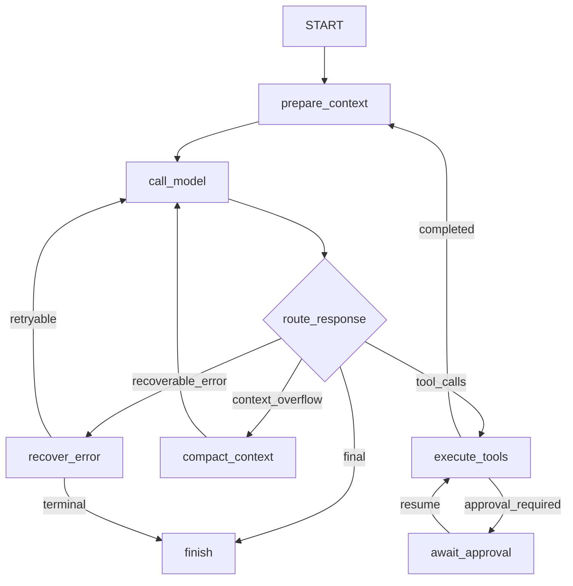

# MiniClaudeCode 设计规格

- 状态：已完成方案讨论，待用户最终审阅
- 日期：2026-07-20
- 项目名：MiniClaudeCode
- Java 包前缀：`dev.miniclaudecode`
- 根 Maven 坐标：`dev.miniclaudecode:mini-claude-code-parent`
- CLI 命令：`miniclaude`

## 1. 项目定位

MiniClaudeCode 是一个面向真实代码工作区的独立 Java 21 单 Agent CLI。它不是聊天机器人演示，也不是对模型 API 的简单封装，而是一个可交互、可执行工具、可审批、可恢复、可扩展并带代码检索能力的 coding agent harness。

项目吸收两个参考项目的长处：

- 借鉴 `DerekYRC/mini-claude-code` 的清晰 Agent 主循环、工具抽象和 Java 工程表达，使核心执行链容易理解、测试和讲解。
- 借鉴 `LiuMengxuan04/MiniCode` 的产品化能力，包括会话、权限、上下文压缩、MCP、Skills、流式交互和恢复机制。
- 使用 Java 生态重新设计，而不是逐文件翻译两个项目。

该项目主要服务于 Java Agent 开发作品集和实习面试展示。评价重点是：状态机设计、模型工具调用、RAG、工程安全、持久化恢复、跨平台能力和可测试性。

### 1.1 v1 目标

v1 必须实现：

1. 使用 LangGraph4j 驱动生产环境的单 Agent 状态图。
2. 使用 LangChain4j 接入 Anthropic、OpenAI-compatible 和 Ollama。
3. 提供 JLine 交互式 CLI、流式输出、Thinking 摘要和斜杠命令。
4. 提供完整的本地 coding tools，并对写操作和高风险行为执行审批。
5. 支持 JSONL 会话事件、LangGraph4j checkpoint 和副作用去重恢复。
6. 支持真实 MCP Client：stdio 和 Streamable HTTP。
7. 支持本地 `SKILL.md` 发现与按需加载。
8. 提供基于 JavaParser、Lucene BM25、向量召回和 RRF 的代码 RAG。
9. 在 Windows、Linux 和 macOS 上运行。
10. 建立覆盖核心行为的自动化测试和三平台 CI。

### 1.2 明确不做

v1 不包含：

- 多 Agent 协作、子 Agent 或任务委派。
- Spring、Spring Boot、Web API、Web UI 或服务端部署。
- 全屏终端 UI。
- 完整 Graph RAG、知识图谱数据库或图谱推理。
- PDF、OCR、图片等通用知识库采集。
- 复杂 Multi-Query、层级 Parent-Child 检索和默认启用的 LLM rerank。
- 依赖高级 `createAgent()` 或类似黑盒封装替代自己的状态图、工具策略和恢复逻辑。

## 2. 核心技术决策

### 2.1 LangGraph4j 是生产运行时

LangGraph4j 不是展示性依赖，也不是可选适配器。所有交互式与非交互式 Agent 请求都必须通过同一张编译后的状态图执行。图负责节点调度、条件路由、暂停审批、checkpoint 和恢复。

业务节点、状态结构、路由条件、错误分类、审批策略和副作用保护由本项目实现。这样既体现框架能力，也保留可解释的 Agent 工程设计。

### 2.2 LangChain4j 是 AI 基础设施

LangChain4j 负责：

- 模型供应商接入与流式 Chat Model。
- 消息、工具调用及响应元数据的适配。
- Thinking/reasoning 摘要能力的供应商适配。
- Embedding Model 接入。
- MCP stdio 与 Streamable HTTP 客户端基础设施。

本项目不会把权限、工具执行、上下文压缩或 Agent 循环隐藏在 LangChain4j 高层 Agent API 后面。

### 2.3 核心不依赖 Spring

全部模块使用构造器注入和显式组装。`agent-cli` 是 composition root，负责读取配置、创建组件并编译状态图。核心模块不依赖 Spring 容器，便于作为普通 Java 程序运行和测试。

### 2.4 RAG 是工具，不是强制图节点

代码检索通过 `code_search` 工具进入 Tool Registry。模型按任务需要主动调用；状态图不在每轮对话前无条件检索。这避免无关上下文和额外延迟，也更符合 coding agent 的工作方式。

## 3. Maven 多模块结构

```text
MiniClaudeCode/
├─ pom.xml
├─ agent-domain/
├─ agent-runtime/
├─ agent-providers/
├─ agent-tools/
├─ agent-rag/
├─ agent-extensions/
├─ agent-persistence/
├─ agent-cli/
└─ docs/
```

模块职责如下：

| 模块 | 职责 |
| --- | --- |
| `agent-domain` | 与框架无关的状态、消息、事件、工具调用、审批、配置值对象及端口接口 |
| `agent-runtime` | LangGraph4j 图定义、节点、路由、轮次控制、上下文预算、错误恢复 |
| `agent-providers` | LangChain4j 模型、Embedding、流事件和 Thinking 的统一适配 |
| `agent-tools` | 内置工具、Tool Registry、路径安全、命令执行、diff 与审批策略 |
| `agent-rag` | 文件发现、JavaParser 分块、Lucene 索引、混合检索、RRF 与评测 |
| `agent-extensions` | MCP Client、远端能力适配、`SKILL.md` 扫描和加载 |
| `agent-persistence` | JSONL Event Store、checkpoint 适配、工具结果存储与执行账本 |
| `agent-cli` | JLine 交互、命令解析、渲染、配置加载、组件组装和发行包 |

依赖方向遵守以下规则：

- `agent-domain` 不依赖其他业务模块。
- 功能模块依赖 `agent-domain` 中的端口，不互相穿透实现细节。
- `agent-runtime` 依赖 LangGraph4j 和所需端口，但不创建具体 Provider 或 CLI。
- `agent-cli` 可以依赖所有实现模块，并负责装配。
- 循环依赖由 Maven Enforcer 阻止。

具体第三方版本在实现计划阶段根据兼容性验证后统一锁定在根 POM 的 `dependencyManagement` 中；禁止使用 SNAPSHOT。

## 4. Agent 状态图

### 4.1 图结构



### 4.2 AgentState

图状态至少包含：

- `sessionId`：会话 ID，同时作为 graph thread ID。
- `turnId`：当前用户轮次。
- `workspace`：规范化后的工作区路径。
- `messages`：当前有效消息视图。
- `pendingToolCalls`：待执行的模型工具调用。
- `toolResults`：本轮产生的工具结果引用。
- `pendingApproval`：等待用户处理的审批请求。
- `contextUsage`：估算或供应商返回的 token 使用情况。
- `retryState`：错误类别、尝试次数和下一次退避信息。
- `status`：运行、等待审批、完成、失败或取消。
- `finalAnswer`：最终展示内容。

状态应尽量使用不可变 record/value object。大文本工具结果不直接反复复制进 checkpoint，而是保存引用和受控预览。

### 4.3 节点职责

- `prepare_context`：加载系统提示、工作区规则、Skills 索引、有效历史、工具结果预览和 token 预算。
- `call_model`：调用统一的流式模型端口，记录文本、Thinking、Tool Call 和 Usage 事件。
- `route_response`：根据结构化模型结果、上下文状态和错误决定下一节点。
- `execute_tools`：从 Tool Registry 查找工具，执行权限判定和副作用账本检查。
- `await_approval`：写入 checkpoint 并暂停图，不占用后台线程等待输入。
- `compact_context`：生成并持久化 compact boundary，更新有效消息视图。
- `recover_error`：执行受限重试、退避或终止策略。
- `finish`：写入最终事件、用量及状态，关闭当前轮次。

### 4.4 一次完整轮次

1. JLine 接收用户输入，写入 JSONL `user_message` 事件。
2. CLI 使用 `sessionId` 启动或恢复 LangGraph4j thread。
3. `prepare_context` 构造本次模型上下文。
4. `call_model` 通过 LangChain4j 流式模型端口发出事件。
5. 若模型直接回答，则进入 `finish`。
6. 若模型请求工具，`execute_tools` 逐个处理。
7. 需要审批时，图在 `await_approval` checkpoint 暂停。
8. CLI 收集用户选择并以审批结果恢复同一 thread。
9. 工具结果写入事件流，然后返回 `prepare_context`，直至完成。

## 5. Provider 与 Thinking

### 5.1 Provider 范围

v1 支持三个 Provider 类型：

- Anthropic：Claude 原生端点。
- OpenAI-compatible：OpenAI，以及 DeepSeek、通义兼容网关等兼容端点。
- Ollama：本地模型。

Provider Profile 支持以下字段：

```yaml
providers:
  work:
    type: openai-compatible
    base-url: https://example.com/v1
    api-key: sk-example
    api-key-env: MINI_CLAUDE_CODE_API_KEY
    model: example-model
    temperature: 0.2
    max-output-tokens: 8192
    thinking: true
    timeout-seconds: 120
    max-retries: 3
active-provider: work
```

`api-key` 与 `api-key-env` 二选一；环境变量优先。用户配置位于 `~/.mini-claude-code/config.yaml`。项目级配置禁止保存明文 Key。

CLI 提供隐藏输入的 `/config set-key`，所有日志、状态、会话和异常输出必须对 Key 及常见鉴权头脱敏。启动时检查配置文件权限并给出风险提示。明文 Key 是用户明确选择的便利性方案，而不是安全默认值的宣称。

### 5.2 统一流事件

Provider Adapter 将不同供应商输出映射为：

- `ProviderThinkingDelta` / `ProviderThinkingCompleted`
- `TextDelta`
- `ToolCallStarted` / `ToolCallDelta` / `ToolCallCompleted`
- `UsageReported`
- `ModelCompleted`
- `ModelFailed`

这样 CLI 不依赖供应商专有响应结构，JSONL 也可以稳定审计。

### 5.3 Thinking 规则

- `/thinking on|off` 控制是否请求并展示 Provider 返回的 thinking/reasoning 摘要。
- 只展示 Provider 明确返回的摘要或 reasoning 字段，不伪造、不要求、不泄露模型隐藏思维链。
- Thinking、Agent 进度和最终答案使用不同的事件和样式。
- 对需要在后续请求中回传的供应商签名、加密块或 reasoning metadata，Provider Adapter 必须无损保存必要字段。
- Provider 不支持 Thinking 时，CLI 明确显示“不支持”，但不影响普通工具调用。

## 6. 工具体系与权限

### 6.1 Tool Contract

每个工具实现统一 `AgentTool` 契约，至少提供：

- 稳定名称和命名空间。
- 描述及 JSON Schema 输入。
- 风险类别和潜在副作用。
- 可取消的执行方法。
- 结构化结果、用户预览和可持久化结果引用。

Tool Registry 聚合内置工具、MCP tools 以及由 Skill 暴露的受控能力。名称冲突必须通过命名空间解决，不允许静默覆盖。

### 6.2 v1 内置工具

- `read`
- `write`
- `edit`
- `apply_patch`
- `list`
- `glob`
- `grep`
- `run_command`
- `todo`
- `ask_user`
- `code_search`
- `web_fetch`

### 6.3 权限模型

默认策略：

- 工作区内普通文件读取自动允许。
- 文件写入、编辑和补丁必须先展示 diff，再审批。
- 工作区外访问必须审批。
- 危险命令、网络访问和敏感文件访问必须审批或被策略拒绝。

审批菜单支持：

- 仅允许本次。
- 本轮或本文件允许。
- 永久允许匹配规则。
- 拒绝。
- 拒绝并向 Agent 提供反馈。

永久规则保存在用户目录 `permissions.json`，规则必须包含工具、作用域和规范化目标，不能只记录过宽的工具名。

### 6.4 文件安全

- 所有路径先相对工作区解析，再执行规范化、真实路径和符号链接检查。
- 对不存在目标的父目录也执行真实路径边界验证。
- 修改审批绑定 `beforeHash` 与 `diffHash`；审批后源文件发生变化必须重新计算并再次审批。
- 写入采用同目录临时文件加原子移动；平台不支持时使用受控降级并保留备份策略。
- 敏感路径如 `.env`、SSH Key、云凭据、配置 Key 自动提升风险等级。

### 6.5 命令安全与跨平台

- 使用 `ProcessBuilder`。
- Windows 选择 PowerShell；Linux/macOS 选择 POSIX shell。
- 命令执行器统一处理 UTF-8、工作目录、环境变量白名单、超时、取消和输出上限。
- 输入保持参数化；必须调用 shell 的命令先进入风险分类，不通过未经验证的字符串拼接构造多层 shell。
- Ctrl+C 取消当前模型请求或子进程，不直接终止整个 CLI。

### 6.6 Web Fetch

- 仅允许 HTTP/HTTPS，拒绝 `file:`、`jar:` 等本地协议。
- 限制重定向次数、响应大小和超时。
- 阻止云元数据地址和明显 SSRF 目标。
- localhost 与私有网络默认需要显式配置或审批。

## 7. RAG 设计

### 7.1 目标

RAG 只解决代码工作区内“找到与当前问题最相关的文件、符号和代码片段”。它强调可解释、可评测和增量更新，不扩展为通用企业知识库。

### 7.2 索引流水线

1. 扫描工作区，并应用 `.gitignore`、默认排除目录和用户配置。
2. 计算文件内容 hash；只处理新增或变化文件，并删除失效文档。
3. Java 文件使用 JavaParser 解析 package、type、method、constructor、field 等符号。
4. Markdown 按标题结构切分。
5. XML、YAML、JSON、properties 按结构或受控长度切分。
6. 其他源码按语言启发式、行数和字符上限回退切分。
7. 为 chunk 生成 embedding，并写入 Lucene 文本与向量字段。

Chunk 元数据至少包含：

- workspace ID
- relative path
- language
- symbol name 与 symbol type
- package/type owner
- start line 与 end line
- content hash
- searchable content
- embedding

索引存储在用户目录的 workspace-hash 下，不污染源码仓库。

### 7.3 混合召回

一次 `code_search` 执行：

1. 使用 Lucene BM25 进行关键词召回。
2. 使用 Lucene 向量检索进行语义召回。
3. 使用 Reciprocal Rank Fusion 合并两个排名。
4. 对精确路径、文件名、符号名和包名匹配施加可解释 boost。
5. 去重并按 token/字符预算返回 top-k 片段。

结果包含路径、符号、行范围、片段、各路排名和融合分数。模型可以据此继续调用 `read` 获取完整上下文。

提供 `Reranker` 接口，但 v1 默认不启用 LLM rerank。可选实现只能消费有限候选，并输出结构化排序结果。

### 7.4 索引生命周期

- 第一次调用 `code_search` 时自动或懒加载建立索引。
- 工作区文件变化触发后台增量更新；检索使用最近一个完整快照。
- `/status` 只显示索引状态、文档数量和最后更新时间，不暴露开发诊断细节。

开发者诊断使用外部子命令：

```text
miniclaude index status
miniclaude index rebuild
miniclaude rag explain "query"
miniclaude rag eval dataset.jsonl
```

不提供 `/index`、`/rag stats` 或 `/rag explain` 斜杠命令，避免把内部机制放进普通对话流程。

### 7.5 RAG 评测

评测数据使用 JSONL，每条包含 query、相关文件/符号/行范围。至少报告：

- Recall@5
- Recall@10
- MRR
- P50/P95 latency
- BM25、vector、hybrid 三种模式对比

这使“混合检索有效”成为可验证结论，而不是演示口号。

### 7.6 Graph RAG 边界

LangGraph4j 是 Agent 工作流状态图；Graph RAG 是把实体关系构造成知识图用于检索，两者不是同一概念。v1 不实现 Graph RAG。未来若有真实需求，可在 JavaParser 索引上增加轻量 symbol graph，例如类继承、方法调用和 import 关系，但不得在 v1 引入图数据库或复杂社区摘要算法。

## 8. MCP 与 Skills

### 8.1 MCP Client

使用 LangChain4j MCP 基础设施支持：

- stdio transport
- Streamable HTTP transport
- tools
- resources
- prompts

每个 server 使用显式配置和命名空间。stdio server 首次启动需要审批，因为它会启动本地进程。远端 MCP 工具不能绕过本地权限策略；工具声明的风险元数据和本地规则共同决定审批。

单个 MCP server 失败必须隔离，不使 Agent 主循环崩溃。大结果写入 tool-result store，只将摘要和引用放入上下文。

### 8.2 SKILL.md

扫描顺序包括：

1. 用户目录 `~/.mini-claude-code/skills/`
2. 项目目录约定位置
3. 兼容 `.claude/skills/`

启动时只把 Skill 名称、描述和位置组成索引注入提示。模型确定需要某个 Skill 后再读取完整 `SKILL.md`，避免所有说明常驻上下文。

Skill 指令不能提升权限。它触发的文件、命令、网络或 MCP 操作仍走统一 Tool Registry 和审批系统。

## 9. 会话、Checkpoint 与恢复

### 9.1 用户数据目录

```text
~/.mini-claude-code/
├─ config.yaml
├─ permissions.json
├─ sessions/<workspace-hash>/<session-id>.jsonl
├─ checkpoints/<session-id>/
├─ tool-results/<session-id>/
├─ indexes/<workspace-hash>/
└─ skills/
```

### 9.2 JSONL Event Store

JSONL 是人可读、可审计的会话事实记录，至少包含：

- user/assistant/thinking message
- model usage
- tool started/result
- approval requested/resolved
- compact boundary
- retry/error
- turn final

每个事件有版本、event ID、session ID、turn ID、时间戳和 payload。读取时允许忽略尾部未完整写入的一行，并报告恢复警告。

### 9.3 Checkpoint

LangGraph4j checkpoint 保存可恢复的执行状态和等待审批位置。checkpoint 不是会话审计日志的替代品：JSONL 记录发生过什么，checkpoint 记录从哪里继续。

### 9.4 工具执行账本

为避免恢复后重复副作用，每个工具调用记录：

- `toolCallId`
- `inputHash`
- `status`
- `riskClass`
- `beforeHash` / `afterHash`（适用时）
- `resultReference`

恢复规则：

- 已完成调用直接复用结果。
- 尚未执行的调用正常执行。
- 被中断的只读调用可以安全重试。
- 文件写入先验证 hash，再决定复用、重试或重新审批。
- 无法确认结果的外部副作用不得自动重放，必须询问用户。

## 10. 上下文管理

只实现两层上下文管理：

1. 确定性清理：把旧的大型工具结果替换为摘要和结果引用，去除重复进度事件，保留最近工具调用/结果对、关键错误和用户约束。
2. LLM compact：达到阈值时生成结构化摘要，保存目标、已做决定、修改文件、失败尝试、未完成事项和恢复线索，并写入 compact boundary。

最近有效对话和重要工具证据必须保留。compact 后的摘要要可检查、可测试，并能从 JSONL 重建有效上下文视图。v1 不实现复杂的多级 context collapse。

## 11. CLI 体验

### 11.1 交互能力

JLine 提供：

- 持久化历史。
- 斜杠命令、Provider、模型、工具名和路径补全。
- 模型文本与 Thinking 的流式渲染。
- 工具调用折叠摘要和 `--verbose` 详情。
- 可键盘选择的审批菜单。
- Ctrl+C 取消当前轮次，空提示符下 Ctrl+D 退出。

JLine 的含义是增强普通终端交互，不是全屏 TUI。

### 11.2 斜杠命令

```text
/help
/status
/provider
/model
/thinking on|off
/tools
/compact
/sessions
/resume
/mcp
/skills
/config
/exit
```

CLI 还提供非交互模式：

```text
miniclaude run "修复当前项目的测试失败"
```

交互模式和非交互模式必须调用同一个 Agent Runtime，不维护两套执行逻辑。

## 12. 错误处理

可重试错误包括 429、502、503、网络超时、空响应，以及部分供应商在 Thinking 场景下的可识别输出上限错误。采用指数退避加 jitter，默认最多三次。

上下文过大不走普通重试，而进入 `compact_context`。鉴权失败、模型不存在和无效配置直接失败并给出可操作提示。

图必须配置每轮最大模型调用数、最大工具调用数和总时限，防止无休止循环。用户取消是正常终止状态，不记录为内部异常。

## 13. 测试与质量门禁

### 13.1 Runtime 单元测试

- final answer 路由。
- tool call 循环。
- Thinking/Text/Tool 事件顺序。
- context overflow 与 compact。
- retry 分类与最大步数。
- 用户取消和终止状态。

### 13.2 工具与安全测试

- 路径穿越、符号链接和工作区边界。
- diff 生成、审批 hash 绑定和并发修改。
- 命令超时、取消、输出截断和平台选择。
- 原子写入及失败回滚。
- Web SSRF 和协议限制。

### 13.3 持久化与恢复测试

- JSONL 尾部损坏恢复。
- compact boundary 重建。
- checkpoint 暂停与恢复。
- 工具账本去重。

核心场景使用 `FakeModelClient`：

```text
用户请求
 -> code_search
 -> read
 -> edit
 -> 暂停等待审批
 -> 用户允许
 -> 执行 edit
 -> 运行测试
 -> final answer
```

必须断言：图节点顺序正确、审批前文件未变化、恢复后只执行一次、JSONL 事件顺序正确、会话最终完成。

### 13.4 RAG 测试

使用小型 Java fixture 验证：

- JavaParser chunk 和行号正确。
- 文件 hash 增量更新与删除同步。
- BM25/vector/hybrid 排名可复现。
- hybrid 相对关键词基线的召回表现。
- 评测指标和延迟输出。

单元测试使用 deterministic `FakeEmbeddingModel`；真实 embedding 只作为可选集成测试。

### 13.5 集成与 CLI 测试

- 使用 MockWebServer 或 WireMock 模拟流式响应、Thinking、Tool Call、429 和错误响应。
- 启动本地测试 MCP stdio server 验证发现、调用、超时和断连。
- 非交互 CLI 做端到端测试；JLine 重点测试命令解析、补全和 Ctrl+C 行为。

### 13.6 工程质量

- JUnit 5、AssertJ、Mockito、Awaitility。
- JaCoCo 核心模块目标覆盖率不低于 75%，以行为覆盖为优先。
- Spotless、SpotBugs、Maven Enforcer。
- GitHub Actions 在 Java 21 的 Windows、Ubuntu、macOS 上执行构建和测试。

## 14. 验收标准

v1 达到以下条件才视为完成：

1. `mvn verify` 在 Java 21 下通过。
2. 三平台 CI 通过。
3. Anthropic、OpenAI-compatible、Ollama 至少各有配置示例和适配测试；真实联网 smoke test 可由用户凭据手动运行。
4. 单 Agent 能在真实小型 Java 项目中检索、读文件、提出补丁、等待审批、修改并运行测试。
5. 中断于审批点后，重启 CLI 可以恢复，且已完成工具不重复执行。
6. `/thinking on|off` 行为明确，并正确处理不支持的 Provider。
7. MCP stdio 与 Streamable HTTP 均可配置，MCP 工具不能绕过审批。
8. `SKILL.md` 能被发现、索引和按需加载。
9. RAG 支持增量索引、BM25/vector/RRF，并能运行可重复的 eval 数据集。
10. API Key 不出现在普通日志、JSONL、异常堆栈或 `/status` 中。
11. README 提供架构图、快速开始、安全说明、RAG 评测示例和面试可讲解的设计取舍。

## 15. 实现顺序建议

后续实现计划应按可验证的纵向切片拆分，而不是先把所有模块空壳铺满。建议顺序：

1. Maven 基线、domain contracts 和最小 LangGraph4j text-only loop。
2. Provider 流式事件和 Thinking 适配。
3. Tool Registry、只读工具、写入 diff 与审批暂停/恢复。
4. JSONL、checkpoint 和工具执行账本。
5. JLine 交互及会话命令。
6. JavaParser + Lucene 混合 RAG 和评测 CLI。
7. MCP 与 Skills。
8. 跨平台加固、完整错误恢复、CI、发行包和文档。

每个切片都必须先写行为测试，再实现，并保持主链路可运行。

## 16. 设计取舍总结

本设计有意选择“一个做深的单 Agent”而不是功能数量：LangGraph4j 展示可恢复工作流，LangChain4j 展示 Java AI 集成，Lucene 混合 RAG 展示可解释检索，审批与工具账本展示真实 Agent 的安全和一致性问题。完整 Graph RAG、多 Agent 和 Web 服务都会稀释主线，因此不进入 v1。
