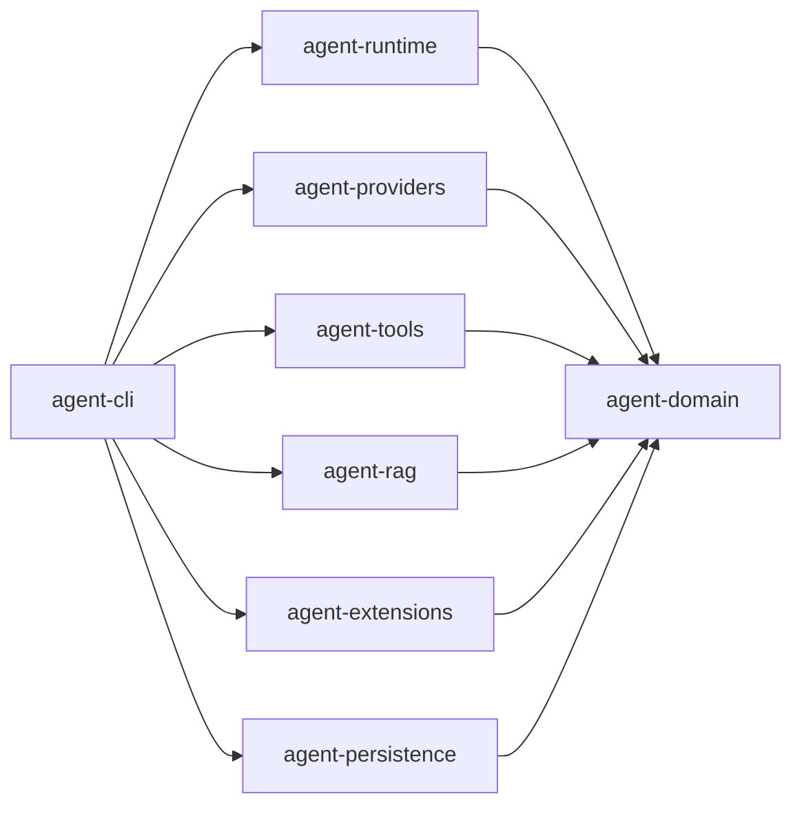

# MiniClaudeCode 代码教程：总览与阅读路线

这是一套面向"第一次打开这个仓库"的读者的分章教程：每章先给出该看哪些文件、再逐类讲每个方法做什么、参数是什么意思，并用箭头调用链标出跳转路径。目标是让你既能自上而下理解设计，也能在 IDE 里照着断点走通真实执行。

阅读前置：会 Java；能跑 `.\mvnw.cmd clean verify`（Windows）或 `./mvnw clean verify`。仓库大部分源码由字节码反编译恢复，个别写法怪异但语义正确，教程只讲语义。

## 章节总表

| 章 | 主题 | 模块 | 一句话 |
|---|---|---|---|
| [01](01-boot-and-wiring.md) | 启动与组装 | agent-cli | 从 `java -jar` 到 REPL 提示符：picocli 命令、composition root、读循环 |
| [02](02-domain-model.md) | 领域模型 | agent-domain | 全项目的公共词汇表：消息、工具、审批、事件、会话，零第三方依赖 |
| [03](03-turn-lifecycle.md) | 轮次生命周期 | agent-cli | 一次输入如何变成一次 turn：提交、流式渲染、审批暂停/恢复、取消 |
| [04](04-agent-graph.md) | 状态图引擎 | agent-runtime | 全仓库的心脏：LangGraph4j 状态图、8 个节点、路由规则、三个有界循环 |
| [05](05-model-providers.md) | 模型接入层 | agent-providers | 一个 `ModelClient` 抽象统一三家：回调→Flow 桥接、错误分类、脱敏 |
| [06](06-tools-read-write.md) | 工具系统：读与写 | agent-tools | 路径安全、只读四件套、写路径的 diff 预览→审批→原子替换模板 |
| [07](07-approval-risk-sandbox.md) | 审批·风险·沙箱 | agent-tools | 安全三层：TOCTOU 绑定的审批、命令风险分级、OS 级沙箱、SSRF 防护 |
| [08](08-persistence-and-config.md) | 持久化与配置 | agent-persistence | 目录布局、配置合并、JSONL 审计、账本、checkpoint、会话恢复 |
| [09](09-rag-indexing.md) | RAG 上篇：索引 | agent-rag | 扫描→指纹→AST 分块→Lucene 写入，增量与全量重建的判定 |
| [10](10-rag-search-and-eval.md) | RAG 下篇：检索 | agent-rag | BM25 + 向量 KNN → RRF 融合 → token 预算裁剪 → 评测指标 |
| [11](11-mcp-and-skills.md) | 扩展：MCP 与 Skills | agent-extensions | 外部工具接入的信任模型与按需加载的技能文本 |
| [12](12-end-to-end-walkthrough.md) | 全链路走读 | 全部 | 一个请求从按键到答案的完整调用链 + 断点地图 |

## 模块依赖方向

`agent-domain` 无第三方依赖，是所有模块的公共语言（第 02 章）；`agent-cli` 是唯一的 composition root（第 01 章），其余模块互不依赖。

## 三条阅读路线

**最短理解线（约 4 章）**：01 → 02 → 04 → 12。看完你就知道这个 agent 怎么转、在哪转、为什么停得下来。

**完整线**：按章号顺读 01 → 12。每章末尾的「下一章」就是这条线的衔接。

**按兴趣跳读**：
- 只关心"agent 循环怎么写" → 02、04、05
- 只关心"工具与安全怎么做" → 02、06、07
- 只关心"崩溃恢复与审计" → 02、03、08
- 只关心"代码检索/RAG" → 09、10
- 要接 MCP 或写 Skill → 02、11

## 本教程的约定

- 文件引用一律是 repo 相对路径，`文件#方法` 表示跳转目标（IDE 里 Ctrl+点击 或 Ctrl+Shift+N 搜文件名）。
- 每个类用「一句话定位 + 方法表（方法 | 参数 | 做什么）」讲解；跨章内容用「参见 XX.md」指出，不重复展开。
- 与设计文档的分工：`docs/architecture.md` 讲宏观决策，`docs/security.md` 讲威胁模型，`docs/adr/` 讲选型理由；本教程讲**代码本身**——想知道"为什么这么设计"看前者，想知道"这行代码在干嘛、从哪跳到哪"看这里。

## 建议的第一小时

1. 跑一次 `.\mvnw.cmd clean verify`，确认环境完好。
2. 读 01 章，对照打开 `MiniClaudeCode.java` 和 `WorkspaceComponents.java`。
3. 读 04 章的 mermaid 图，把 8 个节点名记住。
4. 跳到 12 章，在 `ResponseRouter#routeAfterModel` 打断点，真实跑一条 `run` 命令单步走一圈。
