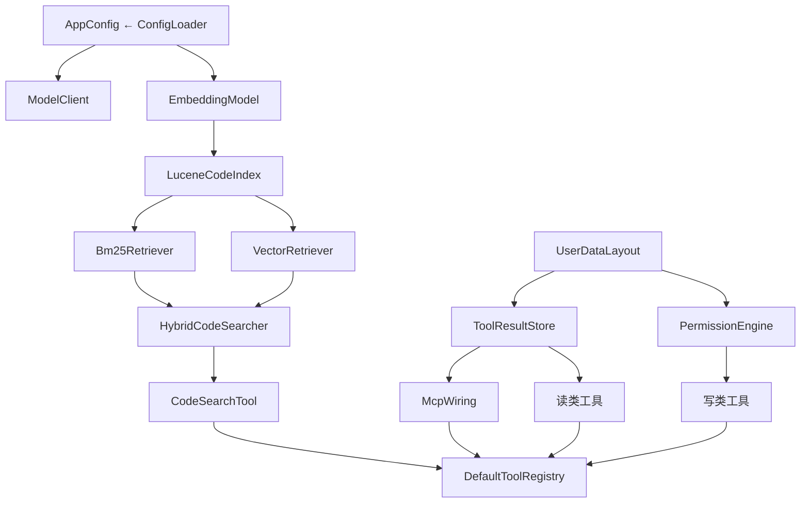

# 01 · 启动与组装：main 到 REPL

本章讲 MiniClaudeCode 从 `java -jar` 启动到出现交互式提示符 `> ` 之间发生的所有事情：picocli 如何把命令行参数路由到动作、`DefaultCliActions` 如何充当所有入口的汇合点、`WorkspaceComponents.create` 这个 composition root 按什么顺序把几十个组件组装起来，以及 `Repl` 的读循环怎样把用户输入分发给斜杠命令或模型轮次。它排在第一章，是因为这条链路会点到仓库里几乎每一个模块——读完本章，你就有了一张跳转地图，后面各章都是沿着这张图往深处走。轮次内部的执行细节（状态图、流式渲染、审批恢复）这里只点到为止，参见 03-turn-lifecycle.md。

## 本章文件

按建议阅读顺序（均为 repo 相对路径）：

1. `agent-cli/src/main/java/dev/miniclaudecode/cli/MiniClaudeCode.java`
2. `agent-cli/src/main/java/dev/miniclaudecode/cli/CliActions.java`
3. `agent-cli/src/main/java/dev/miniclaudecode/cli/commands/RunCommand.java`
4. `agent-cli/src/main/java/dev/miniclaudecode/cli/commands/IndexCommand.java`
5. `agent-cli/src/main/java/dev/miniclaudecode/cli/commands/RagCommand.java`
6. `agent-cli/src/main/java/dev/miniclaudecode/cli/commands/ConfigCommand.java`
7. `agent-cli/src/main/java/dev/miniclaudecode/cli/app/DefaultCliActions.java`
8. `agent-cli/src/main/java/dev/miniclaudecode/cli/app/WorkspaceComponents.java`
9. `agent-cli/src/main/java/dev/miniclaudecode/cli/Repl.java`
10. `agent-cli/src/main/java/dev/miniclaudecode/cli/ReplHeader.java`
11. `agent-cli/src/main/java/dev/miniclaudecode/cli/commands/SlashCommand.java`
12. `agent-cli/src/main/java/dev/miniclaudecode/cli/SlashCommandParser.java`
13. `agent-cli/src/main/java/dev/miniclaudecode/cli/SlashCommandHandler.java`
14. `agent-cli/src/main/java/dev/miniclaudecode/cli/SessionCommandHandler.java`
15. `agent-cli/src/main/java/dev/miniclaudecode/cli/AgentCompleter.java`

## MiniClaudeCode：picocli 根命令

`MiniClaudeCode` 是 `@Command(name = "miniclaude")` 标注的根命令，也是整个程序的 main class；不带子命令直接运行时进入交互式 REPL。它自己不做任何业务，全部委托给构造时注入的 `CliActions`。

| 方法 | 参数 | 做什么 |
|---|---|---|
| `main` | `args`：原始命令行参数 | 用 `new DefaultCliActions()` 构造根命令，`commandLine().execute(args)` 交给 picocli 解析并执行，退出码传给 `System.exit` |
| `commandLine` | 无 | 构造 `CommandLine` 并注册四个子命令：`config`、`run`、`index`、`rag`，每个都注入同一个 `actions` |
| `call` | 无（`workspace` 来自 `-w/--workspace` 选项，默认 `.`） | 没有匹配到子命令时被 picocli 调用，转发到 `actions.interactive(workspace)` 进入 REPL |

## 四个子命令：只做参数收集

四个子命令类结构完全同构：持有 `CliActions`，用 picocli 注解声明参数，`call()` 一行转发。它们是"命令行语法层"，语义全在 `DefaultCliActions`。

| 类 | 参数 | 做什么 |
|---|---|---|
| `RunCommand` | `-w/--workspace`：工作区路径，默认 `.`；`PROMPT`（`arity = "1..*"`）：提示词分片，空格拼接 | 单次非交互执行一个 agent 提示，转发 `actions.run(workspace, prompt)` |
| `IndexCommand` | `-w/--workspace` 同上 | 构建或增量更新 Lucene 代码索引，转发 `actions.index(workspace)` |
| `RagCommand` | `-w/--workspace` 同上；`MODE_OR_QUERY`（`1..*`）：查询词或 `explain`/`stats`/`eval` 子模式 | 检索诊断，转发 `actions.rag(workspace, query)`，模式区分在 actions 内部做 |
| `ConfigCommand` | 无 | 启动交互式 provider 配置向导，转发 `actions.configure()` |

## CliActions：入口动作的抽象

`CliActions` 是一个五方法接口，存在的意义是让命令类可以脱离真实组装被单元测试。方法与上表一一对应：`configure()`、`interactive(Path)`、`run(Path, String)`、`index(Path)`、`rag(Path, String)`，全部返回 `int` 退出码。

## DefaultCliActions：每个动作的真实实现

`DefaultCliActions` 是 `CliActions` 的生产实现，持有四样跨动作共享的资源：`UserDataLayout`（用户目录布局，参见 08-persistence-and-config.md）、不可变 `environment` 快照、`output`/`error` 两个 UTF-8 `PrintWriter`。公开无参构造器用系统默认值填充；包私有构造器供测试注入。

| 方法 | 参数 | 做什么 |
|---|---|---|
| `configure` | 无 | 建一个 JLine `Terminal` + `LineReader`，运行 `ConfigurationWizard`（由 `configurationWizard()` 私有方法基于 `layout.configFile()` 构造），打印结果 |
| `interactive` | `workspace`：REPL 工作区根目录 | 本章主线。创建 `WorkspaceComponents` → 组装 `ApplicationSession` 与 `SessionCommandHandler` → 建终端和 `AgentCompleter` → `Repl.create(...).withHeader(...).run()`，全程 try-with-resources 保证组件关闭 |
| `run` | `workspace` 同上；`prompt`：完整提示词 | 非交互执行一轮：构造 `ApplicationSession`，`start(prompt, ...)` 后 `join()` 等结果；若轮次停在审批请求上，打印 `reason()` 与 `target()` 并返回退出码 3（无人可批） |
| `index` | `workspace` | `components.codeIndex().synchronize(workspace)` 后打印 `UpdateReport` 各计数，参见 09-rag-indexing.md |
| `rag` | `workspace`；`query`：查询串 | 先 `synchronize` 索引，再按前缀分派：`stats` 打印 `IndexStats`；`eval <jsonl>` 走 `evaluate`；`explain <q>` 打印 `response.explain()`；否则打印检索结果。参见 10-rag-search-and-eval.md |

私有辅助方法合并简述：`components(workspace)` 调 `WorkspaceComponents.create`，并把环境变量 `MINICLAUDE_FAKE_RESPONSE` 作为 `Optional` 传入（存在时全程用假模型，供端到端测试）；`evaluate` 用 `RagEvaluator` 对 bm25/vector/hybrid 三条检索路线在同一 top-k 下对比（常量 `EVAL_TOP_K` 等的注释解释了为什么必须对齐）；`renderNonInteractive` 把 `RenderEvent` 的五种子类型映射到 stdout/stderr；`failed` 统一打印异常并返回 2；`selection` 与 `toolNames`、`skills` 是给 `interactive` 用的小型取值函数。

`interactive` 里有一处值得单独看的接线：`SessionCommandHandler` 需要 `session` 提供的回调，而 `ApplicationSession` 又需要读 `SessionCommandHandler` 上的当前 provider/model 选择——循环依赖用一个 `AtomicReference` 解开：

```java
AtomicReference<SessionCommandHandler> commands = new AtomicReference<>();
ApplicationSession session =
    new ApplicationSession(
        components, () -> selection(commands.get(), components), Clock.systemUTC());
SessionCommandHandler commandHandler = new SessionCommandHandler(/* session::status 等回调 */);
commands.set(commandHandler);
```

`selection` 在 `commands.get()` 仍为 null 时（理论上仅构造期间）回退到配置文件里的 `activeProfile()`。`ApplicationSession` 实现了 `Repl.TurnHandler`，是轮次执行的入口，参见 03-turn-lifecycle.md。

## WorkspaceComponents：composition root

`WorkspaceComponents` 是轻量的 composition facade：包私有、`AutoCloseable`，字段只读持有。静态工厂 `create` 只负责编排四个 wiring factory——`ModelWiringFactory`、`RagWiringFactory`、`ExtensionWiringFactory`、`ToolWiringFactory`——不再亲自构造几十个实现。四个 CLI 动作（`interactive`/`run`/`index`/`rag`）各自创建并关闭一份。

`create(requestedWorkspace, layout, environment, fakeResponse)` 的构造顺序，也就是依赖方向：

1. `workspace.toRealPath()` 并校验是目录；
2. `ConfigLoader().load(...)` 合并用户级 `layout.configFile()` 与项目级 `.mini-claude-code/config.yaml` 得到 `AppConfig`（参见 08-persistence-and-config.md）；
3. `ModelClient`：`fakeResponse` 存在则 `StaticResponseModelClient`，否则 `RoutingModelClient(config.providers(), environment, new ProviderFactory())`（参见 05-model-providers.md）；
4. `ToolResultStore`（按 `layout.workspaceHash(workspace)` 分目录）、`WorkspacePathResolver`、`JsonPermissionRuleStore` + `PermissionEngine`（参见 07-approval-risk-sandbox.md）；
5. `RagWiringFactory` 依配置选择 `AUTO` / `FAST` / `REMOTE`；语义检索推荐使用 OpenAI-compatible Embedding API，未配置远端时 `AUTO` 使用无模型依赖的 `FAST` 兜底，据此构造 `LuceneCodeIndex`、`Bm25Retriever`、`VectorRetriever`、`HybridCodeSearcher`（参见 09/10 两章）；
6. `ExtensionWiringFactory` 发现 `SkillCatalog` 并隔离 MCP 连接故障（参见 11-mcp-and-skills.md）；
7. 组装工具清单：`ReadTool`/`ListTool`/`GlobTool`/`GrepTool`（只读）、`WriteTool`/`EditTool`/`ApplyPatchTool`（走 `PermissionEngine`）、`RunCommandTool`（内含 `CommandSandbox.detect` 选 OS 沙箱 + `ProcessRunner`）、`WebFetchTool`、`PlanningRequestTool`、`AskUserTool`、`CodeSearchTool`、`LoadSkillTool`，再追加全部 MCP 工具，装进 `DefaultToolRegistry`（参见 06-tools-read-write.md）；
8. 汇总 `secrets` 集合：所有 provider 与 embedding 配置解析出的 API key，供审计日志脱敏（源码注释强调漏一个 key 就会明文落盘）。



`ExtensionWiringFactory` 保证任何 MCP 故障都不能阻止 agent 启动——异常时先关掉半成品 `McpManager`（避免孤儿 stdio 子进程），再降级为零 MCP 工具并把原因塞进 `ConnectReport.failures()`，让 `/mcp` 能看到；`WorkspaceComponents.create` 的 try/catch 同理，扩展接线之后任何工具构造失败都会先 `extensions.close()` 再抛出。实例方法多为访问器（`workspace()`、`config()`、`tools()`、`searcher()` 等）；`mcpStatus()` 汇总连接、遮蔽和失败原因；`close()` 关闭 `mcpManager`。

## Repl：读循环与分发

`Repl` 是交互层的主循环：从 JLine `LineReader` 读一行，判定是斜杠命令还是模型轮次，分发后回到提示符。它对轮次的全部认知收敛在自己定义的 `TurnHandler` 接口上（`start`/`resume` 返回 `CompletionStage<TurnOutcome>`，外加 `pendingApproval` 两个 default 方法），生产实现是 `ApplicationSession`。

| 方法 | 参数 | 做什么 |
|---|---|---|
| `create`（静态） | `terminal`：JLine 终端；`historyFile`：历史文件路径（父目录会被创建）；`completer`：Tab 补全器；`commandHandler`：斜杠命令处理器；`turnHandler`：轮次处理器；`configurationHandler`（可选重载）：`/config setup` 的实现 | 构建 `LineReader`（绑定历史文件、关闭 `!` 事件展开）、`StreamingRenderer`、`ApprovalMenu`，装配出 `Repl` |
| `withHeader` | `lines`：已渲染好的头部行 | 记录启动横幅，返回 `this` 链式调用 |
| `run` | 无 | 主循环：注册 SIGINT 处理器（取消 `activeTurn` 里的令牌而非杀进程）→ 打印头部 → 循环 `readInput`；空行跳过、`/exit` 退出、斜杠走解析分发、其余走 `executeTurn`；finally 里恢复原信号处理器并保存历史 |
| `prompt` | 无 | 返回青色加粗的 `> ` 提示符 ANSI 串 |

私有方法合并简述：`readInput` 把 `UserInterruptException`（Ctrl-C）映射为"取消当前轮次并给新提示符"，`EndOfFileException`（Ctrl-D）映射为退出循环；`executeTurn` 创建 `CancellationToken`，`await` 轮次结果，只要 `TurnOutcome.approvalRequest()` 非空且未取消，就打印 `approvalPreview`、弹 `ApprovalMenu`、用决定 `resume`——细节参见 03-turn-lifecycle.md 与 07-approval-risk-sandbox.md；`resumePendingApprovalIfPresent` 在每条斜杠命令执行完后检查 `turnHandler.pendingApproval()`，让"审批等待中途去敲了条斜杠命令"的用户能回到审批菜单；`await` 委托 `renderer.renderUntil(stage, RENDER_POLL_INTERVAL)` 边等边渲染流式事件。

`run()` 里斜杠分发有一个特判：`SlashCommand.Config` 且 `setup()` 为 true 时不走 `commandHandler`，而是走注入的 `ConfigurationHandler`（`DefaultCliActions` 传入的 lambda `reader -> this.configurationWizard().run(reader)`），因为配置向导需要直接占用 `LineReader` 做掩码输入。

嵌套类型：`TurnOutcome` 记录一轮的落点——`completed()` 表示正常结束，`waitingFor(request, preview)` 表示停在审批上；`ConfigurationHandler` 是 `String configure(LineReader)` 的函数式接口。

## ReplHeader：启动横幅

`ReplHeader` 是纯静态工具类，只有一个公开方法。`render(terminal, provider, model, thinking, workspace)` 用 JLine `AttributedStringBuilder` 拼四行内容（标题、provider·model·thinking 状态、工作区路径、帮助提示），按最宽一行计算框宽，输出带 `┌─┐│└┘` 边框的 ANSI 字符串列表；私有 `boxed` 负责单行的左右边框与补齐。`DefaultCliActions.interactive` 把渲染结果经 `Repl.withHeader` 注入。

## 斜杠命令四件套

**`SlashCommand`**（sealed interface）：斜杠命令的类型化词汇表，13 个 record 实现：`Help`、`Status`、`Usage`、`Provider(Optional<String> profile)`、`Model(Optional<String> model)`、`Thinking(boolean enabled)`、`Tools`、`Compact`、`Sessions`、`Resume(String sessionId)`、`Mcp`、`Skills`、`Config(boolean setup)`。带参 record 的紧凑构造器做 trim/非空校验（私有静态 `normalized`/`requireText`）。

**`SlashCommandParser`**：文本 → `SlashCommand`。`isSlashCommand(input)` 只看去前导空白后是否以 `/` 开头；`parse(input)` 按空白切词、取首词小写后 switch 到对应 record，私有辅助 `noArguments`/`optionalArgument`/`requiredArgument`/`parseThinking`/`parseConfig` 统一做参数个数校验，错误一律抛 `IllegalArgumentException`（被 `Repl.run` 捕获转成 `RenderEvent.Error` 显示，不会杀死循环）。

**`SlashCommandHandler`**：`String execute(SlashCommand)` 单方法函数式接口，`Repl` 对命令语义的唯一依赖。

**`SessionCommandHandler`**：生产实现，同时是会话内可变状态（`activeProvider`/`activeModel`/`thinking`）的持有者——`/provider`、`/model`、`/thinking` 改的就是这三个字段，`ApplicationSession` 每轮开始时经 `DefaultCliActions.selection` 读回去。所有方法 `synchronized`。

| 方法 | 参数 | 做什么 |
|---|---|---|
| 构造器 | `providerModels`：provider → 模型列表；`activeProvider`/`activeModel`/`thinking`：初始选择（校验必须在表内）；`tools`：工具名集合；`sessionStatus`/`usage`/`sessions`/`mcp`/`skills`：五个惰性取值 `Supplier`；`compact`：压缩会话的 `Runnable`；`resume`：按 id 恢复会话的 `Consumer`；`configFile`：`/config` 要显示的路径 | 全部防御性拷贝并判空后存字段 |
| `execute` | `command`：已解析的 `SlashCommand` | switch 穷举分派：静态文本（`Help`）、本地状态读写（`Status`/`Provider`/`Model`/`Thinking`/`Tools`）、回调转发（`Usage`/`Sessions`/`Mcp`/`Skills`/`Compact`/`Resume`）；`Config(setup=true)` 返回提示文本，因为真正的向导在 `Repl` 层被特判拦走 |
| `activeProvider` / `activeModel` / `thinkingEnabled` | 无 | 读当前选择，供每轮 `TurnSelection` 与 `AgentCompleter` 使用 |

私有方法合并简述：`status` 拼本地状态加 `sessionStatus.get()`；`provider`/`model` 无参时列出可选项、有参时校验并切换（切 provider 时若旧模型不在新列表里自动落到 `getFirst()`）；`requireModel` 校验模型属于 provider；`sorted` 排序拼接集合。

## AgentCompleter：Tab 补全

`AgentCompleter` 实现 JLine `Completer`，让 REPL 的 Tab 键有上下文感知。构造参数：`workspace`（`@` 路径补全的根）、`providers`/`models`/`tools` 三个 `Supplier`（惰性取值，`models` 跟随 `commandHandler.activeProvider()` 动态变化）。`complete(reader, line, candidates)` 的规则：首词以 `/` 开头补 `SLASH_COMMANDS` 常量表（14 项，含 `/exit`）；首词是 `/provider`、`/model`、`/thinking`、`/config` 时分别补 provider 名、模型名、`on|off`、`setup`；其余位置上 `@` 前缀走 `completePath`（`Files.walk` 深度 4、上限 100 个候选、统一 `/` 分隔符），否则补工具名。`completePath` 对 IO 异常静默——补全永远是尽力而为。

## 启动调用链总图

交互式启动（本章主线）：

`MiniClaudeCode.main()` → `CommandLine.execute()`（picocli）→ `MiniClaudeCode.call()`（均在 MiniClaudeCode.java）→ `DefaultCliActions.interactive()`（DefaultCliActions.java）→ `WorkspaceComponents.create()`（WorkspaceComponents.java）→ `Repl.create().withHeader().run()`（Repl.java）

REPL 内两条分发路径：

- 斜杠：`Repl.run()`（Repl.java）→ `SlashCommandParser.parse()`（SlashCommandParser.java）→ `SessionCommandHandler.execute()`（SessionCommandHandler.java）
- 轮次：`Repl.run()` → `Repl.executeTurn()`（Repl.java）→ `TurnHandler.start()` = `ApplicationSession.start()`（app/ApplicationSession.java，参见 03-turn-lifecycle.md）

子命令路径同构：`miniclaude run|index|rag|config` → 对应 Command 类 `call()`（commands/ 目录）→ `DefaultCliActions` 同名方法。

## 下一章

组件都就位了，但 agent 用什么"词汇"思考——消息、工具调用、审批请求这些核心类型长什么样，请看 02-domain-model.md。
