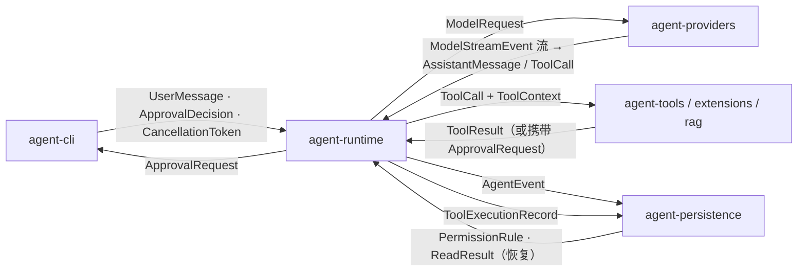

# 02 领域模型：agent 的词汇表

`agent-domain` 只用 JDK，定义消息、工具、审批、事件、会话和取消等稳定领域类型。
与模型厂商无关的 `ModelClient`、`ModelRequest`、`ModelStreamEvent` 与输出协议类型已物理
拆到 `agent-model-api`；Java 包名仍保持 `dev.miniclaudecode.domain.model`，避免消费者
承担无意义的包名迁移。Runtime 不认识 LangChain4j，Providers 不认识终端，两者只交换
这些端口类型。

## 本章文件

按建议阅读顺序；除第 3 项位于 `agent-model-api` 外，其余均在
`agent-domain/src/main/java/dev/miniclaudecode/domain/` 下：

1. `message/AgentMessage.java`
2. `tool/ToolCall.java`、`tool/ToolResult.java`、`tool/ToolDescriptor.java`、`tool/AgentTool.java`
3. `agent-model-api/.../model/ModelRequest.java`、`ModelStreamEvent.java`、
   `ModelClient.java`、`OutputProtocolType.java`
4. `approval/RiskLevel.java`、`approval/ApprovalRequest.java`、`approval/ApprovalDecision.java`、`approval/PermissionRule.java`、`approval/PermissionRuleStore.java`
5. `event/AgentEventType.java`、`event/AgentEvent.java`、`event/EventSink.java`
6. `session/SessionId.java`、`session/TurnId.java`、`session/AgentStatus.java`、`session/SessionEventStore.java`
7. `tool/ToolExecutionRecord.java`、`tool/ToolExecutionLedger.java`
8. `runtime/CancellationToken.java`

先说一个贯穿全包的写法：`Optional` 不可序列化，所以凡是带 `Optional` 字段的可序列化 record（`AssistantMessage`、`ToolResult`、`ToolExecutionRecord`、`ApprovalRequest`、`ApprovalDecision`）都内嵌一个私有 `SerializedForm` record——`writeReplace()` 把 `Optional` 拆成可空 String 写出，`readResolve()` 读回时用 `Optional.ofNullable` 重建。后文不再重复。另外几乎每个 record 的紧凑构造器都做同一件事：`requireText` 校验非空并 trim、`List.copyOf`/`Map.copyOf` 做防御性拷贝，表格里也不再逐一列出。

## 消息：AgentMessage

`AgentMessage` 是 sealed 接口，对话历史的原子单位，只有一个方法 `text()`。四种实现对应对话中的四个角色：

| 子类型 | 字段 | 含义 |
|---|---|---|
| `SystemMessage` | `text` | 系统提示词。由 agent-cli 组装时生产（参见 01-boot-and-wiring.md），providers 消费。 |
| `UserMessage` | `text` | 用户在 REPL 输入的一行。agent-cli 生产，runtime 追加进历史。 |
| `AssistantMessage` | `text`、`thinking`（`Optional<String>`，空白会被归一成 empty）、`toolCalls`（`List<ToolCall>`）、`providerMetadata` | 模型的一次完整回复。由 agent-runtime 从模型事件流聚合而成（详见 04-agent-graph.md）；`toolCalls` 非空就意味着本轮还要执行工具。另有省略 `toolCalls` 的三参便捷构造器。 |
| `ToolMessage` | `toolCallId`、`qualifiedToolName`、`text`、`error` | 工具执行结果回填给模型的消息。runtime 由 `ToolResult` 转换而来，`toolCallId` 与对应 `ToolCall` 配对。 |

流向：agent-cli 与 agent-runtime 生产，`List<AgentMessage>` 装进 `ModelRequest` 交给 agent-providers；agent-persistence 通过事件负载持久化它们用于会话恢复（参见 08-persistence-and-config.md）。

## 工具四件套

### ToolCall（`tool/ToolCall.java`）

模型发起的一次工具调用请求，纯数据。字段：`toolCallId`（provider 分配的唯一 id，贯穿结果、审批、台账全程）、`qualifiedName`（形如 `workspace:read_file`，见 ToolDescriptor）、`argumentsJson`（原样 JSON 字符串——domain 层不解析 JSON，解析留给各工具自己做）。生产者是 agent-providers（从流式事件拼出），消费者是 agent-runtime 的执行节点和各工具实现。

### ToolResult（`tool/ToolResult.java`）

工具执行的统一返回值。

| 方法/字段 | 说明 |
|---|---|
| `toolCallId` | 回指发起它的 `ToolCall`。 |
| `status` | 枚举 `Status`：`COMPLETED` 正常完成；`FAILED` 执行出错；`CANCELLED` 被取消（用户 Esc 或 token 触发）；`APPROVAL_REQUIRED` 工具拒绝执行、要求先走审批（此时 `metadata` 里携带 `ApprovalRequest`，参见 07-approval-risk-sandbox.md）。 |
| `summary` | 给模型看的文本摘要，必填。 |
| `resultReference` | `Optional<String>`，大输出落盘后的引用（如文件路径），避免把全文塞进对话。 |
| `metadata` | 附加键值，如审批请求、哈希。 |
| `isError()` | 仅当 `status == FAILED` 返回 true——`APPROVAL_REQUIRED` 不算错误。 |

生产者是 agent-tools / agent-extensions / agent-rag 里的工具实现，消费者是 agent-runtime（转成 `ToolMessage`）和 agent-cli（渲染）。

### ToolDescriptor（`tool/ToolDescriptor.java`）

工具的静态自描述，模型据此决定调什么。字段：`namespace` 与 `name`（都要匹配正则 `[A-Za-z0-9_.-]+`）、`description`、`inputSchemaJson`（JSON Schema 字符串）、`baseRisk`（`RiskLevel`，该工具的风险底线）。唯一的方法 `qualifiedName()` 返回 `namespace + ":" + name`，这个字符串就是 `ToolCall.qualifiedName`、`ToolMessage.qualifiedToolName`、`PermissionRule.qualifiedToolName` 共用的主键。生产者是每个工具的 `descriptor()`；消费者有两个方向：装进 `ModelRequest.tools` 发给模型，以及审批层读 `baseRisk`。

### AgentTool（`tool/AgentTool.java`）

所有工具的统一接口，也是 06/11 章一切工具实现的契约。

| 方法 | 参数 | 做什么 |
|---|---|---|
| `descriptor()` | 无 | 返回该工具的 `ToolDescriptor`。 |
| `execute(call, context)` | `call`：本次 `ToolCall`；`context`：`ToolContext` | 异步执行，返回 `CompletionStage<ToolResult>`。约定不抛异常，失败也包成 `FAILED` 结果。 |

内嵌 record `ToolContext` 是执行环境：`sessionId` / `turnId` 标识当前会话与轮次；`workspace`（构造时强制 `toAbsolutePath().normalize()`，工具的路径越界检查以它为根）；`eventSink` 让工具在执行中途发进度事件；`attributes` 是执行器塞入的扩展位（例如取消令牌、审批回调）。实现方在 agent-tools、agent-extensions（MCP/Skills 适配）、agent-rag（`CodeSearchTool`）；调用方是 agent-runtime 的 `LedgeredToolExecutor` 与 agent-cli 的 `RegistryToolExecutor`。

## 模型接入三件套

以下类型属于 `agent-model-api` 模块。它只依赖 `agent-domain`，Provider 实现、Runtime
和配置模块都依赖这层稳定端口。

### ModelRequest（`model/ModelRequest.java`）

一次模型调用的完整输入：`providerProfile`（选哪个供应商配置）、`modelName`、`messages`（完整对话历史）、`tools`（可用工具的 `ToolDescriptor` 列表）、`thinkingEnabled`、`maxOutputTokens`（必须 ≥ 1）、`attributes`。agent-runtime 组装，agent-providers 消费。

### ModelStreamEvent（`model/ModelStreamEvent.java`）

sealed 接口，模型流式响应的八种事件。按一次典型响应的出现顺序：

| 事件 | 何时出现 |
|---|---|
| `ThinkingDelta(text)` | 思考模式开启时，思考文本的增量片段，先于正文到达。 |
| `TextDelta(text)` | 正文文本增量，CLI 边收边打印。 |
| `ToolCallStarted(toolCallId, qualifiedToolName)` | 模型决定调用某工具的瞬间，此时参数还没到。 |
| `ToolCallDelta(toolCallId, argumentsFragment)` | 该调用参数 JSON 的增量片段（fragment 可为空串）。 |
| `ToolCallCompleted(toolCall)` | 参数拼完，交付一个完整 `ToolCall`。 |
| `UsageReported(inputTokens, outputTokens, cacheReadTokens, cacheWriteTokens)` | 用量统计，构造器校验 cache 计数不超过 `inputTokens`；另有只带前两参的便捷构造器。 |
| `Completed(finishReason, providerMetadata)` | 流正常收尾，终态事件。 |
| `Failed(errorType, message, retryable)` | 流异常收尾，`retryable` 提示 runtime 是否值得重试。 |

生产者是 agent-providers（`LangChainStreamingModelClient` 及其子类，参见 05-model-providers.md）；消费者是 agent-runtime（聚合成 `AssistantMessage`）和 agent-cli（实时渲染）。

### ModelClient（`model/ModelClient.java`）

`@FunctionalInterface`，唯一方法 `stream(ModelRequest)` 返回 JDK 原生的 `Flow.Publisher<ModelStreamEvent>`——domain 层不引 Reactor，靠 `java.util.concurrent.Flow` 保持零依赖。实现方在 agent-providers；agent-cli 还有三个装饰器实现 `AuditedModelClient` / `RoutingModelClient` / `StaticResponseModelClient`（参见 01-boot-and-wiring.md）；调用方是 agent-runtime 的 `CallModelNode`。核心链路：

`CallModelNode`（agent-runtime）→ `ModelClient.stream(ModelRequest)`（agent-providers 实现）→ `Publisher<ModelStreamEvent>` → runtime 聚合为 `AgentMessage.AssistantMessage`（详见 04-agent-graph.md）

## 审批与风险

### RiskLevel（`approval/RiskLevel.java`）

四级枚举，唯一方法 `requiresApproval()` 返回 `this != LOW`——即代码层面只有「LOW 免审、其余必审」一条硬规则。各级的实际语义由工具赋值体现：`LOW` 只读操作（`ReadTool`、`GrepTool`、`GlobTool`、`ListTool`、`CodeSearchTool` 等）；`MEDIUM` 工作区内可逆写入（`WriteTool`、`EditTool`、`ApplyPatchTool`、`WebFetchTool`）；`HIGH` 外部命令与 MCP 远端调用（`RunCommandTool`、`McpServerConfig`）；`CRITICAL` 由 `CommandRiskClassifier` 对危险命令升级得出（详见 07-approval-risk-sandbox.md）。`ToolDescriptor.baseRisk` 是底线，分类器只会向上升级。

### ApprovalRequest（`approval/ApprovalRequest.java`）

一次待批操作的完整快照：`approvalId`（UUID）、`toolCall`、`riskLevel`、`target`（人类可读的作用对象，如文件路径或命令行）、`reason`、`beforeHash` / `diffHash`（两个 `Optional<String>`，构造器强制同时有或同时无）、`requestedAt`。方法 `isBoundToDiff()` 判断是否绑定了具体 diff——绑定后批准只对「这份内容改成那样」有效，文件在审批期间被改动即失效（哈希对不上）。生产者是工具与执行器（agent-tools / agent-runtime），消费者是 agent-cli 的 `ApprovalMenu`。

### ApprovalDecision（`approval/ApprovalDecision.java`）

用户对某个 `ApprovalRequest` 的裁决：`approvalId` 回指请求、`choice`、`scope`、`feedback`（`Optional<String>`，拒绝时可附理由喂回模型）、`decidedAt`。

- `Choice`：`ALLOW` 放行 / `REJECT` 拒绝，仅两值。
- `Scope` 表示放行的记忆范围：`ONCE` 只放行这一次调用；`TURN` 本轮次内同类调用免再审；`FILE` 对同一目标文件免再审；`PERMANENT` 持久化为 `PermissionRule`，跨会话永久生效。CLI 端按工具类别裁剪可选项：`workspace:` 工具四档全开，`shell:` 工具没有 `FILE` 档，其余工具只有 `ONCE`。

生产者是 agent-cli（用户按 1–5 选择），消费者是 agent-runtime 的执行器（决定放行/拒绝并按 scope 记忆）。

### PermissionRule 与 PermissionRuleStore

`PermissionRule` 是 `PERMANENT` 决定固化后的形态：`ruleId`、`workspace`、`qualifiedToolName`、`normalizedTarget`、`createdAt`；方法 `matches(candidateWorkspace, candidateTool, candidateTarget)` 三元组全等才命中——规则精确到「这个工作区里、这个工具、这个目标」，不做通配。`PermissionRuleStore` 是其仓储接口（`list()` / `save(rule)`），并自带空实现常量 `NONE`（不存、列表恒空），供测试或禁用持久化时注入。实现在 agent-persistence 的 `JsonPermissionRuleStore`；执行器在弹审批前先查规则，命中即静默放行。

## 事件流：AgentEvent / AgentEventType / EventSink

`AgentEvent` 是全系统统一的事件信封：`eventId`（UUID）、`version`（当前 `CURRENT_VERSION = 1`，为事件格式演进留位）、`sessionId`、`turnId`、`occurredAt`、`type`、`payload`（自由键值）。两个静态工厂 `create(...)` 重载：一个收 `Clock` 取当前时刻，另一个直接收 `Instant`——后者给「事后补记」的场景用，比如批量审计层把合并事件的时间戳定在首个片段到达时刻而非 flush 时刻（参见 08-persistence-and-config.md）。

`AgentEventType` 覆盖一轮的全部节拍：模型消息与用量、工具调用、`PLAN_CREATED` / `PLAN_STEP_*` / `PLAN_REVISED` / `PLAN_BLOCKED` / `PLAN_COMPLETED`、审批、checkpoint、压缩、重试、记忆提取和轮次终态。`TASK_UPDATED` 仅为旧会话 JSONL 的向后兼容保留；新运行时不再产生或消费它。

`EventSink` 是 `@FunctionalInterface`，唯一方法 `emit(AgentEvent)`，自带 `NOOP` 常量。它是全项目扇出最广的接口：生产者几乎是所有模块（runtime 节点、工具经 `ToolContext.eventSink`、审计层），消费者两路——agent-cli 渲染进度，agent-persistence 落盘。链路：

任意组件 → `EventSink.emit(AgentEvent)` → `JsonlEventStore.append(...)`（agent-persistence）∥ CLI 渲染器

## 会话标识与状态

| 类型 | 要点 |
|---|---|
| `SessionId` | 单字段 `value` 的 record，静态工厂 `of(value)` / `random()`（UUID），`toString()` 直接返回值。一次 REPL 进程一个。 |
| `TurnId` | 包一个 `long`（必须 ≥ 1），`of(value)` 构造，`next()` 用 `Math.addExact` 自增，实现 `Comparable<TurnId>`。用户每发一条消息递增一次。 |
| `AgentStatus` | 一轮的生命周期状态机：`RUNNING` / `WAITING_APPROVAL` / `COMPLETED` / `FAILED` / `CANCELLED`。`isTerminal()` 判后三者；`canTransitionTo(next)` 校验合法迁移——`RUNNING` 可去任何其他状态，`WAITING_APPROVAL` 只能回 `RUNNING` 或落 `FAILED` / `CANCELLED`，终态不可再出，同状态自迁恒真。 |
| `SessionEventStore` | 事件的持久化接口，`extends EventSink` 且 default `emit` 直接转调 `append(event)`——所以任何要 `EventSink` 的地方都能直接塞一个 store。`read(sessionId)` 返回内嵌 record `ReadResult(events, warnings)`：坏行不让恢复整体失败，而是记进 `warnings` 继续。实现在 agent-persistence 的 `JsonlEventStore`（参见 08-persistence-and-config.md）。 |

## 执行台账：ToolExecutionRecord / ToolExecutionLedger

`ToolExecutionRecord` 是一次工具执行的账本条目，为崩溃恢复而生：`toolCallId`、`qualifiedToolName`、`status`、`riskLevel`、`beforeHash` / `afterHash`（写类工具执行前后的文件哈希，用于判断改动是否真的落盘）、`resultReference`、`updatedAt`。其 `Status` 与 `ToolResult.Status` 不是一回事——它描述的是账面视角：

| Status | 语义 |
|---|---|
| `PENDING` | 已登记、开始执行、尚未有结果。崩溃后停在此态说明「执行了但不知道成没成」。 |
| `AWAITING_APPROVAL` | 卡在审批，尚未真正动手。 |
| `COMPLETED` | 执行成功，结果已知。 |
| `FAILED` | 执行失败（含被取消）。 |
| `UNKNOWN` | 恢复时无法判定实际结局的兜底态。 |

`ToolExecutionLedger` 是台账接口：`find(toolCallId)` 查单条、`list()` 全量、`save(record)` 落一条（同 id 覆盖即状态推进）。写方是 agent-runtime 的 `LedgeredToolExecutor`（先记 `PENDING` 再执行、完毕改终态），实现在 agent-persistence 的 `JsonToolExecutionLedger`；会话恢复时读它对账（参见 08-persistence-and-config.md）。

## 取消：CancellationToken

`CancellationToken` 是 domain 里唯一的可变类：一个 `AtomicBoolean` 加一个 `CopyOnWriteArrayList<Runnable>` 回调表。方法三件：`cancel()` 用 CAS 保证回调只跑一遍（重复取消返回 false）；`isCancellationRequested()` 供长循环轮询；`onCancel(callback)` 注册回调并返回 `Registration`（`AutoCloseable`，`close()` 即注销，适合 try-with-resources 把回调生命周期绑在一段执行上）。注册路径上有一个值得看的竞态处理：

```java
this.callbacks.add(callback);
if (this.cancelled.get() && this.callbacks.remove(callback)) {
  runSafely(callback);
}
```

若 `cancel()` 恰好在 `add` 之后、遍历回调之前完成，这段二次检查靠 `remove` 的返回值裁决归属：移除成功说明 `cancel()` 没跑到它，本线程补跑；移除失败说明 `cancel()` 已经跑了，避免执行两次。回调一律经 `runSafely` 包裹，单个回调抛 `RuntimeException` 不影响其余。生产者是 agent-cli（`Repl` 每轮新建、Esc 触发 `cancel()`），消费者是 agent-runtime 的节点（`CallModelNode` 借它中断流）与 agent-tools 的 `ProcessRunner`（借它杀子进程），详见 03-turn-lifecycle.md。

## 全景：类型在模块间的流动



一句话总结：`agent-domain` 与 `agent-model-api` 定义箭头上的货物和调用端口，后面各章
讲的是箭头两端的机器。

## 下一章

有了词汇表，03-turn-lifecycle.md 将串起一次完整轮次：从 `UserMessage` 进入，到 `TURN_FINAL` 事件落盘，这些类型如何依次登场。
