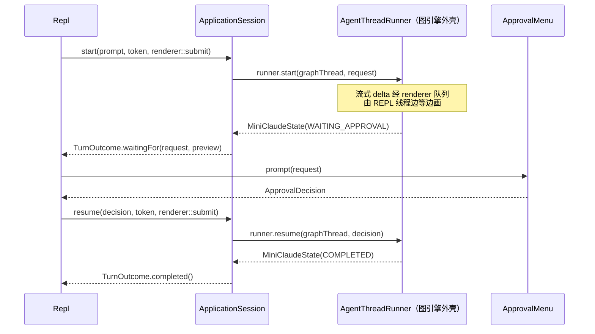

# 03 一次轮次的生命周期

上一章介绍了 agent 的词汇表（参见 02-domain-model.md），本章沿着这些词汇走完一次完整的 turn：用户在 REPL 敲下一句话，到最终答案打印在终端上，中间发生了什么。主角是 `ApplicationSession`——它把每次输入编号成一个 turn，为这个 turn 现场组装一台"运行器"（模型客户端、工具执行器都在这里被层层包装），把结果状态按 `AgentStatus` 分派成不同结局。审批暂停与恢复、Ctrl+C 取消的传播路径也都汇聚在这一层。图引擎内部如何走节点是下一章的事，本章只看图的"外壳"。

## 本章文件

按建议阅读顺序：

1. `agent-cli/src/main/java/dev/miniclaudecode/cli/Repl.java`
2. `agent-cli/src/main/java/dev/miniclaudecode/cli/app/ApplicationSession.java`
3. `agent-runtime/src/main/java/dev/miniclaudecode/runtime/AgentThreadRunner.java`
4. `agent-cli/src/main/java/dev/miniclaudecode/cli/app/AuditedModelClient.java`
5. `agent-cli/src/main/java/dev/miniclaudecode/cli/app/RegistryToolExecutor.java`
6. `agent-cli/src/main/java/dev/miniclaudecode/cli/app/SessionUsageStats.java`
7. `agent-cli/src/main/java/dev/miniclaudecode/cli/StreamingRenderer.java`
8. `agent-cli/src/main/java/dev/miniclaudecode/cli/ApprovalMenu.java`
9. `agent-domain/src/main/java/dev/miniclaudecode/domain/runtime/CancellationToken.java`

## 轮次总览

一次带审批的 turn 长这样（各角色所在文件见上表）：



## Repl：轮次的入口

`Repl` 是 JLine 之上的读入-执行循环，它不认识 `ApplicationSession`，只认识自己定义的 `TurnHandler` 接口（`start` / `resume` / `pendingApproval` / `pendingApprovalPreview`），`ApplicationSession` 实现了它。组装过程参见 01-boot-and-wiring.md。

| 方法 | 参数 | 做什么 |
|---|---|---|
| `run()` | 无 | 主循环：注册 `Terminal.Signal.INT` 处理器（Ctrl+C），逐行读输入；斜杠命令交给 `SlashCommandHandler`，普通文本进 `executeTurn`；退出时恢复原信号处理器并保存历史。 |
| `executeTurn(prompt)` | `prompt` 用户输入原文 | 新建一个 `CancellationToken` 存入 `activeTurn`，调用 `turnHandler.start`；只要结果里带 `approvalRequest` 且未被取消，就弹 `ApprovalMenu` 拿决定再 `resume`，循环直到 turn 真正结束。 |
| `resumePendingApprovalIfPresent()` | 无 | 每条斜杠命令执行完后检查 `turnHandler.pendingApproval()`——`/session` 切换可能恢复出一个悬挂的审批（参见 08-persistence-and-config.md），若有则直接进入与 `executeTurn` 相同的审批循环。 |
| `await(stage)` | `stage` turn 的异步结果 | 关键的"边等边画"：先 `renderer.renderUntil(stage, 20ms)` 把渲染队列消费到 future 完成，再 `join()` 取结果；异常被转成 `Error` 渲染事件而不是让 REPL 崩掉。 |
| `readInput()` | 无 | 读一行；`UserInterruptException`（提示符下按 Ctrl+C）会顺手 cancel 掉 `activeTurn` 里的 token 并返回空串继续循环。 |

`executeTurn` 的审批循环是理解暂停/恢复的最短代码：

```java
TurnOutcome outcome = await(turnHandler.start(prompt, token, renderer::submit));
while (outcome.approvalRequest().isPresent() && !token.isCancellationRequested()) {
  outcome.approvalPreview().ifPresent(this::printApprovalPreview);
  ApprovalDecision decision = approvalMenu.prompt(outcome.approvalRequest().orElseThrow());
  outcome = await(turnHandler.resume(decision, token, renderer::submit));
}
```

`TurnOutcome` 是个只有两个 `Optional` 字段的 record（`approvalRequest`、`approvalPreview`）：都为空表示 turn 结束，带请求表示"暂停等审批"。

## ApplicationSession：一次 turn 的调度中枢

`ApplicationSession` 持有整个会话的对话历史（`messages`）、turn 计数器（`nextTurn`）和“当前活跃 turn”三件套（`activeRunner` / `activeGraphThread` / `activeTurn`），是把 REPL 输入翻译成图执行的薄协调层。具体职责已拆给 `TurnCoordinator`（请求与 runner）、`SessionRestorationService`（恢复）、`MemoryCoordinator`（记忆）和 `SessionAuditService`（事件审计），避免会话类继续膨胀。

| 方法 | 参数 | 做什么 |
|---|---|---|
| `start(prompt, cancellationToken, renderer)` | `prompt` 用户输入；`cancellationToken` 本 turn 的取消令牌；`renderer` 渲染事件的消费者（实为 `StreamingRenderer::submit`） | 同步块内：若已有活跃 turn 或悬挂审批则直接失败；否则分配 `TurnId`，拼出图线程号 `sessionId + "-turn-" + turn`，写 `USER_MESSAGE` 审计事件，把 prompt 追加进消息副本，`createRunner` 组装运行器。随后 `supplyAsync` 在后台线程跑 `runner.start`，成功路径走 `finishState`。 |
| `resume(decision, cancellationToken, renderer)` | `decision` 用户的审批决定；后两个同上 | 没有等待中的 turn 则失败；有 `activeRunner` 就复用，没有（跨会话恢复的审批）就 `createRunner` 现造一个——图会从 checkpoint 续跑（参见 04）。写 `APPROVAL_RESOLVED` 事件后调 `runner.resume`，结果同样进 `finishState`。 |
| `finishState(state, turn, renderer)` | `state` 图返回的 `MiniClaudeState`；`turn` 本轮编号；`renderer` 同上 | 按 `AgentStatus` 分派的终点站，下文单讲。 |
| `createRunner(turn, cancellationToken, renderer)` | 同名参数含义同上 | 委托 `TurnCoordinator` 每 turn 现场组装一台运行器，下文单讲。 |
| `request(selected, turnMessages)` | `selected` 当前 provider/model/thinking 选择；`turnMessages` 本轮完整消息列表 | 查 `ProviderProfile` 拿 `maxOutputTokens`，构造 `ModelRequest`：带工具描述符、thinking 开关，以及 `requireVerification`/`requireTaskCompletion` 等 hints。 |
| `releaseTurnOnFailure(error)` | `error` 图 future 的异常（为 null 则不动） | `finishState` 只在成功路径运行；异常完成时在这里清空活跃三件套，否则后续每次输入都会报"waiting for approval"。 |
| `switchTo(value)` / `restorePendingApproval` / `restoreTasks` | `value` 目标会话 id | 从事件流重建历史、用量、todo，并把最后一个未决 `APPROVAL_REQUESTED` 还原成 `restoredApproval`。细节参见 08-persistence-and-config.md。 |
| `status()` / `sessions()` / `usage()` / `compact()` | 无 | 斜杠命令后端：会话状态、事件文件列表、用量汇总、用 `DeterministicContextReducer` 压缩历史（参见 08）。 |

### TurnCoordinator.createRunner 组装了什么

一次 turn 的运行器是四层洋葱，`createRunner` 的返回语句就是包装关系本身：

```java
return new AgentThreadRunner(
    new AgentGraphFactory(
        model,                                            // AuditedModelClient 包着真正的 ModelClient
        new LedgeredToolExecutor(executor, ledger, this.clock), // 记账层包着 RegistryToolExecutor
        new TurnLimits(24, 64),
        checkpoint,
        cancellationToken));
```

- **模型侧**：`AuditedModelClient` 装饰 `components.modelClient()`，负责审计与渲染转发（本章下文），真正的 provider 实现参见 05-model-providers.md。
- **工具侧**：`RegistryToolExecutor` 把 `ToolCall` 落到注册表里的具体工具（本章下文）；外面再套一层 `LedgeredToolExecutor`，把每次执行记入本 turn 独立的 `JsonToolExecutionLedger`（文件名 `tool-ledger-<turn>.json`），用于崩溃后的幂等恢复——内部机制参见 04-agent-graph.md。
- **状态侧**：`FileCheckpointSaver<MiniClaudeState>` 按工作区哈希存 checkpoint；`TurnLimits(24, 64)` 限制一轮的迭代/工具调用次数。含义均参见 04。

`AgentThreadRunner`（agent-runtime 模块）本身薄得只有两个方法：`start(sessionId, request)` 和 `resume(sessionId, decision)`，全部原样委托给 `AgentGraphFactory`。它存在的意义是给 CLI 一个不暴露图内部结构的把手。

### finishState：按 AgentStatus 分派

图跑完总会交回一个 `MiniClaudeState`，`finishState` 先无条件把 `state.messages()` 收编为新的会话历史，然后看状态：

- **`WAITING_APPROVAL`**：取出 `state.pendingApproval()`，再从 `state.toolResults()` 里找 `toolCallId` 与该审批的 `toolCall` 匹配的那一条，取其 metadata 里的 `unifiedDiff` 作为预览——只展示正在被审批的那个变更的 diff，避免用户误以为一次决定覆盖多个文件。返回 `TurnOutcome.waitingFor(pending, preview)`，注意**不清空**活跃三件套，turn 仍在悬挂。
- **`CANCELLED`**：写 `TURN_CANCELLED` 事件，渲染一行 `Progress("Turn cancelled")`。
- **`FAILED`**：把 `state.error()` 写成 `ERROR` 事件并渲染红色 `Error`。
- **`COMPLETED`（else 分支）**：把 `state.finalText()` 写成 `TURN_FINAL` 事件，渲染 `Completed`。

后三种都会清空 `activeRunner` / `activeGraphThread` / `activeTurn` / `restoredApproval` / `restoredPreview`，返回 `TurnOutcome.completed()`，REPL 回到提示符。

## AuditedModelClient：模型流的审计装饰器

`AuditedModelClient` 实现 `ModelClient`，`stream(request)` 时把下游订阅者包进内部类 `Observer`，在事件流经过时做两件事：转发渲染、写审计日志。渲染路径**不打折**——每个 delta 立刻变成 `RenderEvent` 交给 renderer；被批处理的只有审计路径。

delta 合并（coalescing）规则，全部在 `Observer` 里：

- `TextDelta` 进 `ASSISTANT_MESSAGE` 缓冲，`ThinkingDelta` 进 `PROVIDER_THINKING` 缓冲；两类共用一个 `StringBuilder` 加类型标记，**类型切换先冲刷**，保证合并后事件不会把 thinking 和 text 重排。
- 冲刷时机：缓冲达到 `FLUSH_BYTES`（4096 字节）；距第一个被缓冲 delta 已过 `FLUSH_INTERVAL_MILLIS`（250ms）；遇到任何非 delta 事件（`UsageReported`、`Failed`、default 分支）之前；`onComplete` / `onError`；以及订阅被 `cancel()` 时——取消绕过正常终止信号，不冲刷的话用户已经看到的文字会从审计日志里消失。
- 合并事件的时间戳取**第一个** delta 到达的时刻（`bufferedAt`），而不是冲刷时刻：审计时间线记录的应是模型产出文字的时间。
- `emitAt` 把审计写失败捕获成一行 stderr 而不是抛出——在 `onNext` 里抛异常会吞掉终止信号，让 turn 的 future 永远挂起。

`UsageReported` 除了写 `MODEL_USAGE` 事件，还会喂给构造时传入的 `usageObserver`——即 `SessionUsageStats::record`。

**SessionUsageStats** 是会话级用量累加器：`record(usage)` 用 `saturatedAdd` 累加请求数与四类 token；`restore(events)` 从事件流里的 `MODEL_USAGE` 重放（供 `switchTo` 用）；`summary()` 输出 `/usage` 看到的文本，其中缓存命中率 = `cacheReadTokens / inputTokens`。

## RegistryToolExecutor：工具执行的审计入口

`RegistryToolExecutor` 实现 runtime 的 `ToolExecutor` 接口，把图发来的一批 `ToolCall` 逐个落到 `DefaultToolRegistry` 里的具体工具上。

| 方法 | 参数 | 做什么 |
|---|---|---|
| `execute(calls, pendingApproval, approvalDecision)` | `calls` 本批工具调用；`pendingApproval` 悬挂的审批请求（恢复时才有）；`approvalDecision` 用户的决定（同上） | 用 `thenCompose` 把调用串成**严格顺序**的链——前一个没完不开下一个，结果按原顺序收集。 |
| `executeOne(call, pendingApproval, approvalDecision)` | 同上，单个调用 | 先查 `cancellationToken.isCancellationRequested()`，已取消直接返回 `CANCELLED` 结果不执行；然后 MCP 授权检查；通过后渲染 `Progress("Running …")`、写 `TOOL_STARTED`，把 token 和审批两件套放进 `ToolContext` 的 attributes（key 为 `"cancellationToken"` / `"approvalRequest"` / `"approvalDecision"`）交给 `tool.execute`。结果若是 `APPROVAL_REQUIRED` 则写 `APPROVAL_REQUESTED` 事件（payload 带 approvalId、risk、target、diff 哈希和 `preview`，正是会话恢复时重建审批的原料），否则写 `TOOL_RESULT`。 |
| `authorizeMcp(tool, call, pendingApproval, approvalDecision)` | 同上 | 只对 namespace 以 `mcp.` 开头的工具生效：没有决定时立刻返回 `APPROVAL_REQUIRED`（HIGH 风险、只允许 once）；有决定时校验 `toolCall` 与 `approvalId` 双双匹配，不匹配抛 `SecurityException`，`REJECT` 返回 `CANCELLED` 结果，`ALLOW` 返回空表示放行。参见 11-mcp-and-skills.md。 |

这里就是"审批通过后带着 approvalRequest/approvalDecision 重新进入图"的落点：`ApplicationSession.resume` 只把 `ApprovalDecision` 交给图，图（参见 04）重放待执行的工具批次时把两者传进 `execute`，工具自己从 `ToolContext.attributes` 里读出决定，据此真正落盘或拒绝（工具侧逻辑参见 06-tools-read-write.md 与 07-approval-risk-sandbox.md）。

## StreamingRenderer：渲染事件与线程边界

`StreamingRenderer` 解决一个线程问题：模型流在后台线程产出，而 JLine 终端只能在 REPL 线程写。它用一个 `LinkedBlockingQueue<RenderEvent>` 做交接——后台线程只调 `submit(event)` 入队，REPL 线程在 `await` 里调 `renderUntil(stage, pollInterval)` 循环出队渲染，直到 future 完成且队列排空。

`RenderEvent` 是 sealed 接口，五个实现对应五种视觉形态：

| 事件 | 谁发出 | 渲染成什么 |
|---|---|---|
| `Text(text)` | `AuditedModelClient`（每个 `TextDelta`） | 默认样式流式追加，段首补 `● ` 绿色圆点前缀 |
| `Thinking(text)` | `AuditedModelClient`（thinking 开启时的 `ThinkingDelta`） | 青色斜体流式追加，段首补 `✳ ` 前缀 |
| `Progress(text)` | `RegistryToolExecutor`（Running …）、`finishState`（取消） | 独立一行黄色 `• ` 前缀 |
| `Error(text)` | `finishState`（FAILED）、`Repl.await`（异常） | 独立一行红色 `× ` 前缀 |
| `Completed()` | `finishState`（成功） | 只负责收尾换行 |

流式追加靠 `StreamMode`（NONE/THINKING/TEXT）状态机：`beginStream` 在模式切换时先 `endStream` 换行、再打印新前缀，所以 thinking 段与正文段在终端上自然分行，而同类 delta 连续打印不断行。`Progress`/`Error`/`Completed` 一律先 `endStream` 终结当前流式段。

## ApprovalMenu：审批弹出

`ApprovalMenu.prompt(request)` 在 REPL 线程同步阻塞：打印风险等级、`target`、`reason` 与选项行，循环 `readLine("Select: ")` 直到输入合法。`decide(request, selection, decidedAt)` 把 `"1"`–`"5"` 映射为 ALLOW（scope 分别为 ONCE/TURN/FILE/PERMANENT）或 REJECT。`supportedScopes` 按工具家族裁剪菜单：`workspace:*` 四种 scope 全给，`shell:*` 给 ONCE/TURN/PERMANENT，其余（web、MCP）只给 ONCE——只提供会被真正兑现的选项。scope 如何被消费参见 07-approval-risk-sandbox.md。特例：工具名为 `user:ask` 时走 `promptForAnswer`，用户的回答文本装进 `ApprovalDecision` 的 `feedback` 字段，留空即 REJECT。

## CancellationToken 与 Ctrl+C 的传播

`CancellationToken`（agent-domain 模块）是一个一次性开关：`cancel()` 用 `AtomicBoolean` CAS 保证只生效一次，随后执行并清空所有 `onCancel` 注册的回调（`runSafely` 吞掉回调异常）；`onCancel` 在已取消时立即执行回调，并用二次检查消除注册与取消并发的窗口；返回的 `Registration` 是 `AutoCloseable`，close 即注销。

Ctrl+C 的完整传播链（每 turn 一个新 token）：

`Terminal.Signal.INT` 处理器（Repl.java `run()`）→ `activeTurn.get().cancel()`（CancellationToken.java）→ 两条支路：

1. **模型侧**：provider 桥在 `onCancel` 里注册了取消订阅（参见 05-model-providers.md）→ 订阅 `cancel()` 触发 `AuditedModelClient.Observer` 包装的 Subscription 先 `flush()` 审计缓冲再向上游取消。
2. **工具侧**：`RegistryToolExecutor.executeOne` 在每个工具执行前查 `isCancellationRequested()`，长任务工具还能从 `ToolContext.attributes` 里拿到 token 自行中断。

图检测到取消后以 `AgentStatus.CANCELLED` 收尾（参见 04-agent-graph.md）→ `finishState` 写 `TURN_CANCELLED`、渲染 "Turn cancelled"，REPL 回到提示符。

## 关键调用链

- 提交路径：`Repl.executeTurn()`（Repl.java）→ `ApplicationSession.start()`（ApplicationSession.java）→ `AgentThreadRunner.start()`（AgentThreadRunner.java）→ `AgentGraphFactory.start()`（参见 04）→ 回到 `ApplicationSession.finishState()` → `TurnOutcome`。
- 审批恢复路径：`ApprovalMenu.prompt()`（ApprovalMenu.java）→ `ApplicationSession.resume()` → `AgentThreadRunner.resume()` → 图重放工具批次 → `RegistryToolExecutor.execute(calls, pendingApproval, approvalDecision)`（RegistryToolExecutor.java）→ `tool.execute(call, context)`。
- 渲染路径：`AuditedModelClient.Observer.onNext()`（AuditedModelClient.java）→ `renderer.accept(new Text(...))` → `StreamingRenderer.submit()` 入队 → REPL 线程 `Repl.await()` → `StreamingRenderer.renderUntil()` 出队画到终端。

## 下一章

`runner.start` 之后图里到底发生了什么——节点、边、checkpoint 与 interrupt 机制，见 04-agent-graph.md。
