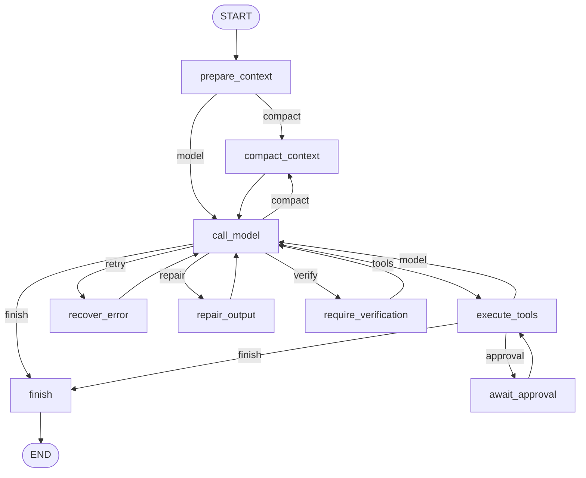

# 04 状态图引擎：agent 的心脏

前三章讲清了从 `main` 到 REPL 的组装（参见 01-boot-and-wiring.md）、agent 的领域词汇（参见 02-domain-model.md）和一次轮次的外层生命周期（参见 03-turn-lifecycle.md）。本章深入轮次内部：`agent-runtime` 模块用 LangGraph4j 把「模型调用 → 工具执行 → 再调模型」这个循环建成一张显式状态图。读完本章你会掌握状态 channel、节点与边，以及模型-工具、压缩、重试、验证和输出修复为什么都不会无限循环。

## 本章文件

按建议阅读顺序：

1. `agent-runtime/src/main/java/dev/miniclaudecode/runtime/state/StateSchema.java`
2. `agent-runtime/src/main/java/dev/miniclaudecode/runtime/state/MiniClaudeState.java`
3. `agent-runtime/src/main/java/dev/miniclaudecode/runtime/TurnLimits.java`
4. `agent-runtime/src/main/java/dev/miniclaudecode/runtime/AgentGraphFactory.java`
5. `agent-runtime/src/main/java/dev/miniclaudecode/runtime/node/PrepareContextNode.java`
6. `agent-runtime/src/main/java/dev/miniclaudecode/runtime/node/CallModelNode.java`
7. `agent-runtime/src/main/java/dev/miniclaudecode/runtime/node/ExecuteToolsNode.java`
8. `agent-runtime/src/main/java/dev/miniclaudecode/runtime/node/AwaitApprovalNode.java`
9. `agent-runtime/src/main/java/dev/miniclaudecode/runtime/node/CompactContextNode.java`
10. `agent-runtime/src/main/java/dev/miniclaudecode/runtime/node/RecoverErrorNode.java`
11. `agent-runtime/src/main/java/dev/miniclaudecode/runtime/node/RequireVerificationNode.java`
12. `agent-runtime/src/main/java/dev/miniclaudecode/runtime/node/FinishNode.java`
13. `agent-runtime/src/main/java/dev/miniclaudecode/runtime/route/ResponseRouter.java`
14. `agent-runtime/src/main/java/dev/miniclaudecode/runtime/retry/RetryPolicy.java`
15. `agent-context/src/main/java/dev/miniclaudecode/context/ContextPlanner.java`
16. `agent-context/src/main/java/dev/miniclaudecode/context/ContextPipeline.java`
17. `agent-context/src/main/java/dev/miniclaudecode/context/DeterministicContextReducer.java`
17. `agent-runtime/src/main/java/dev/miniclaudecode/runtime/ToolExecutor.java`
18. `agent-runtime/src/main/java/dev/miniclaudecode/runtime/LedgeredToolExecutor.java`

## StateSchema：状态的骨架

`StateSchema` 是一个纯静态工具类，声明图状态的全部 channel 及其默认值。LangGraph4j 里每个节点的返回值是一个 `Map<String, Object>` 局部更新，channel 决定更新如何合并进全局状态。本仓库除 `trace` 外全部用 `Channels.base(supplier)`——**后写覆盖先写**，supplier 提供缺省值；只有 `trace` 用 `Channels.appenderWithDuplicate(ArrayList::new)`——**追加且允许重复**（同一节点被访问多次时每次都记一条）。

| 方法 | 参数 | 做什么 |
|---|---|---|
| `channels()` | 无 | 返回全部 channel 定义的不可变 Map，供 `StateGraph` 构造使用 |
| `initialInput(request)` | `request`：本轮的 `ModelRequest` | 构造图的初始输入：`request` 本体加 `request.messages()`。注意 `request` 没有注册 channel——它随初始输入进入状态后没有任何节点会再写它 |
| `traceEntry(node)` | `node`：节点名字符串 | 返回单元素 List，写入 `trace` 这个 appender channel |

各 channel 的含义（默认值即 supplier 产出）：

| channel | 默认值 | 含义 |
|---|---|---|
| `messages` | 空 List | 当前完整对话（`AgentMessage` 列表），每次模型/工具节点整体替换 |
| `modelEvents` | 空 List | 最近一次模型调用的原始 `ModelStreamEvent` 流 |
| `pendingToolCalls` | 空 List | 模型刚要求执行、尚未执行的 `ToolCall`；执行完被清空 |
| `toolResults` | 空 List | 最近一批 `ToolResult`；审批暂停时也存这里供恢复后续用 |
| `pendingApproval` / `approvalDecision` | `""` | 待审批请求与用户决定；用空字符串表示「无」，读取器按类型过滤 |
| `finalText` / `thinking` | `""` | 最近一次模型回复的正文与思考文本 |
| `providerMetadata` | 空 Map | 供应商元数据（token 用量等，参见 05-model-providers.md） |
| `status` | `RUNNING` | `AgentStatus`：RUNNING / WAITING_APPROVAL / COMPLETED / FAILED / CANCELLED |
| `error` / `failureType` / `failureRetryable` | `""` / `""` / `false` | 最近一次失败的信息、类型标签、供应商是否声明可重试 |
| `retryCount` / `compactionCount` / `modelSteps` / `toolSteps` / `verificationPrompts` / `outputRepairCount` | `0` | 分别约束重试、压缩、模型步、工具步、验证提示和输出修复 |
| `trace` | 空 List | 节点访问轨迹，appender 语义，调试与测试断言用 |

## MiniClaudeState：状态的类型化读取器

`MiniClaudeState` 继承 LangGraph4j 的 `AgentState`，为每个 channel 提供一个同名的类型安全读取方法，节点与路由只通过它读状态。

| 方法 | 参数 | 做什么 |
|---|---|---|
| `request()` | 无 | 取出初始 `ModelRequest`，缺失则抛 `IllegalStateException`——它是图运行的前提 |
| `messages()` `modelEvents()` `pendingToolCalls()` `toolResults()` `trace()` | 无 | 各自 channel 的防御性拷贝（`List.copyOf`），缺失返回空 List |
| `pendingApproval()` / `approvalDecision()` | 无 | `Optional` 读取：值是对应类型（`ApprovalRequest` / `ApprovalDecision`）才返回，空字符串占位自然落空 |
| `finalText()` `status()` `failureRetryable()` 及五个计数器 | 无 | 标量读取，类型不符时给默认值（`""` / `RUNNING` / `false` / `0`） |
| `thinking()` `error()` `failureType()` | 无 | `optionalText`：非空白字符串才算有值 |
| `providerMetadata()` | 无 | Map 的防御性拷贝 |

私有辅助 `optionalText` / `optional` / `list` / `map` / `scalar` 统一实现「类型不符即默认值」的宽容读取，让节点不必判空。

## TurnLimits：两条硬预算

`TurnLimits` 是一个 record：`TurnLimits(int maxModelSteps, int maxToolSteps)`，紧凑构造器要求两者都 ≥ 1。它是模型-工具循环的硬上限，由装配层注入（参见 01-boot-and-wiring.md）。

## AgentGraphFactory：把节点连成图

`AgentGraphFactory` 在构造时把 9 个节点和所有边编译成一张
`CompiledGraph<MiniClaudeState>`，对外只暴露三个入口。

| 方法 | 参数 | 做什么 |
|---|---|---|
| `run(request)` | `request`：本轮 `ModelRequest` | 无会话直跑：`graph.invoke(StateSchema.initialInput(request))`，跑到 END 返回终态 |
| `start(sessionId, request)` | `sessionId`：作为 LangGraph4j 的 threadId；`request` 同上 | 带 checkpoint 的启动，可能在审批中断处停下（状态 WAITING_APPROVAL） |
| `resume(sessionId, decision)` | `sessionId`：定位中断的会话线程；`decision`：用户的 `ApprovalDecision` | 用 `GraphInput.resume(Map.of(APPROVAL_DECISION, decision))` 从中断点续跑 |
| `compile(...)`（私有静态） | modelClient / toolExecutor / limits / checkpointSaver / cancellationToken | 建 `StateGraph`、加节点、加边、设 `recursionLimit`；有 checkpointSaver 时追加 `interruptAfter(AWAIT_APPROVAL)` |

图的全貌（节点名即 `AgentGraphFactory` 里的常量，边上标注 `ResponseRouter` 返回的路由键）：



`recursionLimit` 是最后的保险丝，按**节点执行次数**而非逻辑步数计算：
`3 * (maxModelSteps + 1) + maxToolSteps + 16`。重试、压缩、验证和输出修复都会额外
消耗节点执行次数，业务计数上限仍先于图保险丝生效。

## 九个节点

所有节点都实现 `AsyncNodeAction<MiniClaudeState>`，唯一方法是 `apply(MiniClaudeState state)`，返回 `CompletableFuture<Map<String, Object>>` 局部更新。逐个看：

| 节点类 | `apply(state)` 做什么 | 关键写回 |
|---|---|---|
| `PrepareContextNode` | 把 `request.messages()` 灌入 `messages`，置 `status=RUNNING`。是每轮的固定起点 | `messages` `status` |
| `CallModelNode` | 先查 `modelSteps >= limits.maxModelSteps()`，超限直接 FAILED（"model step limit exceeded"）；否则用 `state.messages()` 重建 `ModelRequest`（压缩后的消息因此生效），`modelClient.stream(request)` 订阅流式响应 | 见下文 |
| `ExecuteToolsNode` | 执行 `pendingToolCalls`；先算 carried（见下文），再查 `toolSteps + outstanding.size() > limits.maxToolSteps()` 超限即 FAILED；否则委托 `ToolExecutor.execute(...)` | `messages`（追加 `ToolMessage`）`toolResults` `toolSteps` 等 |
| `AwaitApprovalNode` | 断言 `pendingApproval` 存在（否则抛异常），仅写 `status=WAITING_APPROVAL`。编译时 `interruptAfter` 让图恰好停在它之后 | `status` |
| `CompactContextNode` | 调可插拔 `ContextPipeline` 压缩历史，清空错误字段，`compactionCount + 1` | `messages` `compactionCount` |
| `RecoverErrorNode` | 用 `RetryPolicy.decide(...)` 复核；决定重试则经 `CompletableFuture.delayedExecutor` 延迟后清 `error`、`retryCount + 1`（不重试则返回空更新——防御分支，路由已保证到这里必然可重试） | `error` `retryCount` |
| `RequireVerificationNode` | 向 `messages` 追加一条 `SystemMessage`「Completion gate」提示（要求补完任务清单并用 `shell:run` 跑最窄验证），`verificationPrompts + 1`，回到 call_model | `messages` `verificationPrompts` |
| `RepairOutputNode` | 把 `OutputProtocol` 生成的格式修复指令追加给模型，并增加有界修复计数 | `messages` `outputRepairCount` |
| `FinishNode` | 收敛终态并再次验证输出协议；JSON 协议会把 `final` 字段规范化为最终文本 | `status` `finalText` |

### CallModelNode 的流式聚合

内部类 `ResponseSubscriber` 实现 `Flow.Subscriber<ModelStreamEvent>`，按事件类型累积：`ThinkingDelta` 进 thinking、`TextDelta` 进正文、`ToolCallCompleted` 收集 `ToolCall`、`Completed` 合并供应商元数据、`Failed` 记下 `errorType` 与 `retryable`。`onComplete` 时把聚合结果组装成一条 `AssistantMessage` 追加到 `messages`，同时写 `pendingToolCalls`、`modelSteps + 1`，并**清零 `retryCount`**——重试计数只统计连续失败。失败路径也会 `modelSteps + 1`，防止「失败不计步」导致的无限循环。若构造时传入了 `CancellationToken`，订阅时注册回调：用户取消即 `subscription.cancel()` 并写 `status=CANCELLED`；`AtomicBoolean terminated` 保证成功/失败/取消三条完成路径恰好触发一次。

### ExecuteToolsNode 的批次重放

审批中断恢复后整批 `pendingToolCalls` 会被重放。`carriedResults(state, calls)` 只在 `approvalDecision` 存在时生效：从 `toolResults` 里挑出本批次中已有终态（非 APPROVAL_REQUIRED）的结果直接复用，不再重新执行——因为重跑只会命中账本去重路径拿到占位符而非原始输出。`merge(...)` 把复用结果与新结果按模型请求的顺序排好。执行完成后若任何结果是 `APPROVAL_REQUIRED`，从其 metadata 取出 `ApprovalRequest` 写入 `pendingApproval` 并置 WAITING_APPROVAL（此时**不**追加 ToolMessage）；否则每个结果转成 `ToolMessage` 追加进 `messages`，清空 `pendingToolCalls` / `pendingApproval` / `approvalDecision`，`toolSteps` 只加实际执行数 `executedCalls`。

## ResponseRouter：路由规则全表

`ResponseRouter` 持有 `ContextPlanner` 与 `RetryPolicy`，为三处条件边提供 `AsyncEdgeAction`。规则全表（按判定顺序，先命中先生效）：

| 边 | 条件（按序判定） | 路由键 → 目标节点 |
|---|---|---|
| `afterPrepare()` | `contextPlanner.plan(...).compact()` 为真 **且** `compactionCount == 0` | `compact` → compact_context |
| | 否则 | `model` → call_model |
| `afterModel()` | `status == CANCELLED`（取消是终态，绝不重试——否则 Ctrl-C 会烧完剩余退避次数） | `finish` → finish |
| | 有 `error` 且 `compactionCount == 0` 且 `contextPlanner.isContextOverflow(failureType, error)` | `compact` → compact_context |
| | 有 `error`，且 `retryPolicy.decide(...)` 判可重试 | `retry` → recover_error |
| | 有 `error`，不可重试 | `finish` → finish |
| | 无错且 `pendingToolCalls` 非空 | `tools` → execute_tools |
| | 无错无工具，存在进行中的 Plan step | `verify_step` → verify_step |
| | 无错无工具，但 `requiresVerification(state)` | `verify` → require_verification |
| | 输出不满足当前协议且修复次数未满 | `repair` → repair_output |
| | 输出有效，或修复次数耗尽 | `finish` → finish |
| `afterTools()` | 有 `error` | `finish` → finish |
| | `pendingApproval` 存在 | `approval` → await_approval |
| | 否则 | `model` → call_model |

变更验证以 `verificationPrompts < 2` 为前提（最多催两次），并由 `request.attributes()` 中的开关激活：

- `requiresVerification`：开关 `requireVerification`。扫描 `messages` 里的 `ToolMessage`，若最后一次成功的**变更**（`workspace:write` / `workspace:edit` / `workspace:apply_patch`，见 `isMutation`）出现在最后一次成功的 `shell:run` 之后，说明改了文件却没验证，返回 true。
- Plan 是任务状态的唯一真源。`VerifyPlanStepNode` 根据当前 step 的工具证据和验证结果选择 `COMPLETE / RETRY / REPLAN / BLOCKED`；完成的 step 不可修改。

## RetryPolicy：重试的边界

`RetryPolicy` 决定一次失败是否值得再试以及等多久，默认构造是 `(3, 100ms, 2s, Math::random)`。

| 方法 | 参数 | 做什么 |
|---|---|---|
| `decide(failureType, providerRetryable, retriesAlreadyAttempted, retryAfter)` | `failureType`：失败类型标签；`providerRetryable`：供应商是否声明可重试；`retriesAlreadyAttempted`：已重试次数；`retryAfter`：供应商建议的等待时长（本仓库调用处恒传 `Optional.empty()`） | 禁止类（含 `auth` / `api_key` / `config` / `invalid_request`）永不重试；瞬时类（`providerRetryable` 为真，或含 `429` / `502` / `503` / `rate_limit` / `timeout`）且次数未满才重试。延迟 = 指数退避 `baseDelay << 次数`（封顶 `maximumDelay`；`retryAfter` 非负时优先），再加最多 25% 的随机抖动 |

`Decision(boolean retry, Duration delay)` 是内部 record。注意路由（`afterModel`）与执行（`RecoverErrorNode`）各调一次 `decide`：输入相同、`retry` 位确定性一致，抖动只影响 `delay`。

## ContextPlanner、ContextPipeline 与 Reducer：压缩的判定与执行

`ContextPlanner` 只做算术，回答「该不该压缩」。

| 方法 | 参数 | 做什么 |
|---|---|---|
| `plan(request, messages)` | `request`：读取 `maxOutputTokens` 与 `contextWindowTokens` 属性（缺省 128000）；`messages`：当前对话 | 输入预算 = 窗口 − 输出预留；估算 token ≥ 预算 × 阈值（默认 0.82）即 `Plan.compact()` 为真 |
| `isContextOverflow(failureType, message)` | 失败类型与错误文本 | 匹配 `context_length` / `context window` / `too many tokens` / `prompt is too long` 任一子串即认定为上下文溢出 |
| `estimateTokens(messages)` | 当前对话 | 粗估：字符数 ÷ 4，每条消息 +12、每个工具调用参数 +16 |

`ContextPipeline` 按顺序组合多个 `ContextTransformer`，Runtime 不导入具体压缩算法。
默认的 `DeterministicContextReducer` 纯规则、不调模型，保留最近 8 条消息、行内工具输出
上限 512 字符。`reduce(messages)` 的流程：消息不足 8 条只做旧工具输出瘦身；否则取
`size - 8` 为拟定切点，经 `safeCutoff` 对齐后折叠历史。

`safeCutoff` 是这里最关键的十几行——供应商要求每个 `tool_result` 前面必须有产生它的 `tool_use`，朴素切点一旦落在多工具调用组中间，下一次请求必被拒绝，而压缩每轮只跑一次，这种失败是终态的：

```java
int backwards = cutoff;
while (backwards > 0 && messages.get(backwards) instanceof ToolMessage) {
  backwards--;
}
if (backwards > 0 || !(messages.get(0) instanceof ToolMessage)) {
  return backwards;
}
```

即：切点向前回退到拥有这组工具调用的 assistant 消息上，宁可多保留上下文；仅当整个前缀全是工具结果（防御分支）才改为向后推进、丢弃孤儿。

`summary(older)` 生成的摘要按五节组织：Objective（用户消息，首条 + 末两条）、Decisions and outcomes（无工具调用的 assistant 文本，末 3 条）、Changed files（变更工具触及的目标，去重）、Verification（`shell:run` 输出，末 3 条）、Failed attempts（出错的工具，末 3 条）。Plan 不从对话摘要推导，而由状态和事件流单独保存。

## ToolExecutor 与 LedgeredToolExecutor：带账本的工具执行

`ToolExecutor` 是函数式接口：`execute(List<ToolCall> calls)` 返回 `CompletionStage<List<ToolResult>>`；三参重载 `execute(calls, pendingApproval, approvalDecision)` 默认忽略审批参数，供图节点统一调用。真正的工具实现见 06-tools-read-write.md。

`LedgeredToolExecutor` 是装饰器：把每次工具执行记入 `ToolExecutionLedger`（持久化见 08-persistence-and-config.md），用账本实现崩溃后的幂等恢复。

| 方法 | 参数 | 做什么 |
|---|---|---|
| `execute(calls, pendingApproval, approvalDecision)` | `calls`：本批工具调用；`pendingApproval` / `approvalDecision`：当前审批上下文 | 用 `thenCompose` 串行链逐个执行；一旦累积结果中出现 `APPROVAL_REQUIRED` 立即**短路**停止后续调用——否则剩余调用照跑、它们的审批请求会被只携带一个 `pendingApproval` 的图节点丢弃 |
| `executeOne`（私有） | 单个 call 与按 `toolCallId` 过滤后的审批对（`approvalFor` 保证决定只随自己的请求传递，防止绑定被篡改） | 账本三路判定，见下 |
| `requireUncertainEffectConfirmation`（私有） | call 与审批对 | 二次确认逻辑，见下 |
| `recordResult` / `markInterrupted`（私有） | pending 记录与结果/调用 | 把结果落账：APPROVAL_REQUIRED → `AWAITING_APPROVAL`；COMPLETED / 其它 → `COMPLETED` / `FAILED`（带 `beforeHash` / `afterHash`）；执行中抛异常则安全只读工具回 `PENDING`、其余记 `UNKNOWN` |
| `classify`（私有静态） | call | 风险分级：`SAFE_RETRY_TOOLS` → LOW；`workspace:*` → MEDIUM（文件还在盘上且有哈希，可恢复）；其余（shell、web、MCP，能触达工作区之外）→ HIGH。分级语义详见 07-approval-risk-sandbox.md |

`executeOne` 的三路判定按序：

1. **账本去重**：`ledger.find(call.toolCallId())` 命中 `COMPLETED` 记录，直接返回占位结果 `"Reused completed tool execution: ..."`（metadata 带 `ledgerReused=true`），绝不重放已完成的副作用。
2. **不确定副作用二次确认**：命中 `PENDING` / `UNKNOWN`（`isUncertain`）且该工具不在 `SAFE_RETRY_TOOLS`（`workspace:read` / `list` / `glob` / `grep` / `code_search` 等只读工具）——说明上一个进程可能死在这个工具执行中途。没有审批决定时，构造一个 HIGH 风险 `ApprovalRequest` 返回 `APPROVAL_REQUIRED`；有决定时，校验 `toolCallId` 与 `approvalId` 双匹配且非 REJECT 才放行，否则返回 `CANCELLED`。
3. **正常执行**：先落一条 `PENDING` 账本记录，再委托内层执行，完成后 `recordResult` 落终态；中途异常由 `markInterrupted` 记 `UNKNOWN`——正是下一次恢复时触发第 2 路的伏笔。

## 所有回路为何有界

- **模型-工具循环**（call_model ⇄ execute_tools）：`CallModelNode` 在入口检查 `modelSteps >= maxModelSteps`，`ExecuteToolsNode` 检查 `toolSteps + outstanding > maxToolSteps`，超限即写 FAILED，路由随即导向 finish。计数只增不减，循环必然终止。
- **压缩循环**（→ compact_context → call_model）：`afterPrepare` 与 `afterModel` 的溢出分支都带 `compactionCount == 0` 前置条件——**每轮最多压缩一次**。压缩后仍溢出就走重试或失败，不会反复压缩。
- **重试循环**（call_model → recover_error → call_model）：`RetryPolicy` 要求重试次数低于当前 Provider 的 `max-retries`，`retryCount` 只在模型成功时清零。取消（CANCELLED）在进入重试判定之前就被拦截为终态。
- **输出修复循环**（call_model → repair_output → call_model）：只在最终输出不满足当前 `OutputProtocol` 时进入，由 Provider 的 `max-output-repairs` 封顶；耗尽后 `FinishNode` 把任务标为 FAILED。

验证回路（require_verification → call_model）由 `verificationPrompts < 2` 封顶；即便未来
某处判定出错，`recursionLimit` 仍会按节点执行次数硬性熔断。

## 关键调用链

一次普通轮次（无审批）：

`AgentGraphFactory.run()`（AgentGraphFactory.java）→ `CompiledGraph.invoke()` → `PrepareContextNode.apply()`（PrepareContextNode.java）→ `ResponseRouter.afterPrepare()`（ResponseRouter.java）→ `CallModelNode.apply()`（CallModelNode.java）→ `ResponseRouter.afterModel()` → `ExecuteToolsNode.apply()`（ExecuteToolsNode.java）→ `LedgeredToolExecutor.execute()`（LedgeredToolExecutor.java）→ `ResponseRouter.afterTools()` → …循环… → `FinishNode.apply()`（FinishNode.java）→ END

审批中断与恢复（外层调用方见 03-turn-lifecycle.md）：

`AgentGraphFactory.start()` → … → `ExecuteToolsNode.apply()` 返回 WAITING_APPROVAL → `ResponseRouter.afterTools()` = "approval" → `AwaitApprovalNode.apply()`（AwaitApprovalNode.java）→ `interruptAfter` 挂起 ⇒ 用户决定后 `AgentGraphFactory.resume()` → `GraphInput.resume` 注入 `approvalDecision` → `ExecuteToolsNode.apply()` 重放批次（carried 结果复用）→ …

## 下一章

图中 `CallModelNode` 只面对一个抽象的 `ModelClient`——05-model-providers.md 讲这个接口背后的各家供应商如何把 HTTP 流转换成本章消费的 `ModelStreamEvent`。
