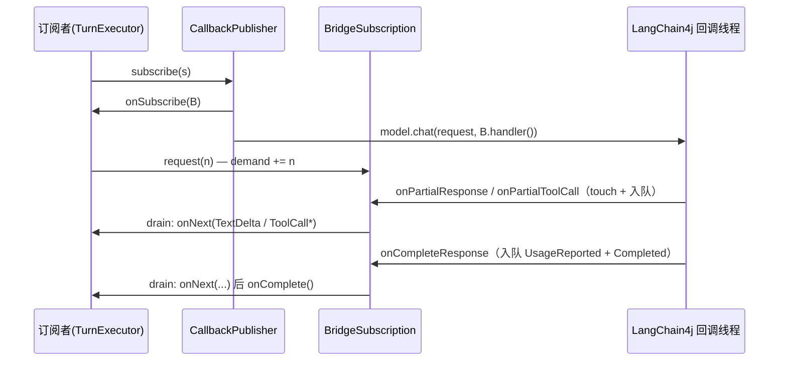

# 05 模型接入层

上一章讲了状态图引擎如何消费 `ModelStreamEvent` 流（参见 04-agent-graph.md），本章讲这条流的源头：模型接入层如何把三家 provider（Anthropic、OpenAI 兼容、Ollama）统一到同一个 `ModelClient` 接口后面。核心难点在于 LangChain4j 的推式回调（callback）与 JDK `Flow.Publisher` 的拉式背压（demand）模型不同构，`LangChainStreamingModelClient` 用一个队列 + demand 计数的桥接器解决了这个问题。本章还覆盖工具名映射、空闲看门狗、错误分类与脱敏，以及路由和测试替身两个 CLI 侧实现。读完本章，你就能回答「一个 `ModelRequest` 是怎么变成一串 `ModelStreamEvent` 的」。

## 本章文件

按建议阅读顺序：

1. `agent-providers/src/main/java/dev/miniclaudecode/providers/ProviderSpec.java`
2. `agent-providers/src/main/java/dev/miniclaudecode/providers/ProviderFactory.java`
3. `agent-providers/src/main/java/dev/miniclaudecode/providers/ThinkingSupport.java`
4. `agent-providers/src/main/java/dev/miniclaudecode/providers/LangChainStreamingModelClient.java`
5. `agent-providers/src/main/java/dev/miniclaudecode/providers/anthropic/AnthropicModelClient.java`
6. `agent-providers/src/main/java/dev/miniclaudecode/providers/openai/OpenAiCompatibleModelClient.java`
7. `agent-providers/src/main/java/dev/miniclaudecode/providers/ollama/OllamaModelClient.java`
8. `agent-cli/src/main/java/dev/miniclaudecode/cli/app/RoutingModelClient.java`
9. `agent-cli/src/main/java/dev/miniclaudecode/cli/app/StaticResponseModelClient.java`
10. `agent-providers/src/main/java/dev/miniclaudecode/providers/StreamEventAssembler.java`

统一的接口是 `agent-domain` 里的 `ModelClient`，只有一个方法 `stream(ModelRequest)`，返回 `Flow.Publisher<ModelStreamEvent>`（接口与事件类型详见 02-domain-model.md）。

## ProviderSpec：一次连接所需的全部参数

`ProviderSpec` 是不可变 record，描述"连到哪家、用什么模型、什么限额"，紧凑构造器把所有非法组合挡在构造期。

| 方法 | 参数 | 做什么 |
| --- | --- | --- |
| 紧凑构造器 | `type`（三选一枚举）、`baseUrl`（可选 URI）、`apiKey`（可选）、`model`（模型名）、`temperature`、`maxOutputTokens`、`thinking`（是否开思考）、`timeout`、`maxRetries` | 校验：temperature 在 0–2；`ANTHROPIC` 开 thinking 时 `maxOutputTokens` 必须 > 1024；非 `OLLAMA` 必须有 apiKey；`OLLAMA` 必须有 baseUrl；maxRetries 0–10。 |
| `normalize` / `requireText` / `validateBaseUrl`（私有） | — | 分别做 trim + 空过滤、非空校验、baseUrl 必须是带 host 的 http/https。 |

`Type` 枚举只有 `ANTHROPIC`、`OPENAI_COMPATIBLE`、`OLLAMA` 三个值。

## ProviderFactory：构造分派

`ProviderFactory` 是三行 switch 的工厂，是配置世界到实现世界的唯一入口。

| 方法 | 参数 | 做什么 |
| --- | --- | --- |
| `create` | `spec`：上面的 `ProviderSpec` | 按 `spec.type()` switch 到 `AnthropicModelClient` / `OpenAiCompatibleModelClient` / `OllamaModelClient` 的构造器，返回 `ModelClient`。 |

## ThinkingSupport：思考能力三档

枚举 `NATIVE`（Anthropic，原生 thinking block）、`BEST_EFFORT`（OpenAI 兼容与 Ollama，尽力而为）、`UNSUPPORTED`。它在 `stream()` 入口处当门卫：请求开了 thinking 但客户端是 `UNSUPPORTED`，直接返回一个只发 `Failed("thinking_unsupported", ..., retryable=false)` 的 `ImmediatePublisher`，根本不发网络请求。

## LangChainStreamingModelClient：桥接核心

抽象基类，实现 `ModelClient`，把 LangChain4j 的 `StreamingChatModel` 回调流包装成符合 Reactive Streams 语义的 `Flow.Publisher`。三个子类只负责构造各家的 `StreamingChatModel`，流式逻辑全部在这里。

| 方法 | 参数 | 做什么 |
| --- | --- | --- |
| 构造器（protected） | `model`：LangChain4j 流式模型；`thinkingSupport`：三档枚举；`secret`：apiKey，用于日志脱敏；`streamIdleTimeout`：空闲超时（可为 null 表示不看门） | 保存字段；两参重载委托到四参版本。 |
| `thinkingSupport` | 无 | 暴露本客户端的思考支持档位，供上层决定是否降级。 |
| `stream` | `request`：`ModelRequest`（含 messages、tools、thinkingEnabled 等） | 先做 thinking 门卫检查；然后 `ToolNameMapping.from(request.tools())` 建映射、`toChatRequest` 翻译请求，返回 `CallbackPublisher`。注意此时**还没发网络请求**——订阅时才发。 |
| `toChatRequest`（静态私有） | `request`、`names` | 把 `AgentMessage` 列表和 `ToolDescriptor` 列表翻译成 LangChain4j 的 `ChatRequest`（带 modelName、maxOutputTokens、toolSpecifications）。 |
| `toChatMessage`（静态私有） | `message`、`names` | 对 sealed 的 `AgentMessage` 做 switch：System/User 直译；Assistant 带 thinking、providerMetadata 和映射后名字的 `ToolExecutionRequest`；Tool 结果带 `isError` 标记。 |
| `toToolSpecification`（静态私有） | `descriptor`、`names` | 手拼 JSON（name/description 走 `escapeJson`，parameters 直接嵌入 schema），交给 `ToolSpecification.fromJson` 解析，失败时抛带工具名的 `IllegalArgumentException`。 |

### ToolNameMapping：为什么要给工具改名

本仓库的工具全名形如 `namespace:name`（带冒号，参见 06-tools-read-write.md），而各家 API 对工具名有 `[A-Za-z0-9_-]` 之类的字符限制。`ToolNameMapping` 是一个双向映射 record：发送前把 qualified name 换成 `tool_<序号>_<namespace>_<name>`（非法字符替换成 `_`，序号保证不同工具净化后也不撞名）；收到工具调用时用 `qualifiedName(providerName)` 换回来。模型偶尔会调用不存在的工具名，反查时 `getOrDefault` 原样透传，让上层报"未知工具"而不是在这里崩溃。

### CallbackPublisher 与 BridgeSubscription：队列 + demand

`CallbackPublisher` 是冷发布者：每次 `subscribe` 都新建一个 `BridgeSubscription`，先 `subscriber.onSubscribe(subscription)`，再真正调 `model.chat(request, subscription.handler())` 发起请求，最后 `armIdleWatchdog`。同步抛出的 `RuntimeException` 也走 `subscription.fail`，保证错误永远以 `Failed` 事件形式到达订阅者。

`BridgeSubscription` 同时实现 `Flow.Subscription` 和（通过 `handler()` 返回的匿名类）LangChain4j 的 `StreamingChatResponseHandler`，两侧共享一把锁（synchronized 方法）：

| 方法 | 参数 | 做什么 |
| --- | --- | --- |
| `handler` | 无 | 返回回调适配器：`onPartialResponse` → `TextDelta`；`onPartialThinking` → `ThinkingDelta`（仅当 thinkingEnabled）；`onPartialToolCall` / `onCompleteToolCall` → 工具调用装配；`onCompleteResponse` → `complete`；`onError` → `fail`。每个回调先 `touch()` 喂看门狗。 |
| `request` | `requested`：订阅者索要的事件数 | ≤0 时按规范 `onError`；否则 `addWithSaturation` 累加 demand（防溢出饱和到 `Long.MAX_VALUE`）后 `drain`。 |
| `cancel` | 无 | 置 cancelled，清空队列和 pendingTools，取消看门狗。 |
| `emit` | `event` | 未取消未终止时入队并 `drain`——回调只生产，交付节奏由 demand 决定。 |
| `acceptPartialToolCall` | `partial`：带 index/id/name/参数片段 | 按 `index` 在 `pendingTools` 里攒 `PendingTool`；id 和 name 齐了就发 `ToolCallStarted`，之后每个参数片段发 `ToolCallDelta`。 |
| `acceptCompleteToolCall` | `complete` | 对账：把 provider 给的完整参数和已流出的片段比较，差的尾巴补一个 `ToolCallDelta`，再发 `ToolCallCompleted`（工具名此处映射回 qualified name，空参数归一成 `{}`）。 |
| `complete` | `response`：最终 `ChatResponse` | 若还有未完成工具调用则 `fail`；否则依次入队 `UsageReported`（见下）和带 finishReason、responseId、model 元数据的 `Completed`，置 `upstreamComplete` 后 `drain`。 |
| `fail` | `error` | 经 `ErrorDetails.from` 分类脱敏后入队 `Failed` 事件——注意错误也是普通事件走队列，之后由 `drain` 发 `onComplete`，流总是正常收尾。 |
| `drain`（私有） | 无 | 交付泵，见下方代码。 |
| `armIdleWatchdog` / `checkIdle` / `cancelIdleWatchdog` / `touch`（私有） | `timeout` / 无 | 空闲看门狗，见下节。 |
| `toUsageEvent`（静态私有） | `usage`：LangChain4j `TokenUsage` | 各家 usage 口径换算，见"三个子类"一节。 |

`drain` 是唯一向订阅者交付的地方，`draining` 标志防止 `onNext` 里同步调 `request` 造成重入：

```java
while (!cancelled && !terminalDelivered && demand > 0 && !queue.isEmpty()) {
  ModelStreamEvent event = queue.remove();
  demand--;
  subscriber.onNext(event);
}
if (!cancelled && !terminalDelivered && upstreamComplete && queue.isEmpty()) {
  terminalDelivered = true;
  cancelIdleWatchdog();
  subscriber.onComplete();
}
```

整体时序：



### idle watchdog：防止无事件挂死

有些错配的 base-url 会让连接建立成功却永远不吐事件。所有子类把 `spec.timeout()` 同时用作 LangChain4j 的 HTTP 超时和这里的空闲超时：`armIdleWatchdog` 在共享的单线程守护调度器 `STREAM_WATCHDOG` 上安排 `checkIdle`；每个回调 `touch()` 刷新 `lastActivityNanos`；到点检查发现空闲超限就 `fail` 一个提示"检查 base-url 是否指向兼容端点"的异常，否则按剩余时间重新调度。流结束时 `cancelIdleWatchdog` 立即取消任务——源码注释特意说明：挂着的调度任务强引用整个订阅链（含全量消息历史），不取消会把一份 transcript 快照钉在内存里直到超时。

### ErrorDetails：错误分类与脱敏

`ErrorDetails.from(error, secret)` 把任意异常归为一个 `(type, message, retryable)` 三元组。策略是**先走 cause 链找类型化的传输异常**（`HttpTimeoutException`、`ConnectException`、`SocketTimeoutException`、`UnknownHostException`、`SSLHandshakeException`、`EOFException`），再对消息文本做**词边界匹配**（`matchesWord`，避免 schema 报错里的 `timeoutSeconds` 被当成超时重试三次）。分类优先级：先判 `invalid_request`（401/403/无效 key 等，绝不重试——重试坏 key 只会烧配额并把真实原因藏在退避延迟后面），再依次判 `rate_limited`、`timeout`、`503`（overloaded/5xx，Anthropic 的 `overloaded_error` 没有状态码，靠 `overloaded` 关键词才不会被误标为永久失败）、`transport_error`，兜底 `provider_error`；`retryable` = 非 forbidden 且命中任一可重试类别。消息脱敏三连：把构造时传入的 `secret`（apiKey 明文）替换为 `***`，正则抹掉 `Bearer xxx` 和 `sk-` / `sk-ant-` 前缀 token，最后截断到 500 字符。

## 三个子类：只差一个 builder

每个子类构造器都是 `this(build(requireType(spec)), spec)` 的两段式：`requireType` 校验 spec 类型匹配，`build` 组装 LangChain4j 模型，然后 `super(model, thinkingSupport, spec.apiKey(), spec.timeout())`。差异集中在三处：

| | AnthropicModelClient | OpenAiCompatibleModelClient | OllamaModelClient |
| --- | --- | --- | --- |
| ThinkingSupport | `NATIVE` | `BEST_EFFORT` | `BEST_EFFORT` |
| thinking 开启方式 | `thinkingType("enabled")` + 预算 `max(1024, min(maxOutputTokens/2, 8192))` + `thinkingDisplay("summarized")`；同时 `temperature` 置 null（API 要求） | `reasoningEffort("medium")` | `think(spec.thinking())` |
| 其他 builder 特性 | `cacheSystemMessages` / `cacheTools` / `returnCacheDiagnostics` 全开（prompt caching） | `maxCompletionTokens` | `numPredict`、baseUrl 必填 |
| `normalizeBaseUrl` | 去尾部 `/`，不以 `/v1` 结尾则补 `/v1` | 去尾部 `/`，**仅当路径为根**才补 `/v1`（尊重自定义路径部署） | 无（URI 直接 toString） |

usage 换算（`toUsageEvent`）：Anthropic 的 `inputTokenCount` 不含缓存部分，所以 `UsageReported` 的 input = providerInput + cacheRead + cacheWrite，四个字段全填；OpenAI 的 `cachedTokens` 已包含在 input 里，只单独抽出 cacheRead，cacheWrite 恒为 0；Ollama 走两参兜底（无缓存概念）。这样上层的成本统计对三家看到的是同一口径。

`OllamaModelClient.build` 里的层层强转是反编译产物，语义就是普通的 builder 链式调用。

## RoutingModelClient：按配置路由

`agent-cli` 里的包私有实现，是运行时真正装进 wiring 的 `ModelClient`（装配位置在 `WorkspaceComponents.create`，参见 01-boot-and-wiring.md）。它让每条 `ModelRequest` 通过 `providerProfile()` 字段自选 provider——这是多 profile 配置（如主模型 + 快速小模型）的基础。

| 方法 | 参数 | 做什么 |
| --- | --- | --- |
| 构造器 | `profiles`：配置里的 profile 名 → `ProviderProfile` 映射（参见 08-persistence-and-config.md）；`environment`：环境变量，用于解析 apiKey 引用；`factory`：`ProviderFactory` | 防御性 `Map.copyOf` 后保存。 |
| `stream` | `request` | 按 `request.providerProfile()` 查 profile，查不到抛 `IllegalArgumentException`；命中则在 `ConcurrentHashMap` 缓存 `clients` 上 `computeIfAbsent` 惰性建客户端并委托 `stream`——同一 profile 的客户端只建一次。 |
| `specification`（私有） | `profile` | 把持久化层的 `ProviderProfile` 翻译成 `ProviderSpec`：`Type.valueOf(profile.type().name())` 桥接两个同名枚举，`profile.resolvedApiKey(environment)` 把 `${ENV_VAR}` 式引用解析成明文。 |

## StaticResponseModelClient：测试替身

同样在 `agent-cli`，当启动参数带了 fake response 时（`WorkspaceComponents.create` 的 `fakeResponse` 参数）替代 `RoutingModelClient`，让集成测试完全离线。

| 方法 | 参数 | 做什么 |
| --- | --- | --- |
| 构造器 | `response`：固定回复文本 | 判空保存。 |
| `stream` | `request`（忽略内容） | 返回 lambda 形式的 Publisher：首个 `request(count)` 上，非空文本发一个 `TextDelta`，然后发 `Completed("stop", Map.of("fake", true))` 和 `onComplete`；demand < 1 按规范 `onError`。 |

它同时是 `ModelClient` 契约的最小示范：任何实现只要发对事件序列就能骗过整个引擎。

## StreamEventAssembler：手写 provider 的装配助手

`agent-providers` 里的公开工具类，作用与 `BridgeSubscription` 内部的 `PendingTool` 逻辑同源：帮不经过 LangChain4j 的自定义 provider 产出**合法的**工具调用事件序列（started → delta* → completed），并强制状态机不变量。当前主代码未使用，仅由 `StreamEventAssemblerTest` 覆盖，属于面向扩展的公共 API。

| 方法 | 参数 | 做什么 |
| --- | --- | --- |
| `startToolCall` | `toolCallId`、`qualifiedToolName` | 登记 pending 条目并返回 `ToolCallStarted`；同 id 重复 start 抛 `IllegalStateException`。 |
| `appendToolArguments` | `toolCallId`、`argumentsFragment`：参数 JSON 片段 | 向对应条目追加片段，返回 `ToolCallDelta`；未 start 的 id 直接抛。 |
| `completeToolCall` | `toolCallId` | 取出累计参数（空白归一为 `{}`），移除条目，返回 `ToolCallCompleted`。 |
| `hasPendingToolCalls` / `verifyComplete` / `reset` | 无 | 分别查询是否有未完成调用、有则抛出（用于流收尾断言）、清空状态。 |

## 关键调用链

一次真实模型调用的完整路径（文件见括号）：

`RoutingModelClient.stream()`（agent-cli/.../app/RoutingModelClient.java）→ `ProviderFactory.create()`（agent-providers/.../ProviderFactory.java）→ `new AnthropicModelClient(spec)`（.../anthropic/AnthropicModelClient.java）→ `LangChainStreamingModelClient.stream()` → `CallbackPublisher.subscribe()` → `model.chat(request, handler)` → LangChain4j 回调 → `BridgeSubscription.emit()` → `drain()` → `subscriber.onNext(ModelStreamEvent)`（订阅者是谁，参见 03-turn-lifecycle.md）。

## 下一章

模型会在流里请求调用工具，下一章 06-tools-read-write.md 讲这些 `ToolCall` 落地成什么：工具系统的读与写两大家族。
