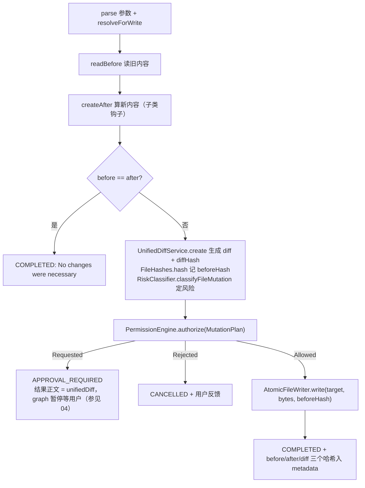

# 06 工具系统：读与写

前几章里，agent graph（参见 04-agent-graph.md）把模型返回的 `ToolCall` 派发给具体工具执行；本章讲这些工具本身。agent-tools 模块回答四个问题：工具怎样被注册和按名查找（`DefaultToolRegistry`）、路径参数如何被约束在 workspace 之内（`WorkspacePathResolver`）、只读工具如何把结果安全地交回模型（`ToolResults` + `ToolResultStore` 的落盘引用机制）、以及写文件的三个工具如何共享同一套「diff 预览 → 审批绑定 → 原子替换」模板（`AbstractFileMutationTool`）。审批引擎 `PermissionEngine`、`RiskClassifier` 的内部实现参见 07-approval-risk-sandbox.md，本章只讲工具侧如何调用它们。

## 本章文件

按建议阅读顺序（均在 `agent-tools/src/main/java/dev/miniclaudecode/tools/` 下）：

1. `registry/DefaultToolRegistry.java`
2. `fs/WorkspacePathResolver.java`、`fs/WorkspacePathException.java`
3. `internal/ToolArguments.java`、`internal/TextFiles.java`
4. `internal/ToolResults.java`、`result/ToolResultStore.java`
5. `fs/ReadTool.java`、`fs/ListTool.java`、`fs/GlobTool.java`、`fs/GrepTool.java`、`internal/GlobMatcher.java`
6. `fs/AbstractFileMutationTool.java`、`fs/WriteTool.java`、`fs/EditTool.java`、`fs/ApplyPatchTool.java`
7. `diff/UnifiedDiffService.java`、`diff/UnifiedPatchApplier.java`、`diff/FileHashes.java`、`fs/AtomicFileWriter.java`
8. `planning/PlanningRequestTool.java`、`user/AskUserTool.java`

## 6.1 注册与查找：DefaultToolRegistry

`DefaultToolRegistry` 是所有 `AgentTool` 实例的静态花名册：构造时一次性建好索引，之后只查不改。每个工具用 `ToolDescriptor`（参见 02-domain-model.md）自述身份、风险和 `ToolEffect`，`qualifiedName()` 即 `namespace + ":" + name`，例如 `workspace:read`、`planning:request`、`user:ask`。

| 方法 | 参数 | 做什么 |
|---|---|---|
| 构造器 | `tools`：`Collection<? extends AgentTool>`，启动时组装好的全部工具（参见 01-boot-and-wiring.md） | 建两张不可变索引：`toolsByQualifiedName`（限定名 → 工具，重复限定名直接抛 `IllegalArgumentException`）和 `toolsByShortName`（短名 → 同名工具列表，允许多命名空间同名）。 |
| `require` | `name`：模型给出的工具名，可以是限定名或短名 | 名字含 `:` 走限定名精确查找；否则按短名查找——命中 0 个抛 "unknown tool"，命中多于 1 个抛 "ambiguous tool name" 并列出全部候选限定名，恰好 1 个才返回。查不到就抛异常而非返回 null，让调用方（参见 03-turn-lifecycle.md）把错误变成 FAILED 的 `ToolResult` 反馈给模型。 |
| `descriptors` | 无 | 返回按 `qualifiedName` 排序的全部 `ToolDescriptor`，用于拼进发给模型的工具清单（参见 05-model-providers.md）。 |

## 6.2 路径安全：WorkspacePathResolver

`WorkspacePathResolver` 是所有文件系统工具的守门人：任何模型给出的路径字符串必须经它换算成真实 `Path`，越出 workspace 的一律抛 `WorkspacePathException`（一个仅带 message/cause 的 `IllegalArgumentException` 子类，方便上层统一按参数错误处理）。

| 方法 | 参数 | 做什么 |
|---|---|---|
| 构造器 | `workspace`：workspace 根目录 | 先 `toRealPath()` 固化为解析过符号链接的绝对真实路径（不存在即失败），再用 `NOFOLLOW_LINKS` 确认它本身是目录而非链接。之后所有前缀检查都基于这个真实根。 |
| `resolveExisting` | `requestedPath`：相对路径文本，空白视为 `.` | 读路径入口。先 `resolveLexically` 做词法检查，再 `toRealPath()` 解析符号链接，最后验证真实路径仍以 workspace 为前缀——链接指向外部即拒绝（"symbolic link resolves outside the workspace"）。 |
| `resolveForWrite` | `requestedPath`：写目标相对路径，不允许空白 | 写路径入口。目标已存在（`NOFOLLOW_LINKS` 判断）则复用 `resolveExisting`；不存在时改为校验其父目录：父目录必须真实存在且 `toRealPath()` 后仍在 workspace 内，然后返回 `realParent.resolve(fileName)`——这样新建文件也无法借不存在的中间目录或链接父目录逃逸。 |
| `relativeDisplay` | `path`：已解析的绝对路径 | 换算回相对 workspace 的展示串，并把 `\` 统一替换成 `/`，保证 Windows 与 POSIX 上给模型看到的路径一致；workspace 自身显示为 `.`。 |
| `resolveLexically`（私有） | `value` | 三连拒：`Path.of` 抛 `InvalidPathException`（如 Windows 下路径里含 `*`、`?`、非法 `:`）→ "invalid workspace path"；`isAbsolute()` 为真 → "workspace path must be relative"；`resolve` + `normalize` 后不以 workspace 为前缀（`..` 爬出、或 Windows 下 `\foo`、`D:foo` 这类带根却不算绝对的写法）→ "path resolves outside the workspace"。 |

关键点：词法检查挡 `..` 和绝对路径，`toRealPath` 检查挡符号链接，最后的 `startsWith(workspace)` 是兜底——三层都过才放行。

## 6.3 公共设施：参数解析与结果落盘

**`ToolArguments`** 把 `ToolCall.argumentsJson` 包装成带校验的取值器（Jackson 解析，顶层必须是 JSON object）。工具里所有参数读取都走它，错误消息统一为 "argument 'x' must be …"。

| 方法 | 参数 | 做什么 |
|---|---|---|
| `parse`（静态） | `json`：原始参数 JSON | 解析并要求是 object，否则抛 `IllegalArgumentException`。 |
| `requiredText` | `name`：字段名 | 必填且非空白的字符串；用于 path、pattern 这类不允许为空的参数。 |
| `requiredString` | `name` | 必填但允许空串；`WriteTool` 的 `content`、`EditTool` 的 `newText` 用它——写入空内容是合法操作。 |
| `optionalText` / `optionalBoolean` | `name`、`defaultValue` | 缺省或为 null 时返回默认值，类型不符抛异常。 |
| `optionalPositiveInt` | `name`、`defaultValue`、`maximum` | 缺省用默认值，给了就必须在 `[1, maximum]` 内——所有 maxLines/maxEntries/maxResults 的上限都由此强制。 |

**`TextFiles`** 是文本处理的两件小工具：`decodeUtf8(bytes)` 用严格模式解码（先扫 NUL 字节判定二进制，再以 `CodingErrorAction.REPORT` 拒绝非法 UTF-8——宁可报错也不给模型看乱码）；`withLineNumbers(text, startLine, maxLines)` 输出 `N | 内容` 格式的带行号窗口，1 起始编号，正是 Read 结果里行号的来源。

**`ToolResults` + `ToolResultStore`** 解决「结果太大撑爆上下文」的问题。`ToolResults.completed(call, output, metadata, store, inlineByteLimit)` 按 UTF-8 字节数分流：不超过 `inlineByteLimit`（各工具默认 32768）就原样内联并标 `truncated=false`；超过则整份落盘换取引用，模型只拿到前一半字节数的预览：

```java
String reference = store.put(normalized);
int previewCharacters = Math.min(normalized.length(), Math.max(1, inlineByteLimit / 2));
String preview = normalized.substring(0, previewCharacters);
resultMetadata.put("truncated", true);
resultMetadata.put("totalBytes", normalized.getBytes(StandardCharsets.UTF_8).length);
return new ToolResult(call.toolCallId(), Status.COMPLETED,
    preview + "\n… output truncated; full result: " + reference,
    Optional.of(reference), resultMetadata);
```

这个 `reference` 同时写进 `ToolResult` 的 `resultReference`（`Optional<String>`）字段。`ToolResults.failed(call, exception)` 则统一产出 FAILED 结果，异常没有 message 时退回类名。

`ToolResultStore` 是内容寻址的文件仓库：`put(content)` 算 SHA-256，以 `<hash>.txt` 存进根目录（构造时 `createDirectories` + `toRealPath`），返回 `"sha256:" + hash`；同内容天然去重（文件已存在直接返回），写入走临时文件 + `ATOMIC_MOVE`（不支持时降级普通 move），并发写同一哈希也安全。`read(reference)` 先用正则 `sha256:[0-9a-f]{64}` 校验引用格式——引用本身不可能携带路径，杜绝了借引用做路径穿越——再读回全文。

落盘链：`ReadTool.execute()`（fs/ReadTool.java）→ `ToolResults.completed()`（internal/ToolResults.java）→ `ToolResultStore.put()`（result/ToolResultStore.java）→ 后续轮次可凭引用取回全文。

## 6.4 只读四件套：Read / List / Glob / Grep

四个工具结构同构：构造器注入 `WorkspacePathResolver` 与 `ToolResultStore`（另有一个带自定义上限的重载），`descriptor()` 返回静态 `DESCRIPTOR`（namespace 均为 `workspace`，`RiskLevel.LOW`），`execute(call, context)` 内部同步完成、以 `CompletableFuture.completedFuture` 返回，`IOException` 与 `RuntimeException` 都被兜住转成 FAILED 结果——只读工具从不向上抛异常。

| 工具 | 关键参数 | 做什么 |
|---|---|---|
| `ReadTool`（`workspace:read`） | `path` 必填；`startLine`、`maxLines`（默认与上限均 10000） | `resolveExisting` 后要求是常规文件；最多读 `maxBytes`（默认 524288）+1 字节以探测截断，`decodeUtf8` 严格解码，`withLineNumbers` 加行号。metadata 带 `path`、`startLine`、`fileTruncated`。 |
| `ListTool`（`workspace:list`） | `path` 默认 `.`；`maxEntries` 默认 500、上限 10000 | 非递归 `Files.list`，过滤符号链接，按 `relativeDisplay` 排序，每行 `dir  ` 或 `file ` 前缀；空目录输出 `(empty directory)`。 |
| `GlobTool`（`workspace:glob`） | `pattern` 必填；`path` 默认 `.`；`maxResults` 默认 1000、上限 100000 | `Files.walk` 递归，跳过符号链接、只留常规文件，用 `GlobMatcher` 对 **workspace 相对路径**（不是 base 相对）匹配。metadata 带 `matches` 数。 |
| `GrepTool`（`workspace:grep`） | `query` 必填（Java 正则）；`glob` 默认 `**`；`path`、`maxResults` 同上 | 先按 GlobTool 同款规则收集候选文件，再排除超过 `maxFileBytes`（默认 2097152）的大文件；逐文件解码——二进制文件解码失败即静默跳过——逐行 `find`，输出 `路径:行号: 行内容`，凑满 `maxResults` 提前收工。 |

`GlobMatcher`（internal/GlobMatcher.java）不用 JDK 的 `PathMatcher`，而是把 glob 手工翻译成正则以保证跨平台行为一致：`**/` → `(?:.*/)?`（可匹配零层目录）、`**` → `.*`、`*` → `[^/]*`、`?` → `[^/]`、`[!abc]` → `[^abc]`，其余正则元字符转义；模式和被匹配路径都先把 `\` 归一成 `/`，所以同一个 pattern 在 Windows 和 Linux 上结果相同。

只读调用链（以 Read 为例）：`ReadTool.execute()`（fs/ReadTool.java）→ `ToolArguments.parse()`（internal/ToolArguments.java）→ `WorkspacePathResolver.resolveExisting()`（fs/WorkspacePathResolver.java）→ `TextFiles.decodeUtf8()` / `withLineNumbers()`（internal/TextFiles.java）→ `ToolResults.completed()`（internal/ToolResults.java）。

## 6.5 写路径三兄弟：AbstractFileMutationTool 模板

`AbstractFileMutationTool` 用模板方法模式固化了「任何写盘都必须先给用户看 diff、审批与这份 diff 绑定、落盘时校验文件未被偷改」的流程。子类只需实现两个钩子：`createAfter(arguments, before)` 算出新内容，`mutationReason(displayPath)` 给审批界面一句话理由。

| 方法 | 参数 | 做什么 |
|---|---|---|
| 构造器（protected） | `resolver`、`permissionEngine`、`diffService`、`writer`、`riskClassifier` | 注入五个协作者；三个子类的公开构造器只接收 `resolver` 和 `permissionEngine`，其余三件（`UnifiedDiffService`、`AtomicFileWriter`、`RiskClassifier`）自行 new——它们无状态。 |
| `execute`（final） | `call`、`context` | 模板主流程，见下方流程图；`final` 保证子类无法绕过审批。 |
| `createAfter`（abstract） | `arguments`：已解析参数；`before`：目标当前内容（新文件为 `""`） | 子类的差异点：纯函数地由旧内容算新内容，不碰磁盘。 |
| `mutationReason`（abstract） | `displayPath` | 返回给审批展示的操作描述。 |
| `readBefore`（私有静态） | `target` | 文件不存在返回空串（即"新建"）；存在但不是常规文件抛错；否则严格 UTF-8 解码。 |



审批绑定的核心是 `PermissionEngine.MutationPlan`：它携带 `call`、风险等级、workspace 路径、`displayPath`、理由、`beforeHash`（落盘前文件哈希，新文件为 `FileHashes.MISSING` 即 `"missing"`）、`diffHash` 与 `unifiedDiff` 全文。用户批准的不是「这个工具」而是「这份 diff 作用于这个哈希的文件」——引擎如何据此判定与记忆参见 07-approval-risk-sandbox.md。

三个子类一览：

| 工具 | 参数 | `createAfter` 语义 |
|---|---|---|
| `WriteTool`（`workspace:write`） | `path`、`content`（`requiredString`，可为空） | 整文件覆盖：直接返回 `content`。 |
| `EditTool`（`workspace:edit`） | `path`、`oldText`、`newText`、`replaceAll`（默认 false） | 精确文本替换：`oldText` 找不到抛错；出现多于一次且未开 `replaceAll` 也抛错（"oldText occurs more than once; set replaceAll=true"），逼调用方给出无歧义锚点。 |
| `ApplyPatchTool`（`workspace:apply_patch`） | `path`、`patch`（unified diff 文本） | 委托 `UnifiedPatchApplier.apply(before, patch)` 打补丁。 |

写路径调用链：`EditTool.execute()`（继承自 fs/AbstractFileMutationTool.java）→ `WorkspacePathResolver.resolveForWrite()` → `EditTool.createAfter()`（fs/EditTool.java）→ `UnifiedDiffService.create()`（diff/UnifiedDiffService.java）→ `RiskClassifier.classifyFileMutation()` → `PermissionEngine.authorize()`（均参见 07）→ `AtomicFileWriter.write()`（fs/AtomicFileWriter.java）。

## 6.6 diff 三件套与原子写入

**`UnifiedDiffService`**：`create(displayPath, before, after)` 生成单 hunk 的 unified diff——找最长公共前缀和后缀，把中间的变化区连同各 3 行上下文（`CONTEXT_LINES`）拼成 `--- a/… +++ b/… @@ … @@` 文本。返回 record `DiffResult(unifiedDiff, beforeContentHash, diffHash)`，其中 `diffHash` 是 diff 文本自身的 SHA-256，供审批绑定用；内容相同时返回空 diff。单 hunk 意味着首尾两处修改之间的未变行也会进 diff，牺牲紧凑换实现简单，语义不受影响。

**`UnifiedPatchApplier`**：`apply(original, patch)` 是 `create` 的逆操作。用正则 `^@@ -(\d+)(?:,\d+)? \+(\d+)(?:,\d+)? @@.*$` 定位 hunk 头，把源文件推进到 `oldStart - 1` 行处，然后逐行按标记处理：空格（上下文）和 `-`（删除）都要 `verifySource` 逐字比对源文件当前行，不匹配即抛 "patch context no longer matches the target file"；`+` 行直接输出；`\ No newline` 行跳过。没有任何 hunk、hunk 区间倒退或越界都抛错，并保留原文件末尾换行符的有无。

**`FileHashes`**：`hash(path)` 对文件内容做 SHA-256 十六进制摘要，文件不存在时返回常量 `MISSING`（`"missing"`）而非抛错——这让「新建文件」也能纳入同一套哈希校验；`sha256(bytes)` 是裸摘要函数，`UnifiedDiffService` 与 `ToolResultStore` 也复用同款逻辑。

**`AtomicFileWriter`**：`write(target, content, expectedBeforeHash)` 是落盘前的最后一道闸：

```java
String currentHash = FileHashes.hash(target);
if (!currentHash.equals(expectedBeforeHash)) {
  throw new ConcurrentModificationException("target changed after diff approval");
}
```

哈希对上后，在**目标同目录**创建临时文件（保证同一文件系统、move 可原子），写满内容并 `channel.force(true)` 刷盘，再 `ATOMIC_MOVE + REPLACE_EXISTING` 替换目标（文件系统不支持时降级为普通 `REPLACE_EXISTING` move），`finally` 里清理残留临时文件。审批期间文件若被人改过，写入会失败而不是覆盖掉别人的修改。

## 6.7 PlanningRequestTool 与 AskUserTool

**`PlanningRequestTool`**（`planning:request`，LOW、`READ_ONLY_LOCAL`）是发现阶段进入规划阶段的显式信号。它本身不执行副作用，只校验 goal 与 `MUTATION / PROCESS / EXTERNAL_EFFECT` 列表，并把结构化请求交给 `CreatePlanNode`。

| 方法 | 参数 | 做什么 |
|---|---|---|
| `execute` | `goal`：要完成的目标；`expectedEffects`：预计需要的副作用类型 | 返回带 `planningRequested=true` 的结构化 metadata。图随后调用独立 Planner；Plan 才是 step 状态、尝试次数、验收标准和证据的唯一真源。 |

**`AskUserTool`**（`user:ask`，LOW）让 agent 主动向用户提一个问题，巧妙之处在于它**复用了审批暂停通道**：没有独立的"提问"机制，问题被包装成一个 `ApprovalRequest` 走审批那条路。

| 方法 | 参数 | 做什么 |
|---|---|---|
| `execute`（首次） | `question`：必填问题文本 | `context.attributes()` 里既无 `approvalRequest` 也无 `approvalDecision` 时，构造一个 `RiskLevel.LOW`、target 为问题原文的 `ApprovalRequest`，返回 `APPROVAL_REQUIRED`——graph 据此暂停等用户（参见 04-agent-graph.md）。 |
| `execute`（重入） | 同一 `call`，attributes 里带回 request 与 decision | 严格校验 decision 对应的 request 与本次 `call`、问题文本、`approvalId` 逐项一致，不一致抛 `SecurityException`（防止把别的审批答案错接到这个问题上）；`Choice.REJECT` → CANCELLED，否则用户在 `decision.feedback()` 里的文字就是答案，作为 COMPLETED 结果返回给模型。 |

## 下一章

写工具把 `MutationPlan` 交给了 `PermissionEngine` 就不再过问——07-approval-risk-sandbox.md 将拆开这只黑盒：风险如何分类、审批如何与 diff 哈希绑定并被记忆、命令执行又是如何被 OS 级沙箱围起来的。
