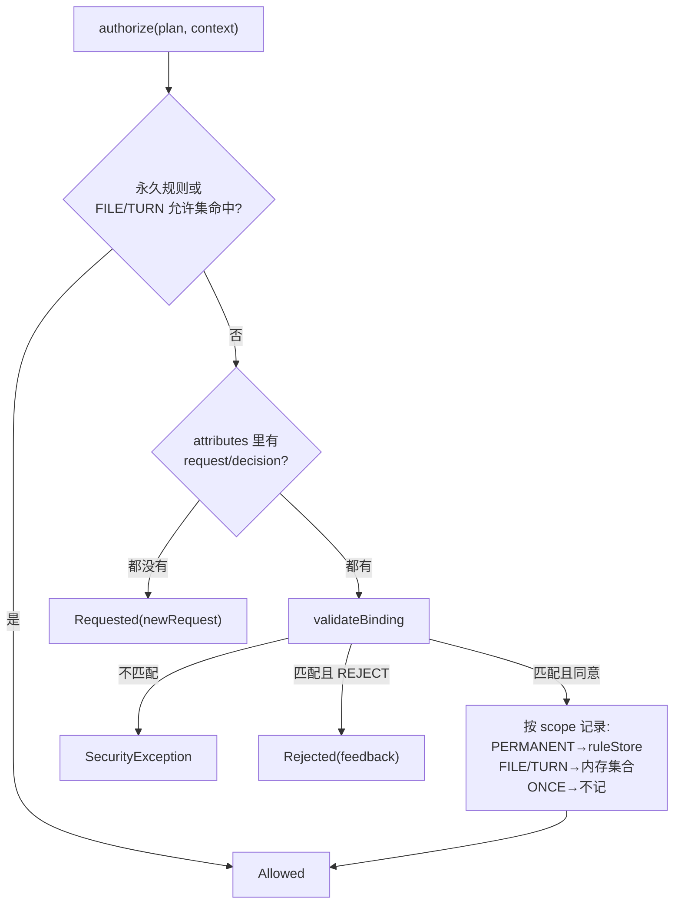

# 07 审批、风险分类与沙箱

上一章讲了工具"能做什么"，本章讲平台如何决定"允不允许做、做的时候怎么兜底"。MiniClaudeCode 的安全模型分三层：**风险分类**（静态判断一个动作有多危险）、**审批**（危险动作先问用户，且防止批完之后偷换内容）、**沙箱与运行时护栏**（即使批了，也限制爆炸半径）。这三层分别对应本章的 `CommandRiskClassifier`/`RiskClassifier`、`PermissionEngine`/各工具的 authorize 流程、`CommandSandbox`/`ProcessRunner`/`NetworkAddressPolicy`。审批交互的 UI 侧与图引擎如何暂停等待用户，分别参见 01-boot-and-wiring.md 与 04-agent-graph.md；本章只讲机制层。

## 本章文件

按建议阅读顺序：

1. `agent-tools/src/main/java/dev/miniclaudecode/tools/approval/PermissionEngine.java`
2. `agent-tools/src/main/java/dev/miniclaudecode/tools/approval/RiskClassifier.java`
3. `agent-tools/src/main/java/dev/miniclaudecode/tools/process/CommandRiskClassifier.java`
4. `agent-tools/src/main/java/dev/miniclaudecode/tools/process/RunCommandTool.java`
5. `agent-tools/src/main/java/dev/miniclaudecode/tools/process/ShellSelector.java`
6. `agent-tools/src/main/java/dev/miniclaudecode/tools/process/ProcessRunner.java`
7. `agent-tools/src/main/java/dev/miniclaudecode/tools/process/CommandSandbox.java`
8. `agent-tools/src/main/java/dev/miniclaudecode/tools/web/WebFetchTool.java`
9. `agent-tools/src/main/java/dev/miniclaudecode/tools/web/NetworkAddressPolicy.java`

## PermissionEngine：文件变更的审批裁决器

`PermissionEngine` 是所有文件写类工具（参见 06-tools-read-write.md）共享的审批裁决器：输入一份"变更计划"，输出三态之一的 `Authorization`。`ApprovalRequest`/`ApprovalDecision`/`PermissionRule` 等领域记录参见 02-domain-model.md。

| 方法 | 参数 | 做什么 |
|---|---|---|
| `authorize` | `plan`：本次变更的 `MutationPlan`；`context`：`ToolContext`，携带 workspace、turnId 和 attributes（审批请求/决定经由 attributes 往返） | 核心裁决。命中永久规则或 FILE/TURN 内存允许集直接 `Allowed`；attributes 里两者皆空则返回 `Requested`（附新建的 `ApprovalRequest`）；两者皆在则先 `validateBinding` 再按 choice/scope 处理。 |
| `validateBinding`（私有静态） | `plan`、`request`、`decision` | 防 TOCTOU 校验，见下文。不匹配抛 `SecurityException`。 |
| `newRequest`（私有） | `plan` | 用随机 `UUID` + plan 的 call/riskLevel/target/reason/beforeHash/diffHash + 当前时刻构造 `ApprovalRequest`。 |
| `fileKey` / `turnKey`（私有静态） | plan（turnKey 另加 context） | 生成内存允许集的键：FILE 键 = `workspace + " " + target`（同文件、任意变更工具都覆盖）；TURN 键 = `workspace + turnId + qualifiedName + target`（额外钉死工具与轮次）。 |

`Authorization` 是 sealed interface，三个实现：`Allowed`（放行）、`Requested(ApprovalRequest request)`（需要问用户，图引擎据此暂停）、`Rejected(String feedback)`（用户拒绝，feedback 回传给模型）。

`MutationPlan` 是入参 record，八个字段全部非空校验：`call`（`ToolCall`）、`riskLevel`、`workspace`、`target`（规范化目标路径）、`reason`、`beforeHash`（变更前文件内容哈希）、`diffHash`（补丁哈希）、`unifiedDiff`（给用户看的 diff 文本）。

### validateBinding：approvalId + 内容哈希双重绑定

审批是两趟执行：第一趟返回 `Requested`，用户决定后第二趟带着 `approvalRequest`/`approvalDecision` 两个 attribute 重放同一个工具调用。两趟之间文件可能被改、模型可能换参数——这就是 TOCTOU 窗口。`validateBinding` 先校验 `decision.approvalId()` 等于 `request.approvalId()`（决定必须对应这份请求），再要求第二趟现算的 plan 与第一趟请求完全一致：

```java
boolean matches =
    request.toolCall().equals(plan.call())
        && request.target().equals(plan.target())
        && request.beforeHash().equals(Optional.of(plan.beforeHash()))
        && request.diffHash().equals(Optional.of(plan.diffHash()));
if (!matches) {
  throw new SecurityException("file or diff changed after approval was requested");
}
```

`beforeHash` 变了说明磁盘上的文件在批复期间被人动过，`diffHash` 变了说明要应用的补丁不是用户看过的那份——任一情况都作废审批，而不是带着旧批文写新内容。

### 四档 scope 的落点

用户批准时选的 `Scope` 决定允许记到哪里：`PERMANENT` → `ruleStore.save(new PermissionRule(...))` 落盘（持久化参见 08-persistence-and-config.md）；`FILE` → 进程内 `fileAllowances` 集合；`TURN` → 进程内 `turnAllowances` 集合（turnId 变了自然失效）；`ONCE` → 什么都不记，下次再问。FILE/TURN 刻意放内存而非 `PermissionRuleStore`——临时授权绝不能悄悄变成永久授权。

永久规则的匹配是**三元组精确相等**（`PermissionRule.matches`）：`workspace`、`qualifiedToolName`、`normalizedTarget` 三者 `equals`，没有通配、没有前缀——一条规则只放行"这个工作区里这个工具对这个目标"。



## RiskClassifier：敏感路径升级

一句话定位：文件变更的风险升档器——路径本身敏感时，把工具自报的基础风险强制抬到 `HIGH`。

| 方法 | 参数 | 做什么 |
|---|---|---|
| `classifyFileMutation` | `normalizedTarget`：规范化目标路径；`baseRisk`：工具描述符自带的基础风险 | 路径小写、反斜杠归一后，命中 `.env`（本名或结尾）、`/.ssh/`、`/id_rsa`、`/id_ed25519`、含 `credentials` 或 `secrets` 任意一条即返回 `RiskLevel.HIGH`，否则原样返回 `baseRisk`。 |

## CommandRiskClassifier：shell 命令分级

一句话定位：把命令字符串映射到 `RiskLevel` 的静态分类器；`LOW` 是唯一免审批直接执行的档位，所以"判 LOW"是安全边界而不是 UI 提示。

| 方法 | 参数 | 做什么 |
|---|---|---|
| `classify` | `command`：完整命令字符串 | 依次判：命中 `CRITICAL_MARKERS` → `CRITICAL`；命中 `HIGH_RISK_MARKERS` → `HIGH`；含 shell 元字符（`;` `&` `\|` `>` `<` 换行 `` ` `` `$` 括号花括号）→ `MEDIUM`；`isProvablyReadOnly` 通过 → `LOW`；否则兜底 `MEDIUM`。 |
| `normalizeForMarkers`（私有静态） | `command` | 小写、tab 转空格、剥掉单双引号、压缩空白——让 `rm\t-rf` 或 `"rm" -rf ~` 无法躲过标记匹配。匹配前首尾各补一个空格，使带尾分隔符的标记能对齐词边界。 |
| `isProvablyReadOnly` / `isSafeArgument` / `tokenize`（私有静态，合并简述） | `command` / `token` | token 化（识别引号）后：首 token 必须**整词**命中 `READ_ONLY_COMMANDS`（`pwd`/`ls`/`rg`/`grep`/`find`/`cat`/`get-childitem` 等，整词匹配使 `lsof` 不会继承 `ls`）；`git` 特判，第二个 token 必须在 `READ_ONLY_GIT_SUBCOMMANDS`（`status`/`diff`/`log` 等 8 个）。随后每个参数过 `isSafeArgument`。 |

参数感知是这套分级的关键：不少"只读"程序给对参数就是任意代码执行引擎——`find -exec`、`find -fprintf`、`rg --pre`、`git -c`、`git --upload-pack`、`grep -o`/`--output` 等都收录在 `EXECUTION_ARGUMENTS`（对整 token 和 `--flag=value` 的前缀部分匹配）。此外任何长得像路径的非 `-` 参数必须留在工作区内：以 `/`、`~`、`\` 开头、含 `..`、或带 Windows 盘符（`hasWindowsDriveLetter`）都判不安全，整条命令落回 `MEDIUM`。

哪些注定高危：`CRITICAL_MARKERS` 收的是不可恢复操作——`rm -rf / `、`rm -rf ~ `、`mkfs`、`diskpart`、`dd if=`、fork 炸弹 `:(){` 等；注意多数条目**保留尾分隔符**，使 `rm -rf /tmp/build` 停在 `HIGH` 而不是被误升 `CRITICAL`——过度升级造成的告警疲劳本身就是安全问题。`HIGH_RISK_MARKERS` 覆盖删除（`rm `、`remove-item`）、提权（`sudo `、`runas `）、网络外联下载（`curl `、`wget `、`iwr `、`certutil `）、权限位（`chmod `、`icacls `）、远程执行（`ssh `、`nc `）与混淆解码（`base64 -d`、`iex `）。HIGH 标记先于元字符检查，所以 `curl x | sh` 判 `HIGH` 而非 `MEDIUM`。

## RunCommandTool：shell:run 的审批与执行入口

一句话定位：`shell:run` 工具本体，把"分级 → 审批 → 执行 → 结果映射"串成一条线。描述符基础风险即 `HIGH`。

| 方法 | 参数 | 做什么 |
|---|---|---|
| `execute` | `call`：`ToolCall`；`context`：`ToolContext` | 解析参数（`command` 必填；`workingDirectory` 默认 `.`，经 `WorkspacePathResolver.resolveExisting` 圈在工作区内；`timeoutSeconds` 默认 120 上限 600；`maxOutputBytes` 默认 512 KiB 上限 4 MiB），调 `riskClassifier.classify`，过 `authorize`；放行则在虚拟线程上执行 `processRunner.run`。lambda 内部自 catch `RuntimeException` 转 `ToolResults.failed`——一条坏命令只赔一次工具调用，不能把整个 turn 拖成 FAILED。 |
| `authorize`（私有） | `call`、`context`、`command`、`risk` | 返回 `Optional<ToolResult>`：empty 表示放行。`LOW` 直接放行；否则查本 turn 允许集与永久规则（三元组里 target 就是命令字符串本身）。都未命中时返回 `APPROVAL_REQUIRED` 的 `ToolResult`，其 `ApprovalRequest.reason` 里内嵌 `processRunner.sandboxDescription()`——用户批命令时**总能看到**沙箱是隔离生效还是已降级。第二趟校验 `request.toolCall()`、`request.target()`（即命令文本）与 `approvalId` 三者绑定（命令没有文件哈希可绑，命令文本本身就是被批的全部内容）；REJECT → `CANCELLED`；`PERMANENT` → `ruleStore.save` 落盘；`TURN` → 内存 `turnAllowances`（键 = workspace + turnId + command）。 |
| `toToolResult`（私有） | `call`、`workingDirectory`、`processResult` | stdout/stderr 拼接后映射状态：cancelled → `CANCELLED`；超时或非零退出码 → `FAILED`（前缀标明原因）；成功 → `ToolResults.completed`，内联上限 32 KiB，超出溢写 `ToolResultStore`（参见 06-tools-read-write.md）。metadata 带 exitCode/timedOut/outputTruncated/durationMillis 等。 |
| `cancellationToken`（私有静态） | `context` | 从 attributes 取 `cancellationToken`，没有就新建（即不可取消）。 |

命令执行主链（读者跳转地图）：

`RunCommandTool.execute()`（RunCommandTool.java）→ `CommandRiskClassifier.classify()`（CommandRiskClassifier.java）→ `RunCommandTool.authorize()` → `ProcessRunner.run()`（ProcessRunner.java）→ `CommandSandbox.wrap(ShellSelector.command(script), dir)`（CommandSandbox.java / ShellSelector.java）→ `ProcessBuilder.start()`

## ShellSelector：平台 shell 选型

一句话定位：把一段脚本文本翻译成平台对应的 argv。

| 方法 | 参数 | 做什么 |
|---|---|---|
| `forOsName` / `system`（静态） | `osName` / 无 | os.name 含 "windows" 则 `Platform.WINDOWS`，否则 `POSIX`。 |
| `command` | `script`：脚本文本 | Windows：`powershell.exe -NoLogo -NoProfile -NonInteractive -ExecutionPolicy Bypass -Command`，并在脚本前拼一段把输入/输出编码强制为无 BOM UTF-8 的前缀（避免中文输出乱码）；POSIX：`/bin/sh -lc script`。 |

## ProcessRunner：进程树、输出预算与超时

一句话定位：真正起进程的执行器，负责三件运行时护栏——整树终止、输出限额、超时/取消区分。

| 方法 | 参数 | 做什么 |
|---|---|---|
| `run` | `request`：`ProcessRequest`（command、workingDirectory、timeout、maxOutputBytes、mergeErrorStream，构造器全量校验）；`cancellationToken` | 已取消则直接返回 `cancelledBeforeStart`。否则 `ProcessBuilder(sandbox.wrap(shellSelector.command(...)))` 起进程并立刻关闭子进程 stdin；注册 `cancellationToken.onCancel(→ terminateTreeOnce)`；虚拟线程分别抽 stdout/stderr；`waitFor(timeout)` 到点未结束就整树终止。`timedOut` 只在"没结束且不是被取消"时为 true——取消和超时在结果里是两个语义。 |
| `terminateTreeOnce`（私有静态） | `process`、`terminationStarted`：CAS 门闩 | 先按 `descendants()` 逆序 `destroy()` 再 destroy 本体（先杀叶子避免孤儿重挂），给 300 ms（`TERMINATION_GRACE`）优雅退出窗口，仍活着的逐个 `destroyForcibly()`。CAS 保证取消回调与超时路径只会执行一次。 |
| `drain`（私有静态） | `capture`：读流的 `Future` | 最多等 2 s（`STREAM_DRAIN_TIMEOUT`）让输出线程收尾，超时就 cancel——杀掉的进程若有孙进程还握着管道，读线程可能永远读不到 EOF，不能陪它等。 |

内部类 `OutputBudget` 是 stdout/stderr **共享**的字节预算：`claim(requested)` 用 CAS 循环扣减剩余额度，扣不满就置 `truncated` 标志；`StreamCapture.read` 每读一块先 claim 再写入，所以无论子进程刷多少输出，内存占用有硬上限，且截断事实会随 metadata 报给模型。

## CommandSandbox：三后端与显式降级

一句话定位：OS 级沙箱包装器——分类+审批决定命令"跑不跑"，它限制"跑起来之后能碰什么"。设计上网络保持放行（`mvn`/`npm install` 需要），主战场是文件系统隔离；后端缺失时降级而非拒绝，但降级**可见**（`describe()` 进审批提示语）。

| 方法 | 参数 | 做什么 |
|---|---|---|
| `detect`（静态） | `policy`、`workspace`（另有加 `osName`/`pathVariable` 的测试重载） | 选后端：Linux 且 PATH 上有 `bwrap` → `Backend.BUBBLEWRAP`（同时预计算系统/家目录 bind 参数）；macOS 且 `/usr/bin/sandbox-exec` 可执行 → `SANDBOX_EXEC`；否则（含 Windows，无纯 Java 隔离原语）→ `NONE`。`Policy.OFF` 直接 `NONE`。 |
| `wrap` | `command`：shell argv；`workingDirectory` | `NONE` 且 `Policy.REQUIRED` → 抛 `IllegalStateException`（按命令报错并提示改 `MINICLAUDE_SANDBOX=auto`，不毒化 CLI 启动）；`NONE` 其余情况原样返回。`BUBBLEWRAP` 构造 argv：`bwrap --die-with-parent --unshare-pid --unshare-uts --unshare-ipc --new-session`（`--new-session` 必不可少——否则子进程保留控制终端，可用 TIOCSTI 向父 shell 注入键击）+ 系统只读 bind + `--proc/--dev/--tmpfs /tmp` + 工作区读写 `--bind` + `--chdir` + `--` + 原 argv。`SANDBOX_EXEC` 则 `/usr/bin/sandbox-exec -p <seatbelt profile>` 前缀。 |
| `describe` | 无 | 给审批提示的一句话：两种后端各自说明"写入圈在哪、网络放行"；`NONE` 分三种措辞——`off`、REQUIRED 下"将被拒绝"、AUTO 下"未沙箱直跑"（提示语不许撒谎）。 |
| `linuxSystemBinds` / `linuxHomeBinds`（包内静态，合并简述） | `root`+`names` / `home` | 系统目录逐个探测：符号链接（merged-usr 的 `/bin`→`/usr/bin`）用 `--symlink` 重建，真目录用 `--ro-bind`。家目录整体只读 bind（否则 Maven 每条命令重下全仓库），仅 `.m2`/`.npm`/`.gradle` 三个构建缓存再 `--bind` 为可写；工作区的 rw bind 排在 argv 更后面，位于家目录之下的工作区仍以可写覆盖生效。 |
| `seatbeltProfile`（静态重载可测） | `workspace`、`tmpdirVariable`、`userHome` | 生成 macOS seatbelt 策略文本，见下。 |

seatbelt 策略的结构是"全允许 → 禁写 → 白名单再开写"，读保持全开（构建要满盘读工具链，禁读的 profile 正是用户会关掉的那种）：

```lisp
(version 1)
(allow default)
(deny file-write*)
(allow file-write* (subpath "<workspace>") (subpath "/private/tmp")
  (subpath "/private/var/tmp") (subpath "/dev")
  (subpath "<realpath($TMPDIR)>") (subpath "<home>/.m2") (subpath "<home>/.npm"))
```

`$TMPDIR` 要先 `toRealPath()`——macOS 上它是指向 `/private/var/folders/...` 的符号链接，seatbelt 的 `subpath` 只认解析后的形态。三档 `Policy` 由环境变量 `MINICLAUDE_SANDBOX` 控制（`Policy.parse`：`auto` 默认/`required`/`off`），在 `WorkspaceComponents` 组装时读取（参见 01-boot-and-wiring.md）。

## WebFetchTool 与 NetworkAddressPolicy：SSRF 防护

`WebFetchTool` 是 `web:fetch` 工具：抓取有界 HTTP(S) 文本，核心是不让模型借它探内网或云 metadata。`NetworkAddressPolicy` 是从中拆出的纯函数策略类，只看地址字节，便于脱离 HTTP 服务器单测。

| 类.方法 | 参数 | 做什么 |
|---|---|---|
| `WebFetchTool.execute` | `call`、`context` | 解析 `url`/`timeoutSeconds`（默认 30 上限 120）/`maxBytes`（默认 1 MiB 上限 4 MiB），先 `classify` 定级，`PRIVATE` 则走 `authorize` 审批（`HIGH` 级请求，target 为完整 URL，绑定校验同 `RunCommandTool` 的三项：toolCall + target + approvalId），放行后异步 `fetch`。 |
| `WebFetchTool.classify`（私有） | `uri` | 只收 http/https；拒绝带 userInfo 的 URL（`user@host` 混淆）；主机名命中 `METADATA_HOSTS`（`metadata.google.internal`、`instance-data.ec2.internal` 等 6 个）直接抛 `SecurityException`；否则解析出**全部**地址——任一地址是 metadata 地址即抛；全部 public 才返回 `Access.PUBLIC`，否则 `PRIVATE`。 |
| `WebFetchTool.fetch`（私有） | `call`、`initial`、`timeout`、`maximumBytes` | 客户端设 `Redirect.NEVER`，重定向由自己循环处理（最多 5 跳）：**每一跳重新 `classify`**，非 PUBLIC 的跳转还必须与初始 URI `sameAuthority`（scheme+host+有效端口三者相等——scheme 参与比较，防止已批的 `https://internal` 被 302 降级到 `http://internal` 还算"批过"）。响应体读 `maximumBytes + 1` 字节，超限直接报错而非静默截断。 |
| `NetworkAddressPolicy.isMetadata`（静态） | `address` | 云 metadata 端点硬阻断：`169.254.169.254`（AWS/GCP/Azure/OpenStack）、`100.100.100.200`（阿里云）、`192.0.0.192`（Oracle）、`fd00:ec2::254`（AWS IPv6）。IPv4-mapped IPv6 先经 `unwrapMappedV4` 展平，`::ffff:169.254.169.254` 逃不掉。 |
| `NetworkAddressPolicy.isPublic`（静态） | `address` | JDK 自带谓词（loopback/link-local/site-local/multicast/any）之外补真实缺口：`Inet6Address.isSiteLocalAddress()` 只认废弃的 `fec0::/10`，不认真正在用的 `fc00::/7` ULA；`100.64.0.0/10` CGNAT、`0.0.0.0/8`、`192.0.0.0/24`、`198.18.0.0/15`、`240.0.0.0/4` 也都判非公网——这些以前全被当 public 免审批放行过。 |

### 诚实标注的残留窗口

`classify` 校验的地址与 `HttpClient` 最终连接的地址是**两次独立解析**——零 TTL 的域名可以给校验回公网地址、给连接回 metadata 地址（DNS rebinding）。`WebFetchTool` 的 static 块把 JVM 级 `networkaddress.cache.ttl` 显式钉为 30 秒（仅在未设置时），让两次解析大概率走同一份缓存；但源码注释明说这只是收窄不是关死——攻击者若能让缓存恰好在两次解析之间过期仍可穿透，彻底关死需要连到钉死的 `InetAddress`，而 `java.net.http` 不暴露这个能力。这种"防不住的部分写在注释里"是本仓库安全代码的一贯风格。

Web 链地图：`WebFetchTool.execute()` → `classify()` → `NetworkAddressPolicy.isMetadata()/isPublic()`（NetworkAddressPolicy.java）→ `authorize()`（仅 PRIVATE）→ `fetch()` 循环内每跳再 `classify()` + `sameAuthority()`（均在 WebFetchTool.java）。

## 下一章

审批产生的 `PermissionRule` 落到哪、`MINICLAUDE_SANDBOX` 这类配置从哪来、会话如何断点恢复，参见 08-persistence-and-config.md。
