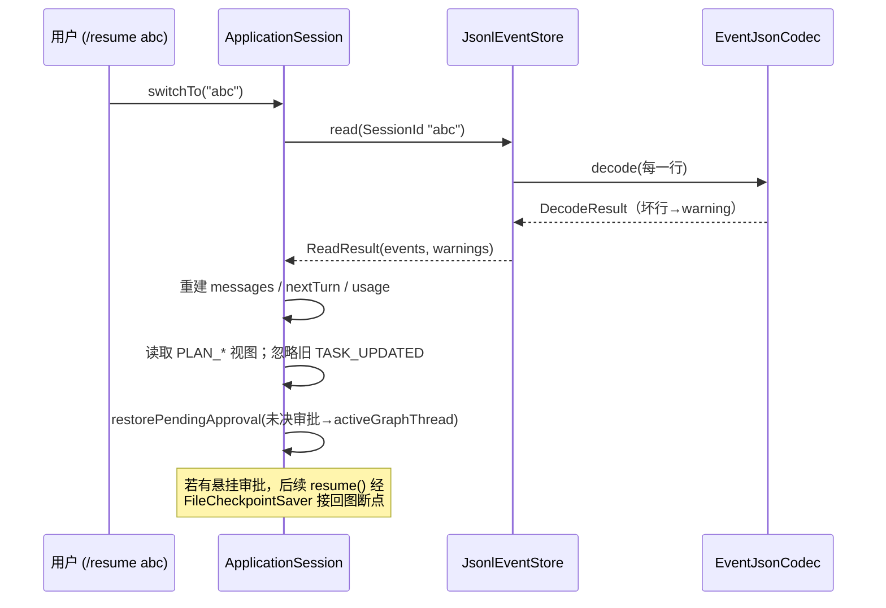

# 08 持久化、配置与会话恢复

前几章里 agent 的一切——审批规则、审计事件、checkpoint——都假设"有地方存"。本章就讲这个地方：`agent-persistence` 模块。它回答四个问题：磁盘目录长什么样（`UserDataLayout`）；配置从哪里来、怎么合并、怎么校验（`ConfigLoader` 一族）；运行时产生的事件、台账、checkpoint、权限规则各自怎么落盘且在崩溃后仍可读（四个 store）；以及重启后 `/resume` 如何只靠 JSONL 事件流把会话重建出来（`ApplicationSession`）。它排在 07 章之后，因为审批产生的权限规则与审计事件正是本章要持久化的东西。

## 本章文件

按建议阅读顺序：

1. `agent-persistence/src/main/java/dev/miniclaudecode/persistence/path/UserDataLayout.java`
2. `agent-persistence/src/main/java/dev/miniclaudecode/persistence/config/ConfigLoader.java`
3. `agent-persistence/src/main/java/dev/miniclaudecode/persistence/config/AppConfig.java`
4. `agent-persistence/src/main/java/dev/miniclaudecode/persistence/config/ProviderProfile.java`
5. `agent-persistence/src/main/java/dev/miniclaudecode/persistence/config/EmbeddingConfig.java`
6. `agent-persistence/src/main/java/dev/miniclaudecode/persistence/config/UserConfigWriter.java`
7. `agent-cli/src/main/java/dev/miniclaudecode/cli/app/ConfigurationWizard.java`
8. `agent-persistence/src/main/java/dev/miniclaudecode/persistence/config/SecretRedactor.java`
9. `agent-persistence/src/main/java/dev/miniclaudecode/persistence/event/EventJsonCodec.java`
10. `agent-persistence/src/main/java/dev/miniclaudecode/persistence/event/JsonlEventStore.java`
11. `agent-persistence/src/main/java/dev/miniclaudecode/persistence/ledger/JsonToolExecutionLedger.java`
12. `agent-persistence/src/main/java/dev/miniclaudecode/persistence/checkpoint/FileCheckpointSaver.java`
13. `agent-persistence/src/main/java/dev/miniclaudecode/persistence/permission/JsonPermissionRuleStore.java`
14. `agent-cli/src/main/java/dev/miniclaudecode/cli/app/ApplicationSession.java`

## UserDataLayout：所有路径的唯一出处

`UserDataLayout` 是用户数据目录 `~/.mini-claude-code` 的路径字典——全仓库没有第二处硬编码这些路径，所有组件都从它拿 `Path`。

| 方法 | 参数 | 做什么 |
| --- | --- | --- |
| `forHome` / `systemDefault` | `userHome`：作为根的用户主目录 / 无参 | 静态工厂；后者取 `System.getProperty("user.home")`。构造时把 home 规范化后拼上 `.mini-claude-code` |
| `root` | 无 | 返回 `~/.mini-claude-code` 根目录 |
| `configFile` | 无 | `config.yaml`，用户级配置（`ConfigLoader` 读、`UserConfigWriter` 写） |
| `permissionsFile` | 无 | `permissions.json`，跨会话永久权限规则（`JsonPermissionRuleStore`） |
| `historyFile` | 无 | `history`，JLine 的 REPL 输入历史（参见 01-boot-and-wiring.md） |
| `sessionsRoot` | 无 | `sessions/`，每 workspace 一个子目录，放事件 JSONL 与工具台账 |
| `checkpointsRoot` | 无 | `checkpoints/`，LangGraph4j 图状态快照（`FileCheckpointSaver`） |
| `toolResultsRoot` | 无 | `tool-results/`，超长工具输出的溢出存储（参见 06-tools-read-write.md） |
| `indexesRoot` | 无 | `indexes/`，每 workspace 的 Lucene 代码索引（参见 09-rag-indexing.md） |
| `skillsRoot` | 无 | `skills/`，用户级 skill 目录（参见 11-mcp-and-skills.md） |
| `sessionWorkspaceRoot` / `indexWorkspaceRoot` | `workspace`：工作区目录 | 分别返回 `sessions/<hash>` 与 `indexes/<hash>`，把不同项目的数据隔离开 |
| `workspaceHash` | `workspace`：工作区目录 | 规范化绝对路径的 SHA-256 十六进制；Windows 上先转小写，避免同一目录因大小写产生两份数据 |

## 配置链路：默认 → 用户 → 项目

### ConfigLoader

`ConfigLoader` 把三层 YAML 合并成一棵树再解析成不可变的 `AppConfig`，是配置的唯一入口。

| 方法 | 参数 | 做什么 |
| --- | --- | --- |
| `load` | `userConfig`：用户配置路径（通常 `layout.configFile()`）；`projectConfig`：可选的项目配置路径 | 以 classpath 资源 `/default-config.yaml` 为底（默认 provider 是本地 ollama），依次 deep merge 用户配置、项目配置，最后 `parseConfig` 出 `AppConfig`。文件不存在就静默跳过该层 |

私有辅助合并简述：`readDefaultConfig` / `readObject` / `requireObject` 负责读 YAML 并强制根节点是对象；`mergeProjectConfig` 在合并前先跑 `rejectPlaintextProjectKeys`——递归遍历整棵树（含数组），任何名为 `api-key`（忽略大小写）且非空的键都抛 `SecurityException` 并带上 `$.providers.xxx.api-key` 式的定位路径。理由：项目配置进 git 仓库，明文密钥只允许放用户配置或环境变量。`parseConfig` / `parseProfile` / `parseEmbedding` 把 JSON 树转成 record，缺省值在这里给（temperature 0.2、max-output-tokens 8192、timeout 120s、max-retries 3；embedding 缺省整段回退 `EmbeddingConfig.fastDefault()`）。

merge 的语义只有一条规则，值得贴出来：

```java
JsonNode existing = target.get((String) entry.getKey());
JsonNode value = (JsonNode) entry.getValue();
if (existing instanceof ObjectNode existingObject
    && value instanceof ObjectNode valueObject) {
  deepMerge(existingObject, valueObject);
  return;
}
target.set((String) entry.getKey(), value.deepCopy());
```

即：两边都是对象才递归合并，其余情况（标量、数组、类型不一致）一律上层整体覆盖下层。所以项目配置里写 `providers.ollama.model` 只改这一个键，但写一个数组会整个替换。

调用链（读者跳转地图）：`WorkspaceComponents.create()`（agent-cli/.../app/WorkspaceComponents.java，项目配置固定取 `<workspace>/.mini-claude-code/config.yaml`）→ `ConfigLoader.load()` → `deepMerge()` → `parseConfig()` → `new AppConfig(...)` / `new ProviderProfile(...)` / `new EmbeddingConfig(...)`。

### AppConfig / ProviderProfile / EmbeddingConfig

五个 record，校验全部压进紧凑构造器，因此"存在即合法"。

`AppConfig(providers, activeProvider, embedding, planning, memory)`：`providers` 防御性 `Map.copyOf` 且非空；`activeProvider` 非空白且必须是 `providers` 的键；`activeProfile()` 返回当前生效的 profile。`PlanningConfig` 约束 Plan-first 执行的最大步骤、单步尝试和重规划次数；`MemoryConfig` 固定使用 SQLite 后端，并强制候选记忆经过批准。

`ProviderProfile` 十个字段：`type`（枚举 `ANTHROPIC` / `OPENAI_COMPATIBLE` / `OLLAMA`，`Type.parse` 接受连字符写法 `openai-compatible`）、`baseUrl`（必须 http/https 且带 host）、`apiKey` / `apiKeyEnv`（trim 后空串归一为 `Optional.empty()`）、`model`（非空白）、`temperature`（0–2 且有限）、`maxOutputTokens`（≥1）、`thinking`、`timeout`（正值）、`maxRetries`（0–10）。

| 方法 | 参数 | 做什么 |
| --- | --- | --- |
| `resolvedApiKey` | `environment`：环境变量 map（注入而非读 `System.getenv`，便于测试） | 先查 `apiKeyEnv` 指向的环境变量，非空则优先；否则退回配置内的 `apiKey`。模型接入层用它拿真实密钥（参见 05-model-providers.md） |

`EmbeddingConfig` 结构与之平行，服务 RAG 的向量化（参见 09-rag-indexing.md）：`AUTO` 是默认值，存在 `base-url` 时走 `REMOTE`，否则使用无模型依赖的 `FAST` 哈希兜底。生产语义检索推荐显式选择 `REMOTE`（OpenAI-compatible `/v1/embeddings`）；`FAST` 只适合离线开发和 CI。`dimensions ≥ 32` 且必须在建索引前声明；`REMOTE` 额外强制 `base-url` 与 `model` 存在。`resolvedApiKey` 与 `ProviderProfile` 同款。

这里的 embedding 仅用于代码 RAG。会话原文写入 JSONL；跨会话长期记忆写入 SQLite FTS5，以 BM25 检索，不生成向量。

### UserConfigWriter 与 ConfigurationWizard

`UserConfigWriter` 是用户 `config.yaml` 的唯一写入方，只有一个公共方法：

| 方法 | 参数 | 做什么 |
| --- | --- | --- |
| `upsertProvider` | `configFile`：目标文件；`profileName`：profile 键名（只允许 `[A-Za-z0-9._-]+`）；`profile`：要写入的 `ProviderProfile`；`makeActive`：是否同时把 `active-provider` 指向它 | 读入现有 YAML 根（缺失则新建空对象），在 `providers` 下覆盖同名节点，然后原子写回 |

私有辅助合并简述：`profileNode` 把 record 序列化回 kebab-case 键；`writeAtomically` 先写同目录临时文件再 `ATOMIC_MOVE`（不支持时降级普通 move），前后各调一次 `restrictPermissions` 把 POSIX 权限收紧到 owner 读写——配置里可能有明文密钥。

`ConfigurationWizard`（agent-cli 侧）是 `/config setup` 背后的交互向导：`run(LineReader)` 依次询问 profile 名、provider 类型、base URL、model、密钥存储方式（1=明文写入用户配置，2=只记环境变量名）、是否开 thinking，密钥输入用 `*` 掩码（dumb 终端除外），最后组装 `ProviderProfile` 调 `writer.upsertProvider(..., true)`，并明确提示"明文保存、重启生效"。

## 审计事件链路：脱敏、批写与崩溃恢复

每个会话的全部事件追加在一个 `<sessionId>.jsonl` 文件里，一行一个 JSON。写入前脱敏（`SecretRedactor` + `EventJsonCodec`），写入时保证持久与互斥（`JsonlEventStore`），读取时容忍半行垃圾。事件类型定义参见 02-domain-model.md。

**SecretRedactor** 只有一个方法 `redact(value, knownSecrets)`，两步走：先用三个正则把 `Authorization: Bearer xxx`、`api-key=xxx` 键值对、URL 查询串里的 `?token=xxx` 替换成 `***`；再把 `knownSecrets`（配置里解析出的真实密钥集合）按长度降序做字面替换——先替换长的，避免短密钥是长密钥子串时留下残片。

**EventJsonCodec** 负责 `AgentEvent` 与 JSON 行的互转：

| 方法 | 参数 | 做什么 |
| --- | --- | --- |
| `encode` | `event`：待写入的 `AgentEvent` | 组装信封（`eventId`、`version`、`sessionId`、`turnId`、`occurredAt`、`type`）加 `payload` 树，写盘前先跑 `redactTree` |
| `decode` | `json`：一行 JSON 文本 | `version > 1` 返回 `DecodeResult.skipped`（带 warning，向前兼容）；否则重建 `AgentEvent`。任何解析失败统一抛 `IllegalArgumentException` |

`redactTree` 的策略是双保险：字段名命中 `SENSITIVE_FIELD` 正则（authorization / api-key / token / secret 等变体）的文本值整体替换为 `***`；其余文本值逐个过 `SecretRedactor.redact`，数组元素继承父字段名。内部 record `DecodeResult(event, warning)` 用构造器强制"二者恰有其一"。

**JsonlEventStore** 实现 domain 的 `SessionEventStore` 接口：

| 方法 | 参数 | 做什么 |
| --- | --- | --- |
| `append` | `event`：单个事件 | 委托 `appendAll(List.of(event))` |
| `appendAll` | `events`：一批事件 | 先全部 `encode` 成行（codec 失败则一个字节都不写），按目标文件分组后每文件一次 `writeBatch`。流式回答被审计层攒批后，2000 个 delta 从 2000 次 fsync 降到少数几次；跨会话批次按文件逐个提交、不保证跨文件原子 |
| `read` | `sessionId`：要读的会话 | 整读文件交给 `decodeLines`，返回 `ReadResult(events, warnings)`——坏行降级为 warning 而非异常 |

私有辅助合并简述：`writeBatch` 上双重锁——进程内每文件一把 `ReentrantLock`（静态 `PROCESS_LOCKS` map），进程间 `FileChannel.lock()` 的 OS 级 `FileLock`——以 `CREATE|WRITE|APPEND` 打开、写完 `channel.force(false)` 刷盘；`eventFile` 用白名单正则拦截含路径分隔符等危险字符的 session id；`decodeLines` 逐行解码，坏行记 `"malformed event skipped"`，session id 不匹配、版本过高各记对应 warning。

崩溃一致性靠写读两端的约定闭环——追加中途断电最多留下半行，读端直接丢弃它：

```java
boolean hasIncompleteTail = !content.isEmpty() && !content.endsWith("\n");
String[] lines = content.split("\n", -1);
int completeLineCount = hasIncompleteTail ? lines.length - 1 : lines.length;
```

写入调用链：`ApplicationSession.emit()`（agent-cli/.../app/ApplicationSession.java）→ `JsonlEventStore.append()` → `appendAll()` → `EventJsonCodec.encode()` → `SecretRedactor.redact()` → `writeBatch()`。流式 delta 的攒批发生在 `AuditedModelClient`（参见 03-turn-lifecycle.md）。

## JsonToolExecutionLedger：工具执行台账的原子写

实现 domain 的 `ToolExecutionLedger`，为每个 turn 记录已执行的工具调用（`toolCallId`、状态、风险级、前后哈希），供崩溃恢复时去重——同一个 `toolCallId` 不会重复执行副作用（消费方 `LedgeredToolExecutor` 参见 04-agent-graph.md）。文件按 turn 切分：`sessions/<hash>/<sessionId>/tool-ledger-<turn>.json`（见下文 `createRunner`）。

| 方法 | 参数 | 做什么 |
| --- | --- | --- |
| `find` | `toolCallId`：工具调用 id | 在 `list()` 结果里找同 id 记录 |
| `list` | 无 | 读整个 JSON 数组；文件缺失、截断、单条不可解析都降级为空/跳过——台账只承载去重信息，坏文件必须表现为"什么都没记过"，不能让本 turn 后续工具调用全部抛错 |
| `save` | `record`：新的 `ToolExecutionRecord` | 读-改-写：按 `toolCallId` 做 upsert（`LinkedHashMap` 保序），整体重写文件 |

私有 `write` 是标准原子替换（同目录临时文件 → `ATOMIC_MOVE`），但多一步关键动作：rename 前 `channel.force(true)`。源码注释点明原因——`ATOMIC_MOVE` 只保证改名原子，不保证数据块已落盘；断电后可能新文件名可见而内容为空，不先 force 就丢掉了台账存在的意义。

## FileCheckpointSaver：LangGraph4j checkpoint 的薄封装

实现 LangGraph4j 的 `BaseCheckpointSaver`，四个方法 `list` / `get` / `put` / `release` 全部转发给内置的 `FileSystemSaver`。封装的价值在构造器：钉死序列化方案为 `ObjectStreamStateSerializer<>(stateFactory)`，并让存储根由调用方（`UserDataLayout`）决定。审批中断后跨进程恢复图状态全靠它（图如何消费 checkpoint 参见 04-agent-graph.md）。

## JsonPermissionRuleStore：永久权限规则

实现 domain 的 `PermissionRuleStore`，落盘 `~/.mini-claude-code/permissions.json`，即审批菜单里"permanent"选项的持久化端（参见 07-approval-risk-sandbox.md）。

| 方法 | 参数 | 做什么 |
| --- | --- | --- |
| `list` | 无 | 读 JSON 数组重建 `PermissionRule`（`ruleId`、`workspace`、`qualifiedToolName`、`normalizedTarget`、`createdAt`）；与台账不同，格式非法直接抛异常——权限文件损坏应当被看见，而不是静默放行 |
| `save` | `rule`：新规则 | 先用 `PermissionRule.matches` 查重，重复则不写；否则追加后走与台账同款的临时文件 + `ATOMIC_MOVE` 重写（此处无 fsync） |

## 会话恢复：/sessions 与 /resume

会话恢复不依赖任何专门的快照——JSONL 事件流就是唯一事实源，`switchTo` 把它重放成内存状态。

`ApplicationSession` 的持久化侧方法（turn 执行侧的 `start` / `resume` / `finishState` 参见 03-turn-lifecycle.md）：

| 方法 | 参数 | 做什么 |
| --- | --- | --- |
| `sessions` | 无 | 列出 `sessions/<hash>/events/` 下所有 `*.jsonl` 文件名（去扩展名、排序），即 `/sessions` 的输出 |
| `switchTo` | `value`：目标 session id 字符串 | `/resume <id>` 的实现：`eventStore.read` 重放事件流，空则报 `unknown session`；否则依次恢复用量统计、消息历史、turn 计数、Plan 视图与悬挂审批（详见下） |
| `emit` | `turnId`：当前 turn；`type`：事件类型；`payload`：事件数据 | 每个关键节点写一条事件——正是这些事件让 `switchTo` 成为可能 |
| `createRunner`（私有） | `turn` / `graphThread` / `cancellationToken` / `renderer` | 每 turn 组装一套运行件：本 turn 专属的 `JsonToolExecutionLedger`、指向 `checkpoints/<workspaceHash>` 的 `FileCheckpointSaver`，图线程 id 固定为 `<sessionId>-turn-<n>` |

`switchTo` 重放的规则：消息历史从零开始——先放一条新鲜的 `SystemMessage(systemPrompt())`，然后 `USER_MESSAGE` 事件的 `text` 变 `UserMessage`、`TURN_FINAL` 的 `text` 变 `AssistantMessage`（中间的工具往返不进历史，上下文因此天然紧凑）；`nextTurn` 取所见最大 `turnId` 加一。Plan 由 `PLAN_*` 事件提供历史和证据视图，运行中断点则从 checkpoint 恢复。旧 JSONL 中的 `TASK_UPDATED` 仍可解码，但会被忽略，不再恢复 todo 状态。

最精巧的是 `restorePendingApproval`：顺序扫描，遇 `APPROVAL_REQUESTED` 记为悬挂、遇 `APPROVAL_RESOLVED` 或 `TURN_FINAL` 清空。扫完仍悬挂，说明上次进程死在等审批——于是从 payload 重建 `ApprovalRequest` 与 diff 预览，并把 `activeGraphThread` 设回 `<sessionId>-turn-<n>`。这个 id 与当初 `createRunner` 用的图线程 id 相同，因此用户批准后 `resume()` 能通过 `FileCheckpointSaver` 找到当时冻结的图状态、从中断点继续执行。



调用链：`/resume <id>` → `SessionCommandHandler`（agent-cli/.../cli/SessionCommandHandler.java，经 `session::switchTo` 方法引用接线）→ `ApplicationSession.switchTo()` → `SessionAuditService.read()` → `SessionRestorationService.restore()`（消息、用量、审批和进度一次性重建）。

## 下一章

存储与配置的地基打完，09-rag-indexing.md 开始讲建在 `indexesRoot` 之上的 RAG：workspace 扫描、Java 分块与 Lucene 索引。
