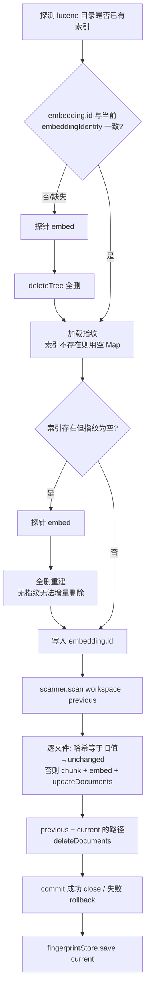

# 09 · RAG 上篇：扫描、分块与索引

本章讲 RAG 流水线的"写入侧"：从工作区里的原始文件，到 Lucene 索引里一条条可检索的文档。整条流水线是 `WorkspaceScanner`（找出哪些文件值得索引、哪些没变）→ `DocumentChunker`（把文件切成语义单元 `CodeChunk`）→ `LuceneCodeIndex.synchronize`（增量写入，向量由 `EmbeddingModel` 生成）。它排在工具系统（参见 06-tools-read-write.md）之后，因为索引正是 `code_search` 工具背后的存储；检索与融合放在下一章（参见 10-rag-search-and-eval.md）。理解本章的关键是两条不变量：**内容哈希是"文件变没变"的唯一真相**，**embedding 身份是"向量能不能混用"的唯一门控**。

## 本章文件

按建议阅读顺序：

1. `agent-rag/src/main/java/dev/miniclaudecode/rag/index/WorkspaceScanner.java`
2. `agent-rag/src/main/java/dev/miniclaudecode/rag/index/FileFingerprintStore.java`
3. `agent-rag/src/main/java/dev/miniclaudecode/rag/chunk/CodeChunk.java`
4. `agent-rag/src/main/java/dev/miniclaudecode/rag/chunk/DocumentChunker.java`
5. `agent-rag/src/main/java/dev/miniclaudecode/rag/chunk/JavaAstChunker.java`
6. `agent-rag/src/main/java/dev/miniclaudecode/rag/chunk/StructuredTextChunker.java`
7. `agent-rag/src/main/java/dev/miniclaudecode/rag/chunk/FallbackChunker.java`
8. `agent-rag/src/main/java/dev/miniclaudecode/rag/embedding/EmbeddingIdentity.java`
9. `agent-rag/src/main/java/dev/miniclaudecode/rag/embedding/LocalCodeEmbeddingModel.java`
10. `agent-rag/src/main/java/dev/miniclaudecode/rag/embedding/RemoteEmbeddingModel.java`
11. `agent-rag/src/main/java/dev/miniclaudecode/rag/index/LuceneCodeIndex.java`

## WorkspaceScanner —— 决定"读什么"

它是流水线入口：遍历工作区目录树，过滤掉不值得索引的文件，并利用已知指纹跳过对未变文件的读取。

| 方法 | 参数 | 做什么 |
|---|---|---|
| 构造器 | `maximumFileBytes`：单文件字节上限（无参构造默认 2097152，即 2 MiB），必须为正 | 超过上限的文件在遍历时直接跳过，不读入内存。 |
| `scan` | `workspace`：工作区根目录 | 便捷重载，等价于用空的已知指纹 Map 调用双参版本，即全量读取。 |
| `scan` | `workspace`：工作区根目录；`known`：路径 → 已知 `FileFingerprint` 的 Map，来自上次同步 | Git 工作区通过 `git ls-files --cached --others --exclude-standard` 获取候选集，因此根目录/嵌套 `.gitignore`、`.git/info/exclude` 和标准 excludes 都生效，同时保留已跟踪文件与 Agent 新建的未跟踪源码。Git 不可用或目录不是仓库时回退 `Files.walkFileTree`，并跳过 `.git`、`.mini-claude-code`、`target`、`node_modules` 等生成目录。两条路径都会过滤符号链接、超大文件和不可解析二进制，最终按 `/` 分隔的相对路径排序。 |

`visitFile` 内部就是**廉价信号快速路径**：若 `known` 中该路径的指纹 `hasCheapSignal()` 且 size 与 mtime 均相同，就直接复用存储的哈希，产出一个 `content` 为 `Optional.empty()` 的 `ScannedFile`——省掉一次全文读取加一次 SHA-256。否则 `readAllBytes` 后走 `decode`：先在前 8192 字节里找 NUL 字节（找到即判为二进制丢弃），再用 `CodingErrorAction.REPORT` 的严格 UTF-8 解码器解码，失败同样丢弃。注意方向性：size+mtime 匹配只用来**跳过工作**，从不单独宣布"文件变了"；接受的代价是"同字节数 + 同一 mtime 粒度内改内容"这种理论窗口。

`ScannedFile` record 有五个分量：`path`、`content`（`Optional<String>`，空表示读取被跳过）、`fingerprint`（内容 SHA-256 十六进制）、`sizeBytes`、`modifiedMillis`。

## FileFingerprintStore —— 指纹的持久化

它把"上次同步时每个文件长什么样"存成 `fingerprints.properties`，是廉价信号和删除检测的数据来源。

| 方法 | 参数 | 做什么 |
|---|---|---|
| 构造器 | `file`：properties 文件路径 | 规范化路径，并派生出旁边的 `<file>.version` 版本文件。 |
| `load` | 无 | 数据文件不存在、或版本文件内容不等于 `SCHEMA_VERSION`（当前为 `"2"`），返回空 Map——上层由此触发一次全量重建。否则按 key 排序解析每行。 |
| `save` | `fingerprints`：路径 → `FileFingerprint` | 先写临时文件再原子 move（不支持 `ATOMIC_MOVE` 时降级为普通 move），**之后**才写版本文件：中途崩溃只会让版本缺失 → `load` 返回空 → 白做一次全量扫描，绝不会留下陈旧的廉价信号。 |
| `decode`（私有） | `value`：`hash,size,mtime` 格式的一行 | 解析失败一律降级为 `FileFingerprint.withoutSignal(hash)` 而不抛异常——最坏结果永远是"重新读一遍文件"，不是索引损坏。 |

`FileFingerprint` record：`contentHash` + `sizeBytes` + `modifiedMillis`，后两者可为哨兵值 `UNKNOWN`（-1），`hasCheapSignal()` 要求两者都非负。schema 从 1 升到 2 时顺带丢弃旧数据，是刻意的：版本 2 与骨架 TYPE 分块（见下）同批发布，全量重建正好替换掉旧索引里的整类大块。

## CodeChunk 与 DocumentChunker —— 索引的原子单位

`DocumentChunker` 是一个 `@FunctionalInterface`：`List<CodeChunk> chunk(String path, String content)`。`CodeChunk` 是它的产物，一个十字段 record：`id`、`path`、`language`、`kind`（枚举 `TYPE`/`METHOD`/`CONSTRUCTOR`/`FIELD`/`SECTION`/`TEXT`）、`packageName`、`owner`、`symbol`、`startLine`、`endLine`、`content`。紧凑构造器把 `packageName`/`owner`/`symbol` 的 null 归一为空串，校验 `startLine >= 1 && endLine >= startLine`。

| 方法 | 参数 | 做什么 |
|---|---|---|
| `create`（静态） | 除 `id` 外的全部九个字段 | 由五元组算出 id 后构造。**内容不参与 id**：位置和签名没动的 chunk，即使方法体改了，id 也不变——Lucene 的更新按 path 整文件替换（见下），id 稳定只为跨次运行可对账。 |
| `embeddingText` | 无 | 供向量化的文本：`path` + 换行 + `包名.owner symbol` + 换行 + `content`，让路径和限定名进入语义空间。 |
| `lexicalText` | 无 | 供 BM25 的文本：在 `embeddingText` 之后追加一份按 `IDENTIFIER_BOUNDARY`（camelCase 边界或非字母数字）切开并小写的词序列，使查询 `sync lock` 能命中标识符 `syncLock`。 |

```java
String identity =
    path + "\u0000" + kind + "\u0000" + owner + "\u0000" + symbol + "\u0000" + startLine;
return new CodeChunk(sha256(identity), path, language, kind, ...);
```

## 三个 Chunker 实现

### JavaAstChunker —— AST 分块与 TYPE 骨架

用 JavaParser（`LanguageLevel.JAVA_21`）解析 Java 源码，按声明切块；解析失败抛 `ParseProblemException` 交给上层兜底。

| 方法 | 参数 | 做什么 |
|---|---|---|
| `chunk` | `path`：文件相对路径；`content`：源码全文 | 解析出 `CompilationUnit` 后做五轮 `findAll`：每个 `TypeDeclaration` 一个 TYPE 骨架块；每个 `MethodDeclaration`、`ConstructorDeclaration`、`CompactConstructorDeclaration`（record 紧凑构造器）、`InitializerDeclaration`（静态/实例初始化块）、`FieldDeclaration` 的每个变量各一块，内容取该节点行区间的原文。最后按 `startLine`、`kind`、`symbol` 排序。 |
| `skeleton`（私有） | `unit`、`type` | 生成 TYPE 块内容：package 声明 + 类级 Javadoc + 注解 + `typeHeader`（含泛型/extends/implements，enum 附常量清单），成员逐条列为一行——字段带 ≤60 字符的单行初始化器（更长的写 `= ...`），方法/构造器只留 `getDeclarationAsString` 签名加分号，初始化块和嵌套类型写 `{ ... }`。 |
| `owner`（私有） | `node`：任意 AST 节点 | 沿 `getParentNode` 向上收集所有外层类型名，用 `.` 连接，如 `Outer.Inner`。 |
| `add`（私有） | 块的元信息 + `node` + `lines` | 从节点 `getRange` 取行区间，按行切原文，调 `CodeChunk.create`。 |

骨架化的动机写在 `addType` 的 Javadoc 里：成员各有各的块，TYPE 若存整个类体，每个文件约被存 `1 + 成员数` 遍，且一个巨型 TYPE 块排到检索首位就会吃光 token 预算。骨架保留只有类级视角能回答的问题——"这个类里有什么"——而方法体留在成员块。id 用的五元组都不因骨架化而变，所以 chunk id 兼容旧版。

### StructuredTextChunker —— Markdown 与纯文本

| 方法 | 参数 | 做什么 |
|---|---|---|
| 构造器 | `maximumLines`：窗口行数（默认 120）；`overlapLines`：相邻窗口重叠行数（默认 20），须小于前者 | 校验窗口参数。 |
| `chunk` | `path`、`content` | `.md`/`.markdown` 文件先按 `^#{1,6} ` 标题切成 `Section`（标题行归属下一节），其余文件整体一节；每节内再按窗口滑动切块，步长 `maximumLines - overlapLines`。有标题的块 `kind` 为 `SECTION`（`symbol` 即标题），无标题为 `TEXT`；`language` 取扩展名小写。 |

### FallbackChunker —— 兜底路由

组合另两个实现：非 `.java` 文件走 `textChunker`；`.java` 先试 `javaChunker`，捕获 `IllegalArgumentException | ParseProblemException`（解析不了、或行区间非法）后降级为文本分块。`LuceneCodeIndex` 的双参构造器默认注入的就是它，所以任何文件都至少能以文本形态进索引。

## Embedding 两实现与身份门控

`EmbeddingIdentity` 接口只有一个方法 `embeddingIdentity()`：返回向量空间的稳定标识。不同模型或不同维度的向量不可比，Lucene 也拒绝同一字段混维度，所以索引持久化这个标识并在变化时强制全量重建。

### LocalCodeEmbeddingModel —— 哈希嵌入

零依赖、确定性的"特征哈希"嵌入：不训练、不联网，把词元哈希到固定维度的槽位上。

| 方法 | 参数 | 做什么 |
|---|---|---|
| 构造器 | `dimensions`：向量维度（默认 `DEFAULT_DIMENSIONS` = 384，最低 32） | 维度即 `dimension()` 的返回值。 |
| `embed` | `text`：待嵌入文本（null 当空串） | 先 `splitIdentifiers`（camelCase 拆词、下划线换空格、小写），按非标识符字符切词；每个词以权重 1.0 投入向量，长度 ≥3 的词再把每个字符 3-gram（加 `#` 前缀区分）以权重 0.25 投入。全零向量兜底置 `vector[0] = 1.0F`。 |
| `embeddingIdentity` | 无 | `"local-hash/" + dimensions`。 |

投入方式是经典 hashing trick——FNV-1a 哈希选槽，哈希最低位定符号，让碰撞在期望上互相抵消：

```java
int slot = (hash & 2147483647) % vector.length;
vector[slot] += (hash & 1) == 0 ? weight : -weight;
```

它没有语义泛化能力（"读文件"匹配不到 `readFile`，但 `read file` 可以，靠的是拆词而非理解），胜在免费、瞬时、可复现——配合 BM25 做混合检索够用（参见 10-rag-search-and-eval.md）。

### RemoteEmbeddingModel —— OpenAI 兼容端点

调用任意 OpenAI 兼容的 `/v1/embeddings` 端点，只依赖 `java.net.http` 和 Jackson。

| 方法 | 参数 | 做什么 |
|---|---|---|
| 构造器 | `baseUrl`：API 基地址（末尾拼上 `/embeddings`）；`apiKey`：`Optional<String>`，有值则发 `Authorization: Bearer` 头；`model`：模型名，非空；`dimensions`：声明的向量维度，Lucene 建字段前就需要它；`timeout`：连接与请求超时 | 全参校验后构造 `HttpClient`。 |
| `embed` | `text` | 每次请求只嵌一条文本（索引侧本就逐块嵌入）。非 2xx 抛 `IllegalStateException`（含截断到 200 字符的响应体）；`parseVector` 校验返回维度必须等于配置的 `dimensions`，否则报错提示修配置——静默的维度漂移会毒化整个索引。 |
| `embeddingIdentity` | 无 | `"remote/" + authority + "/" + model + "/" + dimensions`。端点地址是身份的一部分：llama.cpp、LM Studio 这类本地服务常无视客户端传的模型名，同一模型串在两台主机上可能是两个不兼容的向量空间；代价只是换地址后重建一次索引。 |

选 local 还是 remote 由配置决定，参见 08-persistence-and-config.md。

## LuceneCodeIndex —— 同步与写入

流水线的汇合点：持有 scanner、chunker、embedding model 和指纹仓库，把工作区状态同步进 `indexRoot/lucene` 下的 Lucene 索引。双参构造器默认 `new WorkspaceScanner()` + `new FallbackChunker()`。

| 方法 | 参数 | 做什么 |
|---|---|---|
| `synchronize` | `workspace`：工作区根目录 | 两层锁后进入 `synchronizeLocked`：进程内用 `SYNC_LOCKS`（`ConcurrentHashMap<Path, ReentrantLock>`，按 `indexRoot` 取锁）串行化线程；进程间用 `indexRoot/sync.lock` 上的 `FileChannel.lock()` 串行化进程（`index` CLI 与 REPL 内 `code_search` 的竞争）。 |
| `synchronizeLocked`（私有） | `workspace` | 全流程见下方流程图与逐步说明。返回 `UpdateReport`。 |
| `documents`（私有） | `chunks`：一个文件的全部 chunk | 逐块调 `embeddingModel.embed(chunk.embeddingText())`，克隆向量、空向量抛异常、`normalize` 归一化（全零则置 `[0]=1`），然后组装 Lucene `Document`（字段见下）。 |
| `chunks` / `stats` | 无 | 遍历所有存活文档还原 `CodeChunk` 列表；`stats` 汇总为 `IndexStats(files, chunks, vectorDimensions)`。 |
| `storedChunk`（静态） | `document`：Lucene 存储文档 | 供检索侧把命中文档还原成 `CodeChunk`（参见 10-rag-search-and-eval.md）。 |
| `probeEmbeddingBackendBeforeDestroying`（私有） | 无 | 删旧索引前先 `embed` 一条探针文本：若远程端点已挂，宁可保留旧索引失败退出，也不能删完 BM25 字段后重建失败、落得连一个可搜索索引都不剩。 |

`synchronizeLocked` 的顺序每一步都有因果：



三个关键决策：

1. **身份门控**：`embeddingIdentity()` 优先取 `EmbeddingIdentity` 接口的返回值，否则退化为 `类全名 + "/" + dimension()`（用 `getName()` 而非 `getSimpleName()`，匿名类的 simpleName 为空会撞名）。与 `embedding.id` 文件记录不符（含文件缺失，即来历不明）就全删——静默混用向量会毁掉之后的每一次向量检索。
2. **`embedding.id` 在写任何向量之前落盘**：中途崩溃只会留下"标了当前身份的空索引"（下次一致地重建）或"旧索引原封未动"，绝不会出现"新向量挂着旧身份"这种上面的门控会误放行、且之后任何一次运行都修不好的状态。
3. **增量更新按整文件**：变了的文件（内容哈希 ≠ 旧 `contentHash`）以 `writer.updateDocuments(new Term("path", ...), documents)` 原子替换该路径全部旧文档；scanner 保证变了的文件必带内容，否则抛 `IllegalStateException` 而不是静默漏掉重分块。删除文件 = `previous` 有而 `current` 无的路径。指纹在 commit 之后才 `save`，失败时下次重来。

每个 chunk 写入的字段：`document_type`（恒为 `"chunk"`）、`chunk_id`、`path`、`language`、`kind`、`package`、`owner` 为 `StringField`（不分词、存储，用于精确过滤与还原）；`symbol` 为存储的 `TextField`；`path_text`、`symbol_text` 为不存储的 `TextField`（给 BM25 按字段加权）；`start_line`/`end_line` 各写一份 `IntPoint`（范围查询）加一份 `StoredField`（还原）；`content` 仅存储；`search_text` 是不存储的 `TextField`，内容为 `lexicalText()`；`vector` 为 `KnnFloatVectorField`，相似度函数 `DOT_PRODUCT`——向量已归一化，点积即余弦相似度。

## 调用链地图

主链（同步一次索引）：

`LuceneCodeIndex.synchronize()` → `synchronizeLocked()`（均在 `LuceneCodeIndex.java`）→ `FileFingerprintStore.load()`（`FileFingerprintStore.java`）→ `WorkspaceScanner.scan(workspace, previous)`（`WorkspaceScanner.java`）→ `FallbackChunker.chunk()`（`FallbackChunker.java`）→ `JavaAstChunker.chunk()` / `StructuredTextChunker.chunk()` → `CodeChunk.create()`（`CodeChunk.java`）→ `LuceneCodeIndex.documents()` → `LocalCodeEmbeddingModel.embed()` 或 `RemoteEmbeddingModel.embed()` → `IndexWriter.updateDocuments()` → `FileFingerprintStore.save()`。

## 下一章

索引建好了，10-rag-search-and-eval.md 讲读取侧：BM25 与向量检索如何各自查询这些字段、RRF 如何融合两路结果，以及检索质量如何评测。
