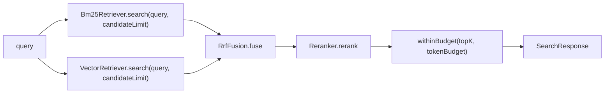

# 10. RAG 下篇：检索、融合与评测

上一章（参见 09-rag-indexing.md）把代码切成 `CodeChunk` 并写进了 Lucene 索引，本章讲查询侧的全链路：一个查询字符串如何同时走 BM25 词法检索和向量 KNN 检索，两路结果如何用 RRF（Reciprocal Rank Fusion）融合成带解释的排名，token 预算如何裁剪最终输出。之后是两条消费路径——模型通过 `code_search` 工具调用它，人通过 CLI 的 `rag` 命令调用它——以及 `RagEvaluator` 如何用 Recall@k / MRR / 延迟分位数回答"这套检索到底好不好"。本章排在索引篇之后、扩展篇之前，因为它是 agent-rag 模块对外的全部出口。

## 本章文件

按建议阅读顺序：

1. `agent-rag/src/main/java/dev/miniclaudecode/rag/search/RetrievalRoute.java`
2. `agent-rag/src/main/java/dev/miniclaudecode/rag/search/RetrievalHit.java`
3. `agent-rag/src/main/java/dev/miniclaudecode/rag/search/SearchResult.java`
4. `agent-rag/src/main/java/dev/miniclaudecode/rag/search/Bm25Retriever.java`
5. `agent-rag/src/main/java/dev/miniclaudecode/rag/search/VectorRetriever.java`
6. `agent-rag/src/main/java/dev/miniclaudecode/rag/search/RrfFusion.java`
7. `agent-rag/src/main/java/dev/miniclaudecode/rag/search/Reranker.java`
8. `agent-rag/src/main/java/dev/miniclaudecode/rag/search/HybridCodeSearcher.java`
9. `agent-rag/src/main/java/dev/miniclaudecode/rag/tool/CodeSearchTool.java`
10. `agent-rag/src/main/java/dev/miniclaudecode/rag/eval/RagEvaluator.java`
11. `agent-cli/src/main/java/dev/miniclaudecode/cli/app/DefaultCliActions.java`

## 检索结果的三个数据类型

**RetrievalRoute** 是一个只有 `BM25` 和 `VECTOR` 两个值的枚举，标记一条命中来自哪一路检索。

**RetrievalHit** 是单路检索的原始命中：record 携带 `chunk`（命中的 `CodeChunk`）、`score`（该路的原始分数）、`rank`（该路内的名次，从 1 起）、`route`（来源路由）。紧凑构造器校验 score 有限、rank ≥ 1，否则抛 `IllegalArgumentException`。

**SearchResult** 是融合之后的最终结果：`chunk`、`fusedScore`（RRF 融合分）、`ranks`（每条路由的最好名次）、`rawScores`（每条路由的最高原始分）。构造时对两个 Map 做 `Map.copyOf` 防御性拷贝，并要求 `fusedScore` 有限且非负。

| 方法 | 参数 | 做什么 |
|---|---|---|
| `SearchResult.explanation()` | 无 | 拼出人类可读的解释串，形如 `RRF=0.031234, BM25 rank=2, vector rank=5`；某路未命中时该 rank 显示 `-1`。这就是工具输出里方括号内的内容。 |

## Bm25Retriever — 词法检索

它是查询侧的 BM25 一路：打开磁盘上的 Lucene 索引，把查询文本分词后构造多字段布尔查询。构造器接收 `indexDirectory`（索引目录 Path，规范化为绝对路径）。

| 方法 | 参数 | 做什么 |
|---|---|---|
| `search(String queryText, int limit)` | `queryText` 查询文本；`limit` 最多返回条数 | 查询为空/`limit < 1`/索引目录不存在/索引未建时直接返回空 List。否则打开 `FSDirectory` 与 `DirectoryReader`，用 `IndexSearcher.search(query, limit)` 取 `TopDocs`，逐条把存储文档经 `LuceneCodeIndex.storedChunk` 还原为 `CodeChunk`，包成 `RetrievalHit`（route 为 `BM25`，rank 按顺序递增）。 |
| `query(String value)`（私有静态） | `value` 原始查询文本 | 先 `analyze` 分词；无有效词项则抛异常。对每个词项加三个 `SHOULD` 子句：`search_text` 原权重、`symbol_text` 加权 3.0、`path_text` 加权 1.8，并 `setMinimumNumberShouldMatch(1)`——命中符号名比命中普通文本贵三倍，命中路径也有额外加成。 |
| `analyze(String value)`（私有静态） | `value` 待分词文本 | 用 Lucene `StandardAnalyzer` 跑 `TokenStream`，收集所有 `CharTermAttribute` 词项。与索引写入侧对 `search_text` 的分析器一致，保证查询词和索引词能对上。 |

源码里 `label86` / `var18` / `var19` 这类怪异写法是反编译产物，语义就是普通的嵌套 try-with-resources：reader 与 directory 一定按序关闭。后面 `VectorRetriever` 同理，不再重复。

## VectorRetriever — 向量 KNN 检索

它是查询侧的语义一路：把查询文本喂给 `EmbeddingModel` 得到向量，在同一份索引的 `vector` 字段上做 KNN。构造器接收 `indexDirectory` 和 `embeddingModel`（langchain4j 的 `EmbeddingModel`，与建索引时同一实现，参见 09-rag-indexing.md 的可插拔 provider）。

| 方法 | 参数 | 做什么 |
|---|---|---|
| `search(String queryText, int limit)` | 同 `Bm25Retriever.search` | 空查询/无索引的早退逻辑与 BM25 完全一致。否则 `embeddingModel.embed(queryText)` 取向量、`clone()` 后就地 `normalize`，再用 `KnnFloatVectorQuery("vector", vector, limit)` 检索。索引侧用的是 `DOT_PRODUCT` 相似度，所以查询向量必须归一化，点积才等价于余弦相似度。命中包成 route 为 `VECTOR` 的 `RetrievalHit`。 |
| `normalize(float[] vector)`（私有静态） | `vector` 待归一化的嵌入向量（就地修改） | L2 归一化：除以模长。空向量抛 `IllegalStateException`；全零向量（模长为 0 无法归一化）退化为把 `vector[0]` 置 1.0，得到一个合法单位向量而不是 NaN。 |

## RrfFusion — 名次融合

两路检索的分数量纲完全不同（BM25 分数无上界，KNN 是相似度），没法直接相加，所以按**名次**融合：每次命中贡献 `weight / (rankConstant + rank)`，同一 chunk 在两路都命中就把贡献加起来。默认构造是 `RrfFusion(60, 1.0, 1.0)`——常数 60 是 RRF 论文的经典取值，两路等权。

| 方法 | 参数 | 做什么 |
|---|---|---|
| `RrfFusion(int rankConstant, double bm25Weight, double vectorWeight)` | `rankConstant` 分母常数（≥1，越大头部名次的优势越平缓）；两个 `weight` 是各路贡献的乘数（非负） | 校验参数，非法配置抛 `IllegalArgumentException`。 |
| `fuse(List<RetrievalHit> bm25, List<RetrievalHit> vector)` | 两路各自的命中列表 | 以 `chunk().id()` 为 key 在 `LinkedHashMap` 里累加两路贡献，然后按 `fusedScore` 降序排序，平分时按 `chunk().path()`、再按 `startLine()` 决胜——保证结果确定性，可复现评测。 |
| 内部类 `Accumulator` | — | 每个 chunk 一个：`ranks` 按路由记**最小**名次（`Math::min`），`rawScores` 按路由记**最大**原始分（`Math::max`），`contributions` 攒所有 RRF 贡献，`result()` 求和产出 `SearchResult`。这就是 `explanation()` 里那两个 rank 的数据来源。 |

## Reranker — 精排扩展点

`@FunctionalInterface`，只有一个方法 `rerank(String query, List<SearchResult> candidates)`，在 RRF 之后、预算裁剪之前重排候选。当前仓库只提供 `Reranker.IDENTITY`（原样拷贝返回），留着接 cross-encoder 之类的精排模型而不用改管线。

## HybridCodeSearcher — 编排全流程

查询侧的门面：串起两路检索、融合、精排、topK 与 token 预算裁剪，产出自带解释的 `SearchResponse`。便捷构造器 `HybridCodeSearcher(bm25, vector)` 使用默认 `RrfFusion` 和 `Reranker.IDENTITY`。



| 方法 | 参数 | 做什么 |
|---|---|---|
| `search(String query, SearchOptions options)` | `query` 查询文本；`options` 见下 | 两路各取 `candidateLimit` 条候选，`fusion.fuse` 后交给 `reranker.rerank`，再 `withinBudget` 裁剪，最后组装 `SearchResponse`（含原始两路命中，便于解释与调试）。 |
| `search(String query)` | `query` | 用 `SearchOptions.defaults()` 调上一个重载。 |
| `withinBudget(candidates, topK, tokenBudget)`（私有静态） | 排好序的候选；最多保留条数；估算 token 上限 | 顺序装入直到 `topK` 满或预算不够；预算不够的候选计入 `dropped`。见下方片段。 |
| `estimatedTokens(...)`（私有静态，两个重载） | 结果列表或单个 chunk | 粗估 token 数：`(content().length() + 3) / 4`，至少 1——每 4 字符算 1 token 的经验值。 |

record `SearchOptions(int topK, int tokenBudget, int candidateLimit)` 校验 `topK ≥ 1`、`tokenBudget ≥ 1`、`candidateLimit ≥ topK`（候选池必须不小于产出数），`defaults()` 为 `(8, 6000, 40)`。

`withinBudget` 有一个刻意的不对称：

```java
if (results.isEmpty() || used + tokens <= tokenBudget) {
  results.add(candidate);
  used += tokens;
} else {
  dropped++;
}
```

第一名**无条件保留**，哪怕它一个 chunk 就超预算。源码注释解释了原因：`JavaAstChunker` 会产出装着整个类体的 TYPE 大 chunk（参见 09-rag-indexing.md），若照旧默默跳过超预算候选，`code_search` 会在 BM25 明明有命中的情况下回答 "No relevant code found."。同理，被预算挤掉的条数记入 `droppedForBudget` 并暴露在 `SearchResponse` 上——**空结果和"被截断的结果"从此可区分**，调用方能把"预算裁掉了 N 条"如实报告，而不是让截断伪装成"索引里没有"。

record `SearchResponse(query, results, bm25Hits, vectorHits, estimatedTokens, droppedForBudget)` 对所有 List 做防御性拷贝、query 空则置 ""。它的 `explain()` 输出 query、两路候选数、若有截断则输出 `dropped for token budget: N`，然后逐条打印 `path:startLine symbol [explanation()]`——这是 CLI `rag explain` 的输出体。

## CodeSearchTool — 模型怎么用它

实现 `AgentTool`（参见 02-domain-model.md）的检索工具，让模型自己发起代码搜索。`ToolDescriptor` 声明：命名空间 `workspace`、名字 `code_search`、`RiskLevel.LOW`（无需审批，参见 07-approval-risk-sandbox.md），参数 JSON schema 为——`query`（string，必填）、`topK`（integer ≥ 1）、`tokenBudget`（integer ≥ 1）。

| 方法 | 参数 | 做什么 |
|---|---|---|
| `execute(ToolCall call, ToolContext context)` | `call` 携带模型给的 `argumentsJson`；`context` 提供 `workspace()` 根目录 | 解析参数（`topK` 默认 8、`tokenBudget` 默认 6000），然后 **synchronize-then-search**：先 `index.synchronize(context.workspace())` 增量同步索引（未变文件走 size+mtime 快速路径，参见 09-rag-indexing.md），保证搜的永远是当前磁盘状态；再以 `SearchOptions(topK, tokenBudget, Math.max(40, topK * 4))` 调 `searcher.search`——候选池至少 40、且随 topK 放大 4 倍。成功时返回 `COMPLETED` 的 `ToolResult`，metadata 里带 `results` / `estimatedTokens` / `bm25Candidates` / `vectorCandidates` 四个计数；任何 `RuntimeException`/`IOException` 都被捕获并转成 `FAILED` 结果而不是让轮次崩溃。 |
| `render(SearchResponse response)`（私有静态） | 检索响应 | 空结果返回 `"No relevant code found."`；否则每条结果输出一行头 `path:startLine-endLine symbol [explanation()]`，紧跟完整 `chunk().content()`——模型直接拿到可引用的代码正文加"为什么排到这"的解释。 |
| `requiredText` / `positiveInt` / `safeMessage`（私有静态） | — | 参数校验辅助：必填非空字符串、可缺省的正整数（缺省取默认值、非法则抛异常）、异常消息判空兜底。 |

## RagEvaluator — 检索质量评测

离线评测器：读 JSONL 用例集，对若干命名策略跑同一批查询，产出可对比的指标表。

用例文件每行一个 JSON 对象，Jackson 直接反序列化为 `EvaluationCase(String query, Set<String> relevantChunkIds)`，其中 chunk id 与 `CodeChunk.id()` 一致（参见 09-rag-indexing.md）：

```jsonl
{"query":"how is the token budget applied","relevantChunkIds":["<chunk-id-1>","<chunk-id-2>"]}
{"query":"where are tool calls approved","relevantChunkIds":["<chunk-id-3>"]}
```

`EvaluationCase` 紧凑构造器要求 query 非空、`relevantChunkIds` 非空集合。

| 方法 | 参数 | 做什么 |
|---|---|---|
| `load(Path jsonLines)` | JSONL 文件路径 | 逐行读（跳过空行），每行反序列化为一个 `EvaluationCase`，返回不可变 List。 |
| `evaluate(cases, strategies)` | `cases` 用例集；`strategies` 是名字到 `SearchStrategy` 的 Map（`SearchStrategy` 是函数式接口 `search(String query)`） | 两者均非空，否则抛异常；对每个策略调私有 `evaluate` 汇总成 `EvaluationReport`。 |
| `evaluate(cases, strategy)`（私有静态） | 单策略 | 对每个用例计时执行 `strategy.search`，累加 Recall@5、Recall@10、倒数名次，纳秒差换算毫秒存入延迟数组；最后取均值并算 p50/p95。 |
| `recallAt(results, relevant, limit)`（私有静态） | 结果、相关集、截断位 | Recall@k = 前 k 条结果里命中的**不同**相关 chunk 数 ÷ 相关集大小。注意分母是全部相关数：相关集大于 k 时 Recall@k 天然到不了 1.0。 |
| `reciprocalRank(results, relevant)`（私有静态） | 结果、相关集 | 找第一条相关结果的位置 i（0 起），返回 `1/(i+1)`；全不相关返回 0。所有用例取均值即 MRR。 |
| `percentile(sorted, percentile)`（私有静态） | 已排序延迟数组、分位 | 最近秩法：`index = ceil(p * n) - 1`，夹到合法区间后直接取值，不做插值。 |

产出 record：`EvaluationMetrics(recallAt5, recallAt10, meanReciprocalRank, p50LatencyMillis, p95LatencyMillis, cases)`，`EvaluationReport(Map<String, EvaluationMetrics> strategies)`。

## DefaultCliActions — CLI 怎么驱动这一切

CLI 动作的默认实现（`interactive` / `run` / `configure` 属于别的链路，参见 01-boot-and-wiring.md 与 03-turn-lifecycle.md），本章只看 `index` 与 `rag` 两个入口。所有入口都先 `components(workspace)` 组装 `WorkspaceComponents`（try-with-resources，退出即关闭）。

| 方法 | 参数 | 做什么 |
|---|---|---|
| `index(Path workspace)` | 工作区根目录 | 调 `components.codeIndex().synchronize(...)`，打印 `UpdateReport`：files / updated / unchanged / deleted / 写入 chunk 数。这是"手动重建索引"的入口。 |
| `rag(Path workspace, String query)` | 工作区；子命令串 | 先同步索引，然后按前缀分派：`stats` 打印 `IndexStats`（files/chunks/vectorDimensions）；`eval <file>` 转 `evaluate`；`explain <query>` 搜索后打印 `SearchResponse.explain()`；其余当普通查询，逐条 `printResult`（与工具的 `render` 同构：位置头 + explanation + 正文）。 |
| `evaluate(components, fixture)`（私有） | 组件；JSONL 路径 | 用 `RagEvaluator` 对三个策略跑同一用例集：`bm25`、`vector`（各自单路检索后经 `results` 适配）、`hybrid`（走 `HybridCodeSearcher`），逐策略打印 `recall@5 / recall@10 / MRR / p50 / p95 / cases` 一行。 |
| `evalSearchOptions()`（私有静态） | 无 | 返回 `SearchOptions(EVAL_TOP_K=10, EVAL_TOKEN_BUDGET=1_000_000, EVAL_CANDIDATE_LIMIT=40)`。 |
| `results(List<RetrievalHit>)`（私有静态） | 单路命中 | 把 `RetrievalHit` 适配成 `SearchResult` 以复用同一套指标代码：分数取 `Math.max(0.0, hit.score())`（`SearchResult` 要求非负），ranks/rawScores 各是单元素 Map。 |

`rag` 子命令速查（都在同步索引之后执行，前缀匹配不区分大小写）：

- `rag stats` — 打印索引规模：`files=... chunks=... vectorDimensions=...`
- `rag eval <cases.jsonl>` — 对 bm25 / vector / hybrid 三策略跑评测，逐策略输出一行指标
- `rag explain <query>` — 打印 `SearchResponse.explain()`：候选数、截断数、每条结果的 RRF 解释
- `rag <query>` — 普通检索，输出位置头 + explanation + chunk 正文

三个 `EVAL_*` 常量是本类最值得读的注释：三条策略必须在**相同的有效 top-k** 下比较才有意义。此前 bm25/vector 各取 10 条，而 hybrid 用默认 `topK=8` 加 6000 token 预算——`recallAt(..., 10)` 让 hybrid 的 Recall@10 从构造上就封顶 0.8，预算还可能进一步截断，对比失真。现在三路统一取 10 条，评测预算给到一百万 token 保证永不截断；交互式的 `code_search` 工具不受影响，仍用调用方传入的 `SearchOptions`。

## 两条关键调用链

模型侧（一次 `code_search` 工具调用）：

`AgentGraph` 工具执行节点（参见 04-agent-graph.md）→ `CodeSearchTool.execute()`（rag/tool/CodeSearchTool.java）→ `LuceneCodeIndex.synchronize()`（rag/index/LuceneCodeIndex.java，参见 09-rag-indexing.md）→ `HybridCodeSearcher.search()`（rag/search/HybridCodeSearcher.java）→ `Bm25Retriever.search()` + `VectorRetriever.search()` → `RrfFusion.fuse()` → `Reranker.rerank()` → `withinBudget()` → `CodeSearchTool.render()` → `ToolResult`

评测侧（`rag eval cases.jsonl`）：

`DefaultCliActions.rag()`（cli/app/DefaultCliActions.java）→ `DefaultCliActions.evaluate()` → `RagEvaluator.load()` + `RagEvaluator.evaluate()`（rag/eval/RagEvaluator.java）→ 每策略每用例 `SearchStrategy.search()` → `recallAt()` / `reciprocalRank()` / `percentile()` → 打印 `EvaluationReport`

## 下一章

检索让 agent 能"读懂"工作区；下一章看它如何向外生长——通过 MCP 接入外部工具、通过 Skills 复用打包好的工作流，详见 11-mcp-and-skills.md。
