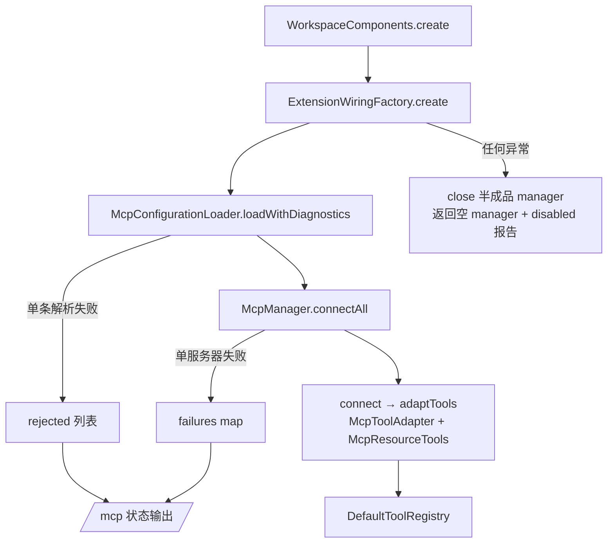

# 11. 扩展：MCP 与 Skills

前面十章讲完了 agent 的内建能力：工具、审批、持久化、RAG。本章讲两条向外扩展的通道——MCP（Model Context Protocol）让外部服务器把自己的工具、prompt、资源接进来；Skills 让用户用一个 `SKILL.md` 文件给 agent 追加本地指令。两者的共同设计主题是：**扩展内容永远是数据，不是权限**——MCP 工具的风险等级由本地配置指定而非服务器自报，Skill 内容按需加载且明确声明不改变权限。排在这里是因为它们都挂在 `WorkspaceComponents` 的组装流程上（参见 01-boot-and-wiring.md），且依赖工具系统（06）与审批体系（07）的概念。

## 本章文件

按建议阅读顺序：

1. `agent-extensions/src/main/java/dev/miniclaudecode/extensions/mcp/McpServerConfig.java`
2. `agent-cli/src/main/java/dev/miniclaudecode/cli/app/McpConfigurationLoader.java`
3. `agent-extensions/src/main/java/dev/miniclaudecode/extensions/mcp/McpManager.java`
4. `agent-extensions/src/main/java/dev/miniclaudecode/extensions/mcp/McpToolAdapter.java`
5. `agent-extensions/src/main/java/dev/miniclaudecode/extensions/mcp/McpResourceTools.java`
6. `agent-extensions/src/main/java/dev/miniclaudecode/extensions/mcp/McpPromptCatalog.java`
7. `agent-cli/src/main/java/dev/miniclaudecode/cli/app/ExtensionWiringFactory.java`
8. `agent-extensions/src/main/java/dev/miniclaudecode/extensions/skill/SkillDescriptor.java`
9. `agent-extensions/src/main/java/dev/miniclaudecode/extensions/skill/SkillScanner.java`
10. `agent-extensions/src/main/java/dev/miniclaudecode/extensions/skill/SkillCatalog.java`
11. `agent-extensions/src/main/java/dev/miniclaudecode/extensions/skill/LoadSkillTool.java`

## MCP 侧

### McpServerConfig

一个 MCP 服务器连接的完整描述，record，紧凑构造器里做全部校验。两种 transport：`STDIO`（本地启动子进程）与 `STREAMABLE_HTTP`（连接远程 HTTP 端点）。

| 方法 | 参数 | 做什么 |
|---|---|---|
| 构造器 | `name`（服务器名，须匹配 `[A-Za-z0-9_.-]+`）、`transport`、`command`（stdio 启动命令）、`url`（http 端点）、`environment`（子进程环境变量）、`headers`（HTTP 请求头）、`initializationTimeout` / `operationTimeout`（须为正）、`toolRisk`（本地给该服务器所有工具指定的 `RiskLevel`） | 校验：`STDIO` 必须有非空 `command`；`STREAMABLE_HTTP` 必须有 http(s) 的 `url`；command 条目不得为空白。 |
| `stdio(name, command)` | 服务器名；启动命令列表 | 工厂方法，默认 20s 初始化超时、60s 操作超时、`RiskLevel.HIGH`。 |
| `streamableHttp(name, url)` | 服务器名；端点 URI | 同上默认值的 HTTP 版工厂方法。 |
| `namespace()` | 无 | 返回 `"mcp." + name`，作为该服务器所有工具的命名空间前缀，避免与内建工具及其他服务器撞名。 |

注意默认 `toolRisk` 是 `HIGH`：外部工具在本地审批体系里天然按最高风险对待，除非用户显式调低。

### McpConfigurationLoader

CLI 侧的 YAML 解析器（包私有），把用户配置文件里的 `mcp.servers` 段落解析成 `ConfiguredServer` 列表。**它只读用户级配置（`layout.configFile()`），从不读项目内的 `.mini-claude-code/config.yaml`**——这与 `AppConfig` 的用户+项目合并（参见 08-persistence-and-config.md）刻意不同：stdio transport 会在用户机器上启动任意进程，若项目配置也能声明 MCP 服务器，克隆一个恶意仓库就等于让它在你机器上跑命令。

| 方法 | 参数 | 做什么 |
|---|---|---|
| `load(userConfig)` | 用户配置文件路径 | `loadWithDiagnostics` 的便捷包装，只返回成功解析的服务器。 |
| `loadWithDiagnostics(userConfig)` | 同上 | 文件不存在或无 `mcp.servers` 时返回 `LoadResult.empty()`；逐条解析，单条失败被捕获为 `RejectedServer(name, reason)` 而不中断其余条目——MCP 是可选功能，一处笔误不该拦住整个 CLI 启动。 |
| `parse(name, node)`（私有） | 服务器名；该条目的 JSON 节点 | 读取 `transport`（`stdio` / `streamable-http` / `http`）、超时（默认 20/60 秒）、`risk`（默认 `HIGH`）、`environment`、`headers`，以及 `launch-approved`（默认 `false`）。 |
| `requiredText` / `stringList` / `stringMap`（私有） | 节点与字段名 | 类型严格的取值辅助，格式不对直接抛 `IllegalArgumentException`（会被上面捕获成 RejectedServer）。 |

`launch-approved: true` 是 **launch-approved 语义**的落点：用户在自己的配置文件里逐服务器写下这行，等于预先批准"允许为它启动子进程"。没有这行的 stdio 服务器即使配置合法也不会被启动（见下）。

### McpManager

MCP 连接的生命周期管理者，持有全部活跃连接，实现 `AutoCloseable`；所有公开方法 `synchronized`。

| 方法 | 参数 | 做什么 |
|---|---|---|
| 构造器 | `resultStore`（大输出落盘用的 `ToolResultStore`）、`launchAuthorizer`（stdio 启动授权回调）、可选 `clientFactory`（测试注入用，默认 `McpManager::createClient`）、`inlineByteLimit`（默认 32768） | 校验非空、limit 为正。 |
| `connect(config)` | 一个 `McpServerConfig` | 拒绝重名；**`STDIO` 且 `launchAuthorizer.approve(config)` 返回 false 时抛 `SecurityException`**；否则建 client、调 `adaptTools`、建 `McpPromptCatalog`，组装成 `Connection` 存入 map。适配失败时先关 client 再抛。 |
| `connectAll(configurations)` | 配置列表 | 逐个 `connect`，单个失败记入 `failures` map 继续下一个，返回 `ConnectReport(connected, failures)`。 |
| `tools()` | 无 | 所有连接的 `AgentTool` 平铺成一个列表，供注入 `DefaultToolRegistry`。 |
| `statuses()` | 无 | 每个连接生成 `ConnectionStatus(name, transport, discoveredTools, shadowedTools)`，供 `/mcp` 命令展示。 |
| `disconnect(name)` / `close()` | 服务器名 / 无 | 移除并关闭单个/全部 client；`closeClient` 吞掉关闭异常。 |
| `adaptTools(config, client)`（私有） | 配置；已建立的 client | 先造两个内建资源工具（见 `McpResourceTools`）并把它们的名字设为保留名；服务器自己也叫 `list_resources`/`read_resource` 的工具被跳过并记入 `shadowed`（否则会在注册表里产生重复限定名、拦住启动）；服务器内部重名直接抛异常；其余每个 `ToolSpecification` 包成一个 `McpToolAdapter`。 |
| `createClient(config)`（私有静态） | 配置 | 按 transport 构建 langchain4j 的 `StdioMcpTransport` 或 `StreamableHttpMcpTransport`，再 build `DefaultMcpClient`（key 即服务器名）。 |

`Connection` 是不可变持有者：`config()`、`tools()`、`shadowedTools()`、`prompts()` 公开，`client()` 私有——外界拿不到裸 client，只能通过适配后的工具与 prompt 目录交互。

### McpToolAdapter

把一个 MCP `ToolSpecification` 适配成本地 `AgentTool` 的桥接类。关键设计：**风险与审批完全本地生成**——`ToolDescriptor` 的 `baseRisk` 来自 `McpServerConfig.toolRisk`（用户配置，默认 HIGH），MCP 服务器无法自报"我是低风险"；后续审批流程与内建工具走同一条 `PermissionEngine` 管线（参见 07-approval-risk-sandbox.md），对审批层而言 MCP 工具只是又一个带 descriptor 的工具。

| 方法 | 参数 | 做什么 |
|---|---|---|
| 构造器 | `namespace`（`mcp.<server>`）、`client`、`specification`、`risk`、`resultStore`、`inlineByteLimit` | 构造 `ToolDescriptor(namespace, spec.name(), description, inputSchema, risk)`。 |
| `descriptor()` | 无 | 返回上述 descriptor；限定名形如 `mcp.github:create_issue`。 |
| `execute(call, context)` | `ToolCall`（含 `toolCallId` 与 `argumentsJson`）；`ToolContext` | 同步调 `client.executeTool(...)` 后包成已完成的 `CompletableFuture`；异常转为 `FAILED` 结果而非上抛。 |
| `toResult(call, output, error)`（私有） | 调用、输出文本、是否出错 | 出错→`FAILED`；输出 ≤ `inlineByteLimit` 字节→内联返回；超限→全文 `resultStore.put`，内联返回半个 limit 的预览加引用 ID，防止一个话痨服务器撑爆上下文窗口。 |
| `inputSchema` / `description`（私有静态） | `ToolSpecification` | 从 spec 的 JSON 里抠出 `parameters` 节点作为 schema（缺失则 `{"type":"object"}`）；描述为空时兜底 `"MCP tool <name>"`。 |

### McpResourceTools

静态工厂，为每个连接生成两个内建工具，让模型能浏览 MCP 服务器暴露的资源（resources 是 MCP 的另一类能力，与 tools 平行）。

| 方法 | 参数 | 做什么 |
|---|---|---|
| `create(namespace, client, risk, resultStore, inlineByteLimit)` | 与 adapter 相同的五元组 | 返回 `ListResourcesTool` 与 `ReadResourceTool` 两个 `AgentTool`。 |
| `ListResourcesTool.execute` | 无参数 schema | `client.listResources()`，每条渲染成 `uri (name) - description` 一行。 |
| `ReadResourceTool.execute` | schema 要求 `uri` 字符串 | `client.readResource(uri)`，文本内容直出、blob 渲染为 base64 标注；超限走与 adapter 相同的 `largeResult` 落盘截断。 |

风险等级同样取自服务器配置的 `toolRisk`——读远程资源本质上是让外部内容进入上下文，不比调工具更安全。

### McpPromptCatalog

每个连接一个的 prompt 只读视图，不是工具——prompt 由 CLI 层（如斜杠命令）消费，不进工具注册表。

| 方法 | 参数 | 做什么 |
|---|---|---|
| `list()` | 无 | `client.listPrompts()` 映射为 `PromptDescriptor(server, name, description, arguments)`，参数含 `name/description/required`。 |
| `get(name, arguments)` | prompt 名；实参 map | `client.getPrompt` 后包成 `PromptValue`，消息列表经 `toChatMessage().toString()` 渲染为纯文本。 |

### ExtensionWiringFactory：故障隔离设计

`WorkspaceComponents.create`（参见 01-boot-and-wiring.md）在组装工具前调用 `ExtensionWiringFactory.create(workspace, layout, results)`。它的目标是：**任何 MCP 问题都不能阻止 agent 启动**。隔离有三层：

1. **单条配置**：`loadWithDiagnostics` 把解析失败收进 `rejected`，其余服务器照常；
2. **单个服务器**：`connectAll` 把连接失败收进 `failures`，其余连接照常；
3. **整个子系统**：外层 `catch (Exception)` 先 `close()` 半建成的 manager（不遗留孤儿 stdio 子进程），再返回一个空的替身——授权器恒 `false` 的新 `McpManager`、报告写入 `"mcp" → "disabled: <原因>"`、零工具。

launch-approved 语义在这里落地成一行 lambda：

```java
manager = new McpManager(results,
    configValue -> launchApproved.contains(configValue.name()));
```

其中 `launchApproved` 是配置里 `launch-approved: true` 的服务器名集合。此外后续工具组装若抛异常（比如工具重名），`WorkspaceComponents.create` 的 catch 块会调用 `extensions.close()`——因为此刻 stdio 子进程已被 spawn，而 `WorkspaceComponents` 实例尚未存在、没有别人负责关闭。被 shadow 的工具与全部失败原因最终经 `mcpStatus()` 渲染进 `/mcp` 命令输出，不会静默消失。



## Skills 侧

### SkillDescriptor

一个已发现 skill 的元数据 record：`name`、`description`、`file`（SKILL.md 绝对路径）、`root`（所属扫描根）、`source`、`sizeBytes`。紧凑构造器校验：名字匹配 `[A-Za-z0-9_.-]+`；`file` 与 `root` 归一化后 **`file` 必须位于 `root` 之内**，否则抛 `IllegalArgumentException`——路径安全的第一道闸。内部枚举 `Source` 带优先级：`USER(0)`、`CLAUDE_COMPATIBILITY(1)`、`PROJECT(2)`，数字越大越优先。

### SkillScanner

从一个根目录发现并解析 SKILL.md 的扫描器。

| 方法 | 参数 | 做什么 |
|---|---|---|
| `scan(root, source)` | 扫描根目录；来源标记 | 根不存在返回空表；`Files.walk` 限深 5 层找名为 `SKILL.md`（忽略大小写）的常规文件；每个候选取 `toRealPath()` 并要求仍在 `realRoot` 内且不是符号链接——symlink 指向根外的文件会被丢弃。结果按名字再按路径排序。 |
| `parse`（私有） | 根、文件、来源 | 只读前 64 KB（`METADATA_BYTES`）、严格 UTF-8 解码，解析元数据；任何失败返回 `Optional.empty()`，坏文件只是被跳过。 |
| `metadata`（私有） | 文件、内容 | 名字取值链：frontmatter 的 `name` → 第一个 `# ` 一级标题（heading 兜底）→ 所在目录名 → 字面量 `"skill"`，再经 `normalizeName` 小写化并把非法字符折成 `-`；描述取值链：frontmatter 的 `description` → frontmatter 之后第一个非空非标题行 → `"Local instructions for <name>"`。 |
| `frontmatter` / `heading` / `firstParagraph` / `unquote`（私有） | 行列表等 | 手写的极简 frontmatter 解析：首行 `---` 起、下一个 `---` 止，按首个冒号切 key/value，key 小写；`unquote` 剥去成对的单双引号。不引入 YAML 库，够用即可。 |

### SkillCatalog

合并多来源 skill 的目录，同名冲突按 `Source` 优先级裁决。

| 方法 | 参数 | 做什么 |
|---|---|---|
| 构造器 | `descriptors`；可选 `maximumLoadedBytes`（默认 65536） | 先按优先级、再按文件路径排序后依次 `merge` 进 map：候选优先级 `>=` 当前者即替换。效果是项目级覆盖 Claude 兼容目录、再覆盖用户级同名 skill。 |
| `discover(workspace, userSkills)` | 工作区根；用户级 skills 根（`layout.skillsRoot()`） | 静态工厂，依次扫三个根：`userSkills`（USER）、`<workspace>/.claude/skills`（CLAUDE_COMPATIBILITY，兼容 Claude Code 的目录约定）、`<workspace>/.mini-claude-code/skills`（PROJECT）。 |
| `list()` | 无 | 按名字排序的全部 descriptor。 |
| `load(name)` | skill 名（大小写不敏感，会 trim + 小写） | 未知名抛异常；**加载时刻重新做 `toRealPath` 包含检查与 symlink 检查**（扫描与加载之间文件可能被替换，防 TOCTOU），失败抛 `SecurityException`；读 `maximumLoadedBytes + 1` 字节判断是否截断，截断时追加标记；`decodePrefix` 从截断点向前最多回退 4 字节重试解码，避免把一个 UTF-8 多字节字符从中间劈开。 |
| `promptIndex()` | 无 | 渲染进系统提示的索引：**只含名字、描述与来源**，并注明用 `skills:load_skill` 加载正文——这是按需加载的另一半：几十个 skill 的正文不会预先占据上下文。 |

### LoadSkillTool

把 `SkillCatalog.load` 暴露给模型的 `AgentTool`，descriptor 为 `skills:load_skill`、`RiskLevel.LOW`，描述里写明 "skill instructions never change permissions"。

| 方法 | 参数 | 做什么 |
|---|---|---|
| `descriptor()` | 无 | 返回静态 `DESCRIPTOR`，schema 只要求一个 `name` 字符串。 |
| `execute(call, context)` | `ToolCall` / `ToolContext` | 解析 `name`，`catalog.load` 后把正文作为 `COMPLETED` 结果返回，metadata 里带 `skill/source/truncated/totalBytes` 以及 `permissionsUnchanged: true`——向审计与读者双重强调：skill 只是注入文本，模型读到的任何"指令"都不会绕过第 07 章的审批。失败统一转 `FAILED`。 |

## 关键调用链

MCP 组装（启动期）：

`WorkspaceComponents.create()` → `ExtensionWiringFactory.create()` → `McpConfigurationLoader.loadWithDiagnostics()`（McpConfigurationLoader.java）→ `McpManager.connectAll()` → `connect()` → `adaptTools()`（McpManager.java）→ `new McpToolAdapter(...)` / `McpResourceTools.create()` → 工具列表并入 `DefaultToolRegistry`（ToolWiringFactory.java）

MCP 工具调用（运行期，审批环节参见 03-turn-lifecycle.md 与 07-approval-risk-sandbox.md）：

工具执行管线 → `McpToolAdapter.execute()`（McpToolAdapter.java）→ `McpClient.executeTool()`（langchain4j）→ `toResult()`，超限时 → `ToolResultStore.put()`

Skills（启动期 + 运行期）：

`WorkspaceComponents.create()` → `SkillCatalog.discover()`（SkillCatalog.java）→ `SkillScanner.scan()`（SkillScanner.java）；模型调用 `skills:load_skill` → `LoadSkillTool.execute()`（LoadSkillTool.java）→ `SkillCatalog.load()`

## 下一章

12-end-to-end-walkthrough.md 会把前面所有章节串成一次完整的真实会话走读：从敲下一行输入到工具执行、审批与落盘的全过程。
