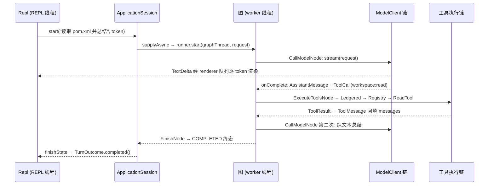

# 12. 全链路走读：从按键到答案

前面十一章按模块拆讲了每个零件，本章把它们串成一条线。主线是一个最小但完整的请求——用户在 REPL 输入「读取 pom.xml 并总结」——从 JLine 读到这行字，到图执行两轮模型调用、跑一次 `workspace:read`，再到终端渲染出总结，逐步给出「文件#方法」引用。你可以照着这张地图在 IDE 里打断点单步走完整个系统。之后用第二条线（一次需要审批的 `workspace:edit`）讲清 WAITING_APPROVAL 暂停/恢复与主线的差异，最后给出一组高信息量断点。各步的机制细节不重复展开，一律指向对应章节。

## 本章文件

按主线经过的顺序（也是建议的跳转顺序）：

- `agent-cli/src/main/java/dev/miniclaudecode/cli/Repl.java`
- `agent-cli/src/main/java/dev/miniclaudecode/cli/app/ApplicationSession.java`
- `agent-runtime/src/main/java/dev/miniclaudecode/runtime/AgentThreadRunner.java`
- `agent-runtime/src/main/java/dev/miniclaudecode/runtime/AgentGraphFactory.java`
- `agent-runtime/src/main/java/dev/miniclaudecode/runtime/node/PrepareContextNode.java`
- `agent-runtime/src/main/java/dev/miniclaudecode/runtime/route/ResponseRouter.java`
- `agent-runtime/src/main/java/dev/miniclaudecode/runtime/node/CallModelNode.java`
- `agent-cli/src/main/java/dev/miniclaudecode/cli/app/AuditedModelClient.java`
- `agent-runtime/src/main/java/dev/miniclaudecode/runtime/node/ExecuteToolsNode.java`
- `agent-runtime/src/main/java/dev/miniclaudecode/runtime/LedgeredToolExecutor.java`
- `agent-cli/src/main/java/dev/miniclaudecode/cli/app/RegistryToolExecutor.java`
- `agent-tools/src/main/java/dev/miniclaudecode/tools/fs/ReadTool.java`
- `agent-runtime/src/main/java/dev/miniclaudecode/runtime/node/FinishNode.java`
- `agent-cli/src/main/java/dev/miniclaudecode/cli/StreamingRenderer.java`

## 主线：「读取 pom.xml 并总结」

先记住线程模型：REPL 线程只做两件事——读输入、泵渲染队列；图在 `CompletableFuture.supplyAsync` 的公共线程池线程上执行；两边靠 `StreamingRenderer` 内部的 `BlockingQueue` 交会（参见 03-turn-lifecycle.md）。

### 阶段 A：按键到 turn 启动（agent-cli）

1. `Repl.java#run` — `readInput()` 经 JLine `reader.readLine` 拿到整行；不是斜杠命令，走 `executeTurn(input)`。
2. `Repl.java#executeTurn` — 为本次 turn `new CancellationToken()` 并存入 `activeTurn`（Ctrl+C 的 SIGINT handler 从这里取 token 调 `cancel()`），然后调 `turnHandler.start(prompt, token, renderer::submit)`。
3. `ApplicationSession.java#start` — synchronized 块内：确认没有活跃 turn，分配 `TurnId` 与图线程 id `<sessionId>-turn-<n>`，经 `SessionAuditService` 写 `USER_MESSAGE`，由 `MemoryCoordinator` 构建本轮记忆上下文，再让 `TurnCoordinator.request(...)` 组出 `ModelRequest`（携带全部工具 descriptor、`requireVerification` 和规划配置属性）。
4. `TurnCoordinator.java#createRunner` — 组装四层洋葱：`AuditedModelClient` 包住 `components.modelClient()`（即 `RoutingModelClient`，参见 05-model-providers.md）；`LedgeredToolExecutor` 包住 `RegistryToolExecutor`；加 `TurnLimits(24, 64)` 与 `FileCheckpointSaver`，交给 `AgentGraphFactory`，再套 `AgentThreadRunner`。
5. `ApplicationSession.java#start`（续）— `CompletableFuture.supplyAsync(() -> runner.start(graphThread, request))` 把图抛到后台线程；REPL 线程回到 `Repl.java#await`，用 `StreamingRenderer#renderUntil` 每 20ms 泵一次渲染队列直到 future 完成。

### 阶段 B：图的第一圈——模型要求调工具（agent-runtime、agent-providers）

6. `AgentThreadRunner.java#start` → `AgentGraphFactory.java#start` — `graph.invoke(StateSchema.initialInput(request), runnableConfig(sessionId))`，LangGraph4j 从 START 边进入。
7. `PrepareContextNode.java#apply` — 把 `state.request().messages()` 写入 `messages` channel，status 置 `RUNNING`。
8. `ResponseRouter.java#afterPrepare` — `ContextPlanner.plan` 判断上下文没超限 → 返回 `"model"`。
9. `CallModelNode.java#apply` — `modelSteps` 未到 24，用 `state.messages()` 重建 `ModelRequest`，`modelClient.stream(request).subscribe(new ResponseSubscriber(...))`，返回一个尚未完成的 `CompletableFuture`——节点在事件流终止前不会推进。
10. `AuditedModelClient.java#stream` → `RoutingModelClient.java#stream` → `LangChainStreamingModelClient#stream`（参见 05-model-providers.md）— 事件逆流回来时经过 `AuditedModelClient.Observer#onNext`：每个 `TextDelta` 立即 `renderer.accept(new Text(...))`（所以终端是逐 token 出字的），审计侧按 4096B/250ms 合并后写 JSONL。
11. `CallModelNode.ResponseSubscriber#onComplete` — 把累积的 text/thinking/toolCalls 聚合成一条 `AssistantMessage`；本例模型回了一个 `ToolCall`：`workspace:read`，参数 `{"path":"pom.xml"}`，写入 `pendingToolCalls`，`modelSteps + 1`。
12. `ResponseRouter.java#routeAfterModel` — 无 error、`pendingToolCalls` 非空 → 返回 `"tools"`。

### 阶段 C：执行 workspace:read（agent-runtime → agent-cli → agent-tools）

13. `ExecuteToolsNode.java#apply` — `carriedResults` 为空（没有审批重放），检查 `toolSteps` 限额后调 `toolExecutor.execute(outstanding, pendingApproval, approvalDecision)`。
14. `LedgeredToolExecutor.java#executeOne` — `ledger.find(toolCallId)` 查台账去重（首次执行查不到）；`classify` 因 `workspace:read` 在 `SAFE_RETRY_TOOLS` 里得 `LOW`；先 `save` 一条 `PENDING` 记录再委托 delegate（参见 04-agent-graph.md）。
15. `RegistryToolExecutor.java#executeOne` — `registry.require("workspace:read")` 取出工具；渲染 `Progress("Running workspace:read")`、emit `TOOL_STARTED`；组 `ToolContext`（attributes 里塞 `cancellationToken`）；`tool.execute(call, context)`；结果回来后 emit `TOOL_RESULT`。
16. `ReadTool.java#execute` — `resolver.resolveExisting("pom.xml")` 三层路径防御 → `readNBytes(maxBytes + 1)` 探测截断 → `TextFiles.withLineNumbers` 编行号 → `ToolResults.completed` 分流：超过 32 KiB 落盘 `ToolResultStore`，否则整段内联（参见 06-tools-read-write.md）。
17. `ExecuteToolsNode.java#apply`（私有 `completed`）— 没有 `APPROVAL_REQUIRED`，把结果转成 `ToolMessage` 回填 `messages`，清空 `pendingToolCalls`，`toolSteps + 1`。
18. `ResponseRouter.java#afterTools` — 无 error、无 `pendingApproval` → 返回 `"model"`，回到 call_model。

### 阶段 D：第二圈模型调用与收尾

19. `CallModelNode.java#apply`（第二次）— 对话里现在有 pom.xml 内容的 `ToolMessage`，模型流回纯文本总结，没有新 `ToolCall`，`finalText` 即总结全文。
20. `ResponseRouter.java#routeAfterModel` — `pendingToolCalls` 为空、当前无进行中的 Plan step，且 `requiresVerification` 为 false → 返回 `"finish"`。若存在进行中的 step，则先进入 `verify_step`，不会直接结束。
21. `FinishNode.java#apply` — 非 CANCELLED、`error` 为空 → status 定格 `COMPLETED`，图走到 END，`graph.invoke` 返回终态 `MiniClaudeState`。
22. `ApplicationSession.java#finishState` — 把 `state.messages()` 回写为会话历史；COMPLETED 分支 emit `TURN_FINAL`（payload 带 `finalText`），`renderer.accept(new Completed())`，清空 activeRunner/activeGraphThread/activeTurn，返回 `TurnOutcome.completed()`。
23. `Repl.java#await` — `renderUntil` 排空队列（剩余 Text delta 与 Completed 换行收尾），`future.join()` 拿到 outcome；`approvalRequest` 为空，`executeTurn` 退出循环，回到 `> ` 提示符。

## 第二条线：需要审批的写操作

把输入换成「把 pom.xml 里版本号改成 2.0」，阶段 A/B 完全相同，分叉从阶段 C 开始：

- 模型第一圈返回的是 `workspace:edit` 的 `ToolCall`；`LedgeredToolExecutor.java#classify` 给 `MEDIUM`（workspace 前缀但不在只读白名单）。
- `EditTool` 继承的 `AbstractFileMutationTool.java#execute` 走到 `PermissionEngine.authorize`：没有既存规则时返回 `Authorization.Requested`，工具产出 `Status.APPROVAL_REQUIRED` 的 `ToolResult`，metadata 里带 `approvalRequest` 与 `unifiedDiff`（参见 07-approval-risk-sandbox.md）。
- `RegistryToolExecutor.java#executeOne` 据此 emit `APPROVAL_REQUESTED` 事件（payload 含 approvalId/risk/beforeHash/diffHash/preview——这正是崩溃后 `restorePendingApproval` 重建悬挂审批的原料，参见 08-persistence-and-config.md）。
- `ExecuteToolsNode.java#apply` 检测到 `APPROVAL_REQUIRED`：不回填 `ToolMessage`，改写 `pendingApproval` 并把 status 置 `WAITING_APPROVAL`；`ResponseRouter#afterTools` 返回 `"approval"` → `AwaitApprovalNode.java#apply`。编译期配置的 `interruptAfter(AWAIT_APPROVAL)` 让 `graph.invoke` 在此返回，checkpoint 已由 `FileCheckpointSaver` 落盘。
- `ApplicationSession.java#finishState` 走 WAITING_APPROVAL 分支：从 `state.toolResults()` 里挑出与 `pending.toolCall().toolCallId()` 匹配的那条 `unifiedDiff` 作预览，返回 `TurnOutcome.waitingFor(pending, preview)`，且**不清**活跃三件套。
- REPL 侧回到 `Repl.java#executeTurn` 的 while 循环：`printApprovalPreview` 打出 diff，`ApprovalMenu.prompt` 收集 `ApprovalDecision`，再调 `turnHandler.resume(decision, token, renderer::submit)`。
- `ApplicationSession.java#resume` — emit `APPROVAL_RESOLVED`，`runner.resume(graphThread, decision)` → `AgentGraphFactory.java#resume` 用 `GraphInput.resume(Map.of(MiniClaudeState.APPROVAL_DECISION, decision))` 从 checkpoint 续跑。`await_approval` 的固定边回到 `execute_tools`，整批工具调用重放：`ExecuteToolsNode#carriedResults` 让已完成的结果直接复用，只有待批的那次真正重跑；这次 `PermissionEngine.authorize` 经 `validateBinding` 核对 approvalId + beforeHash + diffHash 后返回 `Allowed`，`AtomicFileWriter.write` 落盘。
- 之后回到 call_model。注意收尾会与主线不同：成功的 mutation 会让 `ResponseRouter#requiresVerification` 返回 true，先经 `RequireVerificationNode` 提示模型跑一次 `shell:run` 验证再放行 finish（参见 04-agent-graph.md）。

## 调试建议

按信息密度排序的断点位置（都在主线或审批线上）：

| 断点 | 能观察到什么 |
| --- | --- |
| `Repl.java#executeTurn` | 原始输入、`CancellationToken` 的创建与归还；REPL 线程与图线程的分界点 |
| `ApplicationSession.java#start`（synchronized 块内） | TurnId/graphThread 命名规则、组装完的 `ModelRequest`（消息条数、工具 descriptor 全表、attributes） |
| `ResponseRouter.java#routeAfterModel` | 图最重要的岔路口，返回的字符串就是下一个节点；一处断点看全 tools/compact/retry/verify/finish 五路 |
| `CallModelNode.ResponseSubscriber#onComplete` | 一次模型调用的全部产物：text、thinking、toolCalls、providerMetadata；第二次命中即收尾文本 |
| `LedgeredToolExecutor.java#executeOne` | 台账查重（`ledgerReused` 短路）、风险分类结果、审批请求与 decision 的配对过滤 |
| `RegistryToolExecutor.java#executeOne` | `ToolContext.attributes` 的实际内容（cancellationToken / approvalRequest / approvalDecision），审批重放时 decision 如何注入工具 |
| `PermissionEngine#authorize`（审批线） | Authorization 三态的分派现场与 `validateBinding` 的 TOCTOU 校验 |
| `ApplicationSession.java#finishState` | 终态四路分派、WAITING_APPROVAL 时 diff 预览的提取、活跃三件套的清理时机 |

两个实用技巧：`ResponseRouter#routeAfterModel` 用条件断点（如 `state.modelSteps() > 1`）可以只停在第二圈；观察 `MiniClaudeState` 时直接看 `trace()`——它是 appender channel，累积了到目前为止每个节点的执行足迹，等于免费的执行日志。

## 下一章

全书正文到此走完；回到 00-index.md 按你关心的模块选一条重读路线，或直接照本章断点表开一次真实调试。
